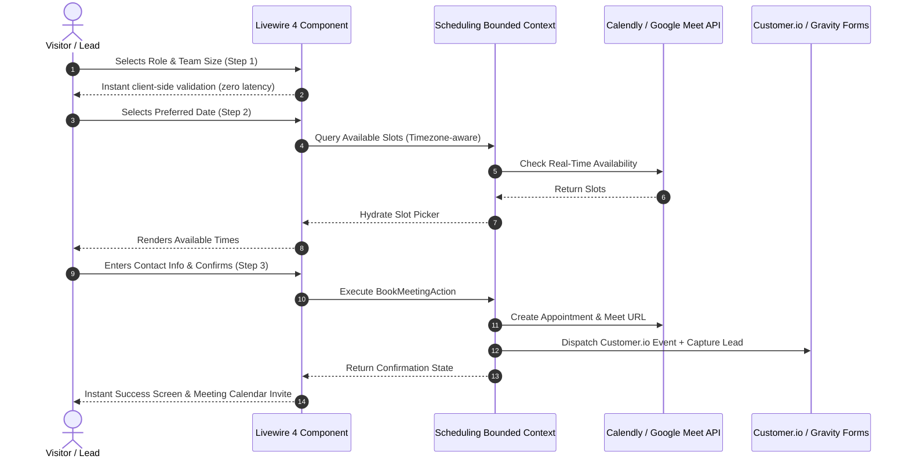
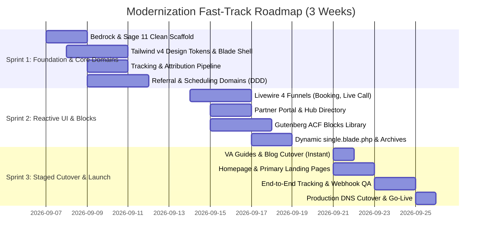

# Remote Leverage Website Modernization
## Enterprise Architecture Proposal & Strategic Migration Plan (Roots Bedrock + Sage 11 + Acorn 5 + Livewire 4 + DDD)

**Prepared by:** Adrián Salvatori  
**Target Platform:** [remoteleverage.com](https://remoteleverage.com)  
**Strategy:** Clean-Slate Greenfield Rebuild with Parallel Staging & Zero-Downtime Cutover  

---

## 1. Executive Summary

Remote Leverage’s digital platform has outgrown its legacy architecture. Currently, the production application relies on **Elementor / Elementor Pro**, a legacy child theme, and **8 disparate bespoke plugins** (`rl-elementor-blocks`, `rl-referral-program`, `rl-customer-io`, `rl-partners-hub`, `rl-join-live-call`, `rl-posthog-feature-flags`, `rl-social-kit`, and `rl-content-auditor`).

While this setup supported early rapid prototyping, it now creates acute organizational and technical bottlenecks:
1. **Performance Drag & Core Web Vitals (CWV)**: Multi-megabyte DOM footprints, deep widget nesting, and redundant JavaScript runtimes (`elementor-frontend.js`, jQuery, Swiper, custom scripts) depress mobile conversion rates and organic SEO rankings.
2. **High Architectural Fragility**: Business logic for referral tracking, Calendly integration, Stripe webhooks, and Customer.io telemetry is scattered across uncoordinated plugins with separate database interactions and autoloaders.
3. **Severe Page Builder Lock-in**: Minor layout tweaks require brittle builder interfaces rather than predictable, version-controlled design systems.

### The Strategic Solution
Rather than patching legacy debt, we will **initialize a clean-slate, greenfield project** powered by the industry standard **Roots enterprise stack**:
- **Roots Bedrock**: Modern WordPress stack with 12-factor application architecture, strict environment configuration (`.env`), and clean Composer dependency management.
- **Roots Sage 11**: Next-generation theme engine utilizing **Vite 6**, **Tailwind CSS v4**, and **Laravel Blade** templating.
- **Roots Acorn 5**: Enterprise application framework bringing Laravel 11/12 service container, dependency injection, Eloquent ORM, and Artisan CLI tooling into WordPress.
- **Livewire 4**: Next-gen reactive frontend components delivering Single-Page-Application (SPA) fluidity for complex funnels (booking wizards, partner dashboards) with zero detached headless infrastructure.
- **Domain-Driven Design (DDD)**: Re-architecting all 8 legacy plugins into cohesive, testable, and isolated **Bounded Contexts** (`Referral`, `Scheduling`, `Tracking`, `PartnerHub`, `ContentAudit`).
- **Native Gutenberg (ACF Composer)**: Replacing 36 legacy Elementor widgets with ~16 unified, lightweight native blocks sharing a centralized design token system.

---

## 2. Current State vs. Proposed Architecture

| Dimension | Current Legacy Architecture | Proposed Clean-Slate Architecture |
| :--- | :--- | :--- |
| **Project Foundation** | Fragmented WP install, plugins loaded ad-hoc, mixed environments | **Roots Bedrock**: 12-factor setup, automated Composer builds, immutable deployments |
| **Theme / UI Layer** | `hello-elementor` child theme + Elementor Pro drag-and-drop | **Roots Sage 11**: Vite 6, Tailwind CSS v4, Blade components, automated `theme.json` |
| **Backend Core** | Procedural PHP hooks scattered across 8 custom plugins | **Roots Acorn 5 (Laravel 11/12)**: Dependency Injection, Service Providers, Eloquent ORM |
| **Business Logic** | Tangled procedural scripts, direct global `$wpdb` calls | **Domain-Driven Design (DDD)**: 5 isolated Bounded Contexts with pure domain actions & DTOs |
| **Interactive UX** | Bulky iframe embeds, heavy jQuery sliders, and fragile shortcodes | **Livewire 4**: Reactive state machines, Form Objects, instant qualification flows |
| **Content Authoring** | Heavy Elementor canvas with multi-level div nesting | **Native Gutenberg**: Semantic blocks via `log1x/acf-composer` & dynamic Blade templates |
| **Database & Schema** | Unversioned custom tables created on plugin activation | **Acorn Migrations**: Version-controlled, idempotent database schema migrations |
| **Code Quality & CI** | Zero automated tests; difficult to run automated linting | **Laravel Pint & PHPUnit**: Automated domain unit testing & CI/CD pipeline readiness |

---

## 3. Complete Target Folder Structure (Bedrock + Sage 11 + DDD)

Below is the complete, production-ready directory tree for the clean-slate greenfield project:

```
remoteleverage-platform/                <-- Clean-Slate Bedrock Root
├── .env.example                        # Canonical environment configuration
├── .gitignore
├── composer.json                       # Bedrock root dependencies
├── composer.lock
├── config/                             # Bedrock environment configurations
│   ├── application.php
│   └── environments/
│       ├── development.php
│       ├── staging.php
│       └── production.php
├── vendor/
└── web/
    ├── app/
    │   ├── mu-plugins/                 # Acorn autoloader & essential drop-ins
    │   ├── plugins/                    # Minimal 3rd party plugins (Gravity Forms, etc.)
    │   ├── uploads/
    │   └── themes/
    │       └── remote-leverage/        <-- Roots Sage 11 Theme Framework
    │           ├── app/
    │           │   ├── Domains/        <-- Bounded Contexts (Pure Business Logic)
    │           │   │   ├── Referral/   # Ported from rl-referral-program
    │           │   │   │   ├── Actions/
    │           │   │   │   │   ├── TrackReferralClickAction.php
    │           │   │   │   │   ├── RegisterPartnerAction.php
    │           │   │   │   │   └── ProcessPayoutAction.php
    │           │   │   │   ├── Data/
    │           │   │   │   │   ├── PartnerData.php
    │           │   │   │   │   ├── ReferralData.php
    │           │   │   │   │   └── PayoutData.php
    │           │   │   │   ├── Events/
    │           │   │   │   │   ├── ReferralRecorded.php
    │           │   │   │   │   ├── PartnerRegistered.php
    │           │   │   │   │   └── PayoutCompleted.php
    │           │   │   │   ├── Listeners/
    │           │   │   │   │   ├── SendPartnerWelcomeEmail.php
    │           │   │   │   │   └── DispatchReferralWebhook.php
    │           │   │   │   ├── Models/
    │           │   │   │   │   ├── Partner.php
    │           │   │   │   │   ├── Referral.php
    │           │   │   │   │   └── Payout.php
    │           │   │   │   ├── Repositories/
    │           │   │   │   │   ├── PartnerRepositoryInterface.php
    │           │   │   │   │   └── EloquentPartnerRepository.php
    │           │   │   │   └── Services/
    │           │   │   │       ├── StripeConnectGateway.php
    │           │   │   │       └── AttributionEngine.php
    │           │   │   │
    │           │   │   ├── Scheduling/ # Ported from rl-elementor-blocks & rl-join-live-call
    │           │   │   │   ├── Actions/
    │           │   │   │   │   ├── FetchAvailableSlotsAction.php
    │           │   │   │   │   ├── BookMeetingAction.php
    │           │   │   │   │   └── RouteInstantCallAction.php
    │           │   │   │   ├── Data/
    │           │   │   │   │   ├── TimeSlotData.php
    │           │   │   │   │   └── BookingRequestData.php
    │           │   │   │   ├── Gateways/
    │           │   │   │   │   ├── CalendlyClient.php
    │           │   │   │   │   └── GoogleCalendarClient.php
    │           │   │   │   └── Services/
    │           │   │   │       └── LiveCallAvailabilityRouter.php
    │           │   │   │
    │           │   │   ├── Tracking/   # Ported from rl-customer-io & rl-posthog-feature-flags
    │           │   │   │   ├── Actions/
    │           │   │   │   │   ├── RecordBehaviorEventAction.php
    │           │   │   │   │   └── EvaluateVariantAction.php
    │           │   │   │   ├── Data/
    │           │   │   │   │   ├── UserProfileData.php
    │           │   │   │   │   └── AnalyticsEventData.php
    │           │   │   │   ├── Gateways/
    │           │   │   │   │   ├── CustomerIOClient.php
    │           │   │   │   │   └── PostHogClient.php
    │           │   │   │   └── Subscribers/
    │           │   │   │       └── GravityFormsSubmissionSubscriber.php
    │           │   │   │
    │           │   │   ├── PartnerHub/ # Ported from rl-partners-hub
    │           │   │   │   ├── Actions/
    │           │   │   │   │   ├── SyncNotionPartnersAction.php
    │           │   │   │   │   └── QueryPartnersAction.php
    │           │   │   │   ├── Models/
    │           │   │   │   │   └── PartnerProfile.php
    │           │   │   │   └── Services/
    │           │   │   │       └── NotionSyncService.php
    │           │   │   │
    │           │   │   └── ContentAudit/ # Ported from rl-content-auditor & rl-social-kit
    │           │   │       ├── Actions/
    │           │   │       │   ├── AuditMarkdownContentAction.php
    │           │   │       │   └── GenerateSignatureHtmlAction.php
    │           │   │       └── Services/
    │           │   │           └── PrismAiAuditor.php
    │           │   │
    │           │   ├── Application/    <-- Presentation & Delivery Layer (Sage 11)
    │           │   │   ├── Blocks/     # Native Gutenberg Blocks (ACF Composer)
    │           │   │   │   ├── HeroBlock.php
    │           │   │   │   ├── BookingBlock.php
    │           │   │   │   ├── LiveCallBlock.php
    │           │   │   │   ├── TestimonialsBlock.php
    │           │   │   │   ├── DepartmentCardsBlock.php
    │           │   │   │   ├── ProcessStepsBlock.php
    │           │   │   │   ├── BenefitsGuaranteeBlock.php
    │           │   │   │   ├── AccordionFaqBlock.php
    │           │   │   │   ├── DataTableBlock.php
    │           │   │   │   └── CtaBannerBlock.php
    │           │   │   │
    │           │   │   ├── Livewire/   # Reactive State Components (Livewire 4)
    │           │   │   │   ├── Booking/
    │           │   │   │   │   ├── MultistepBookingWizard.php
    │           │   │   │   │   ├── Forms/BookingForm.php
    │           │   │   │   │   └── InstantLiveCallButton.php
    │           │   │   │   ├── Referral/
    │           │   │   │   │   ├── PartnerPortalDashboard.php
    │           │   │   │   │   ├── Forms/PartnerRegisterForm.php
    │           │   │   │   │   └── PartnerRegistrationForm.php
    │           │   │   │   ├── Partners/
    │           │   │   │   │   └── PartnerDirectoryGrid.php
    │           │   │   │   ├── Tools/
    │           │   │   │   │   └── EmailSignatureGenerator.php
    │           │   │   │   └── Blog/
    │           │   │   │       └── GuideIndexFilter.php
    │           │   │   │
    │           │   │   ├── Http/       # External Webhook Entrypoints
    │           │   │   │   ├── Controllers/
    │           │   │   │   │   ├── StripeWebhookController.php
    │           │   │   │   │   └── CalendlyWebhookController.php
    │           │   │   │   └── Middleware/
    │           │   │   │       ├── ReferralAttributionMiddleware.php
    │           │   │   │       └── PostHogRedirectMiddleware.php
    │           │   │   │
    │           │   │   └── View/       # Blade View Composers
    │           │   │       └── Composers/
    │           │   │           ├── Header.php
    │           │   │           ├── Footer.php
    │           │   │           └── SinglePost.php
    │           │   │
    │           │   └── Infrastructure/ <-- Framework & System Adapters (Acorn 5)
    │           │       ├── Database/
    │           │       │   └── Migrations/
    │           │       │       ├── 2026_09_01_000001_create_referral_partners_table.php
    │           │       │       ├── 2026_09_01_000002_create_referrals_table.php
    │           │       │       └── 2026_09_01_000003_create_payouts_table.php
    │           │       ├── Providers/
    │           │       │   ├── DomainServiceProvider.php
    │           │       │   ├── ReferralServiceProvider.php
    │           │       │   ├── SchedulingServiceProvider.php
    │           │       │   ├── TrackingServiceProvider.php
    │           │       │   └── LivewireServiceProvider.php
    │           │       └── WordPress/
    │           │           ├── Hooks/
    │           │           │   ├── TrackingHooks.php
    │           │           │   └── GravityFormsHooks.php
    │           │           └── PostTypes/
    │           │               └── PartnerPostType.php
    │           │
    │           ├── config/             # Acorn 5 configuration files
    │           │   ├── app.php
    │           │   ├── database.php
    │           │   ├── post-types.php
    │           │   ├── services.php
    │           │   └── mail.php
    │           │
    │           ├── resources/          # Frontend assets & Blade views
    │           │   ├── css/
    │           │   │   ├── app.css     # Tailwind CSS v4 (@theme tokens)
    │           │   │   └── editor.css  # Block editor matching styles
    │           │   ├── js/
    │           │   │   ├── app.js      # Minimal front entrypoint
    │           │   │   └── editor.js   # Gutenberg block extensions
    │           │   └── views/
    │           │       ├── layouts/
    │           │       │   └── app.blade.php
    │           │       ├── sections/
    │           │       │   ├── header.blade.php
    │           │       │   └── footer.blade.php
    │           │       ├── blocks/     # Native Gutenberg Block Blade Templates
    │           │       │   ├── hero.blade.php
    │           │       │   ├── booking.blade.php
    │           │       │   ├── live-call.blade.php
    │           │       │   ├── testimonials.blade.php
    │           │       │   ├── department-cards.blade.php
    │           │       │   ├── process-steps.blade.php
    │           │       │   ├── benefits.blade.php
    │           │       │   ├── accordion.blade.php
    │           │       │   ├── data-table.blade.php
    │           │       │   └── cta-banner.blade.php
    │           │       ├── livewire/   # Livewire 4 Component Templates
    │           │       │   ├── booking/
    │           │       │   │   ├── multistep-booking-wizard.blade.php
    │           │       │   │   └── instant-live-call-button.blade.php
    │           │       │   ├── referral/
    │           │       │   │   ├── partner-portal-dashboard.blade.php
    │           │       │   │   └── partner-registration-form.blade.php
    │           │       │   ├── partners/
    │           │       │   │   └── partner-directory-grid.blade.php
    │           │       │   ├── tools/
    │           │       │   │   └── email-signature-generator.blade.php
    │           │       │   └── blog/
    │           │       │       └── guide-index-filter.blade.php
    │           │       ├── single.blade.php        # Dynamic Single Post / VA Guide
    │           │       ├── single-rl_partner.blade.php
    │           │       ├── archive.blade.php
    │           │       ├── archive-rl_partner.blade.php
    │           │       ├── index.blade.php
    │           │       └── 404.blade.php
    │           │
    │           ├── composer.json       # Theme dependencies (Acorn 5, Livewire 4, etc.)
    │           ├── package.json        # Frontend dev tooling (Vite 6, Tailwind v4)
    │           ├── theme.json          # Preprocessed Gutenberg theme settings
    │           └── vite.config.js      # Vite 6 configuration
    │
    ├── index.php
    └── wp-config.php
```

---

## 4. Livewire 4: High-Conversion Reactive UX

Rather than building a brittle, decoupled Headless React/Next.js frontend that forfeits native WordPress SEO and increases maintenance overhead, we utilize **Livewire 4**:



### High-Impact Use Cases
1. **`MultistepBookingWizard`**: 3-step qualification and live slot selection wizard powered by Livewire 4 Form Objects.
2. **`InstantLiveCallButton`**: Real-time sales rep availability status ("2 Consultants Online Now") with 1-click Google Meet routing.
3. **`PartnerPortalDashboard`**: Real-time partner earnings, live referral counts, custom attribution link generation, and payout logs.
4. **`PartnerDirectoryGrid`**: Instant, zero-reload search and taxonomy filtering for the strategic partner network.
5. **`EmailSignatureGenerator`**: Dynamic field input with instant SVG/HTML signature rendering and 1-click clipboard copying.

---

## 5. Elementor to Native Gutenberg Migration Matrix

We consolidate 36 bespoke Elementor widgets into ~16 lightweight, composable native blocks built with `log1x/acf-composer` and rendered via Laravel Blade:

| Legacy Elementor Widget(s) | Proposed Gutenberg Block | UX & Performance Improvements |
| :--- | :--- | :--- |
| `HeroWidget`, `HeroSectionWidget`, `HeroCarouselWidget` | `HeroBlock` (`hero.blade.php`) | Native video background with lazy loading; zero layout shifts; instant LCP render. |
| `HeadlessCalendlyMultistepWidget`, `GoogleCalendarMultistepWidget`, `IsolatedFieldsHeadlessCalendlyMultistepWidget` | `BookingBlock` (`booking.blade.php`) | Wraps the `MultistepBookingWizard` Livewire 4 component. Eliminates iframe bloat and jQuery dependencies. |
| `JoinLiveCallWidget` | `LiveCallBlock` (`live-call.blade.php`) | Wraps the `InstantLiveCallButton` Livewire 4 component with dynamic availability polling. |
| `TestimonialCardWidget`, `TestimonialListWidget`, `TrustSectionWidget` | `TestimonialsBlock` (`testimonials.blade.php`) | Lightweight CSS scroll-snap carousel with Alpine.js controls; video modal lightbox. |
| `DepartmentCardWidget`, `ContractorCardWidget`, `GlassCardWidget` | `DepartmentCardsBlock` (`department-cards.blade.php`) | Glassmorphism via Tailwind v4 utilities; hardware-accelerated CSS hover states. |
| `ProcessStepsWidget`, `HiringProcessWidget` | `ProcessStepsBlock` (`process-steps.blade.php`) | Semantic SVG stepper timeline; responsive layout collapse on mobile. |
| `BenefitsSectionWidget`, `GuaranteeSectionWidget` | `BenefitsGuaranteeBlock` (`benefits.blade.php`) | Inline SVG icons; satisfaction guarantee callout with micro-animations. |
| `ArticleFAQAccordionWidget` | `AccordionFaqBlock` (`accordion.blade.php`) | Semantic `<details>` and `<summary>` elements with automated Schema.org FAQ structured data. |
| `ArticleDataTableWidget` | `DataTableBlock` (`data-table.blade.php`) | Fully responsive comparison matrix with sticky left column for mobile viewports. |
| `ContactCTAWidget`, `ArticleLeadFormWidget` | `CtaBannerBlock` (`cta-banner.blade.php`) | Embedded Gravity Form styling with HandL UTM Grabber pre-population. |
| `ArticleHeaderWidget`, `ArticleTableOfContentWidget`, `ArticleAuthorBioWidget`, `ArticleAlsoReadWidget` | Native **`single.blade.php`** | **Automated Dynamic Template**: Replaces Elementor Theme Builder single post layout. Instantly upgrades 100+ VA Guides without touching post records. |
| `BlogIndexHeaderWidget`, `BlogIndexFilterWidget`, `BlogIndexGridWidget` | Native **`index.blade.php`** | Powered by `GuideIndexFilter` Livewire component for instant topic filtering. |

---

## 6. Fast-Track Delivery Roadmap (3-Week Parallelized Execution)

To eliminate unnecessary delays, the clean-slate migration is structured into **three focused 1-week sprints** executed in a parallelized staging workflow:



### Sprint 1: Foundation & Core Domain Architecture (Days 1–5)
- Scaffold fresh clean Bedrock repository, Sage 11, Acorn 5, Livewire 4, and Tailwind CSS v4.
- Map brand tokens (`League Spartan`, `Inter Variable`, `Poppins`, `#0d6efd`, dark slate).
- Build the global Blade shell ([header.blade.php](file:///Users/adriansalvatori/Documents/projects-rl/rl-testing/web/app/themes/alma/resources/views/sections/header.blade.php) and [footer.blade.php](file:///Users/adriansalvatori/Documents/projects-rl/rl-testing/web/app/themes/alma/resources/views/sections/footer.blade.php)).
- Migrate `Referral`, `Scheduling`, and `Tracking` bounded contexts into `app/Domains/`.
- Deploy centralized `TrackingServiceProvider` (GTM, LinkedIn Insight, Meta Pixels, HandL UTMs).

### Sprint 2: Livewire 4 Components & Gutenberg Block Library (Days 6–10)
- Build the Livewire 4 `MultistepBookingWizard`, `InstantLiveCallButton`, and `PartnerPortalDashboard`.
- Build the ~16 native Gutenberg ACF blocks in `app/Application/Blocks/` with Blade views.
- Build dynamic `single.blade.php` and `index.blade.php`.

### Sprint 3: Page Cutover, End-to-End QA & Production Launch (Days 11–15)
- Activate dynamic `single.blade.php` to immediately upgrade 100+ VA Guides and articles.
- Assemble Homepage (`/`) and primary landing pages in native blocks.
- Run complete attribution, Calendly, Stripe, and Gravity Forms integration tests.
- Perform visual regression validation against live screenshots.
- Execute seamless DNS cutover to production with zero downtime.

---

## 7. Business Continuity & Risk Mitigation

| Risk Area | Potential Impact | Built-in Mitigation Strategy |
| :--- | :--- | :--- |
| **Attribution & Referral Loss** | Unattributed sales, affiliate commission disputes | `ReferralAttributionMiddleware` maintains the exact same cookie schema (`rl_ref`, 90-day persistence) and database structure. Pre-cutover attribution tests ensure zero cookie breakage. |
| **Lead Generation Disruption** | Missed discovery calls, form abandonment | Gravity Forms + GP Advanced Phone Field are preserved. Livewire 4 booking wizard includes automated retry logic and fallback Google Meet / direct email routing if Calendly API limits are reached. |
| **Telemetry & Marketing Pixel Drop** | Disrupted ad spend optimization on Meta/Google | All GTM tags, LinkedIn Insight (`6411876`), Meta Pixels, and Customer.io data pipelines are managed via a centralized `TrackingServiceProvider`, validated in staging prior to production deployment. |
| **SEO Ranking Fluctuation** | Organic traffic decline from URL or tag shifts | Identical permalink structures, automated OpenGraph / Yoast SEO schema pass-through, and canonical URL preservation. 301 redirects mapped for any retired testing variants. |
| **Visual Inconsistency** | Brand erosion, user confusion | Strict design token parity using Tailwind CSS v4 and Google/custom fonts (`League Spartan`, `Inter Variable`, `Poppins`). Visual regression snapshot tests executed against the live site. |

---

## 8. Expected Outcomes & Technical Efficiency

```
Core Web Vitals Impact:
  Mobile PageSpeed Score:  42/100 (Legacy)  ──►  96+/100 (Sage 11)
  Largest Contentful Paint: 4.8s  (Legacy)  ──►  < 1.2s  (Sage 11)
  Cumulative Layout Shift:  0.28  (Legacy)  ──►  0.00    (Sage 11)
  Total Blocking Time:     850ms (Legacy)  ──►  < 50ms   (Sage 11)

Payload & Architecture Optimization:
  Asset Payload Size:      ~4.2MB (Legacy) ──►  < 450KB  (Sage 11)
  Active Plugins:          27 plugins      ──►  ~10 plugins
  Third-Party Dependency:  Heavy Elementor ──►  Native Core Gutenberg
```

1. **Conversion Uplift**: Decreasing page load times from 4.8s to < 1.2s dramatically reduces drop-offs on mobile and paid traffic funnels.
2. **Superior Developer Velocity**: Modern Git workflows, automated linting (`vendor/bin/pint`), and unit tests (`vendor/bin/phpunit`) replace visual page-builder friction.
3. **Enterprise Scalability**: Decoupled DDD architecture allows new features (client portals, automated payouts, AI tools) to be introduced rapidly without risking template stability.

---

## 9. Next Steps & Approval

To proceed with Sprint 1:
1. **Executive Sign-off**: Final approval on the 3-week roadmap and target architecture.
2. **Greenfield Repository Initialization**: Create the clean Git repository with Roots Bedrock, Sage 11, Acorn 5, Livewire 4, and Tailwind CSS v4.
3. **Staging Environment Provisioning**: Deploy staging instance for continuous review and verification.

---
*Document Version: 2.1.0 (Enterprise Stakeholder Edition)*  
*Prepared by Adrián Salvatori for Remote Leverage*
