# Remote Leverage v2

A ground-up rebuild of [remoteleverage.com](https://remoteleverage.com) on **Roots Bedrock + Sage + Acorn**, replacing an Elementor site and eight bespoke plugins with one version-controlled WordPress application.

This repository *is* the new platform. It is not live yet — it runs locally and on staging while content is migrated off production. See [Replacing production](#replacing-production) for exactly what stands between here and the DNS flip.

> **Status of this document.** Everything below was verified against the code on **2026-09-14**. Content-migration counts come from [`docs/content-migration-next-phase-plan.md`](web/app/themes/remote-leverage/docs/content-migration-next-phase-plan.md) (audited 2026-09-10) and could not be re-verified in this pass — the local database was not running. Treat page counts as "as of 2026-09-10", everything else as current.

---

## Table of contents

- [What this is](#what-this-is)
- [Stack](#stack)
- [Repository layout](#repository-layout)
- [Quick start](#quick-start)
- [How it fits together](#how-it-fits-together)
- [The seven domains](#the-seven-domains)
- [Replacing production](#replacing-production)
- [Documentation index](#documentation-index)
- [Known issues](#known-issues)

---

## What this is

Production today is `hello-elementor` + Elementor Pro + eight in-house plugins (`rl-elementor-blocks`, `rl-referral-program`, `rl-customer-io`, `rl-partners-hub`, `rl-join-live-call`, `rl-posthog-feature-flags`, `rl-social-kit`, `rl-content-auditor`). Business logic lives in procedural hooks, each plugin talks to its own tables, and layout changes require the page builder.

v2 folds all of it into a single Sage theme with an Acorn (Laravel) container inside it:

- **Business logic** lives in seven bounded contexts under `app/Domains/`, each with its own actions, DTOs, events, models and gateways.
- **Content** is native Gutenberg — 38 code-first ACF blocks with Blade views, composed into 53 registered block patterns.
- **Interactive funnels** (booking wizard, live-call button, referrer portal, partner directory) are Livewire 4 components, not iframes or shortcodes.
- **Schema** is version-controlled Acorn migrations, applied automatically on deploy.
- **Everything is tested** — 404 Pest tests, 1320 assertions, green as of this writing, gated in CI on every PR.

## Stack

| Layer | Technology | Version | Notes |
| :--- | :--- | :--- | :--- |
| WordPress stack | Roots Bedrock | — | 12-factor layout, `.env` config, Composer-managed core |
| WordPress core | `roots/wordpress` | 7.1 | Abilities API (6.9+) is relied on by the sync/AI features |
| Theme | Roots Sage | 10.x | `web/app/themes/remote-leverage` |
| App container | Roots Acorn | ^6.0 | Laravel service container, Eloquent, events, Artisan inside WP |
| Reactive UI | Livewire | ^4.4 | 7 components |
| Blocks | Log1x ACF Composer | ^3.4 | 38 code-first blocks |
| Fields | ACF Pro | * | Licensed; `ACF_PRO_KEY` required to `composer install` |
| Styling | Tailwind CSS | ^4.0 | `@theme` tokens in `resources/css/app.css` |
| Build | Vite | ^8.0 | `@roots/vite-plugin` |
| Tests | Pest | ^5.1 | 404 tests |
| Lint | Laravel Pint | ^1.20 | `pint.json` at repo root |
| AI / MCP | `roots/acorn-ai`, `WordPress/mcp-adapter` | ^0.1.2 / ^0.6.1 | Abilities API–backed |
| Monitoring | Sentry Laravel | ^4.27 | Config present; **DSN not set in `.env`** |
| Phone parsing | libphonenumber-for-php | ^9.0 | E.164 normalisation |

PHP **8.3+** (CI runs 8.4), Node **20.19+ / 22.12+**.

## Repository layout

```
remoteleverage-v2/
├── .github/workflows/          ci.yml (Pint + Pest + Vite build), deploy-staging.yml (ECR → ECS)
├── config/                     Bedrock environment config
├── doc/adr/                    ADR 0001–0008 — the decisions this build rests on
├── docker/                     entrypoint.sh, nginx.conf, php.ini, www.conf
├── scripts/                    seed-staging-secrets.sh (local .env → AWS Secrets Manager)
├── Dockerfile                  PHP-FPM + nginx image used by staging and docker-compose
├── docker-compose.yml          Local preview of the staging image (MySQL + Redis + app)
├── plan.md                     Original 8-phase roadmap — PROGRESS FIGURES ARE STALE
├── PAGE-MIGRATION-STATUS.md    Superseded by the content-migration checklist
└── web/app/themes/remote-leverage/
    ├── app/                    240 PHP files — the application (see below)
    ├── config/                 services, redirects, post-types, rl-sync, ai, sentry
    ├── docs/                   ← all project documentation lives here
    ├── patterns/               53 Gutenberg block patterns
    ├── resources/              css, js, views (Blade), fonts, images
    ├── routes/                 web.php, api.php (Acorn routes, not WP rewrites)
    └── tests/                  Pest suite (Unit + Feature)
```

Inside the theme's `app/`:

```
app/
├── Ai/                 MCP-callable landing-page abilities + LandingPageComposer
├── Application/        Livewire components, HTTP controllers, middleware
├── Blocks/             38 ACF Composer block definitions
├── Domains/            ← business logic: 7 bounded contexts
├── Fields/             ACF field groups (PartnerHubFields)
├── Infrastructure/     Providers, migrations, console commands, WP admin & hooks
├── Support/            BlockDefaults, MediaLibrary, DocumentOutline, Pattern, ReadingTime
└── View/               Blade composers, nav walkers
```

## Quick start

```bash
# 1. Dependencies (ACF Pro is licensed — you need ACF_PRO_KEY in auth.json)
composer install
cd web/app/themes/remote-leverage && composer install && npm install

# 2. Environment
cp .env.example .env      # at the repo root; fill DB_*, WP_HOME, salts, APP_KEY, ACF_PRO_KEY

# 3. Schema
wp acorn migrate

# 4. Dev server (from the theme directory)
npm run dev               # Vite + HMR
npm run build             # production assets
```

Or run the staging image locally:

```bash
docker compose --env-file env up --build   # http://127.0.0.1:8080
```

Full detail, including the WP-CLI command inventory: [`docs/local-development.md`](web/app/themes/remote-leverage/docs/local-development.md).

## How it fits together

Acorn boots inside WordPress, so there are two request paths and they behave differently — this trips people up more than anything else in the codebase.


Two things worth knowing up front:

1. **WordPress pages do not pass through Acorn's HTTP kernel.** Anything that needs to run on a normal page load (the legacy 301 map, HTTPS redirect) hooks `template_redirect` in `app/setup.php` rather than being registered as Laravel middleware.
2. **Event listeners are synchronous.** No listener implements `ShouldQueue` and no queue worker is deployed — a deliberate decision recorded in ADR-0008 and [`docs/adr-status.md`](web/app/themes/remote-leverage/docs/adr-status.md). A slow HubSpot or Slack call is inside the user's request.

Deeper: [`docs/architecture.md`](web/app/themes/remote-leverage/docs/architecture.md).

## The seven domains

Each has its own document with the classes, the data it owns, the wiring and how to exercise it.

| Domain | Replaces | Owns | Doc |
| :--- | :--- | :--- | :--- |
| **Lead** | Gravity Forms + `GF_HubSpot` | `rl_leads`, `rl_lead_activity_logs`; capture, validation, attribution stamping, dual-write audit log, retention purge | [lead.md](web/app/themes/remote-leverage/docs/domains/lead.md) |
| **Scheduling** | Calendly embeds, `rl-join-live-call` | Calendly token pool + event-type routing, Google Meet creation, booking retry, `rl_live_call_sessions` | [scheduling.md](web/app/themes/remote-leverage/docs/domains/scheduling.md) |
| **Tracking** | `rl-customer-io`, `rl-posthog-feature-flags` | Dual dispatch to PostHog + Customer.io, server-side flag evaluation, script injection | [tracking.md](web/app/themes/remote-leverage/docs/domains/tracking.md) |
| **Referral** | `rl-referral-program` | `rl_referrers`, `rl_referrals`, `rl_referral_clicks`, `rl_referral_rewards`, `rl_payouts`; attribution cookie, Stripe Connect payouts | [referral.md](web/app/themes/remote-leverage/docs/domains/referral.md) |
| **PartnerHub** | `rl-partners-hub` | `rl_partner` CPT, 9-tab co-branded hubs, Notion-synced directory | [partner-hub.md](web/app/themes/remote-leverage/docs/domains/partner-hub.md) |
| **ContentAudit** | `rl-content-auditor`, `rl-social-kit` | Elementor AST audit/conversion, blog import, email-signature HTML | [content-audit.md](web/app/themes/remote-leverage/docs/domains/content-audit.md) |
| **Sync** | *(new)* | Environment-to-environment dataset transfer over the Abilities REST API | [sync.md](web/app/themes/remote-leverage/docs/domains/sync.md) |

`rl-elementor-blocks` is replaced by the block/pattern library rather than by a domain — see [`docs/design-system.md`](web/app/themes/remote-leverage/docs/design-system.md).

---

## Replacing production

The engineering is largely done. **The cutover is blocked on content and on four business decisions, not on code.**

```mermaid
flowchart LR
    subgraph PROD["Production today — remoteleverage.com"]
        P1["Elementor + hello-elementor"]
        P2["8 bespoke plugins"]
        P3["233 pages · 119 posts · 2 partners"]
        P4["Yoast SEO Premium"]
    end

    subgraph V2["v2 — this repo"]
        direction TB
        V1["✅ Platform<br/>Bedrock · Sage · Acorn · 404 tests green"]
        V2b["✅ 7 domains<br/>all 8 plugins ported"]
        V3["✅ Design system<br/>38 blocks · 53 patterns"]
        V4["✅ CI + staging deploy<br/>GitHub Actions → ECR → ECS"]
        V5["🟡 Content<br/>~37 of 233 pages · 0 of 119 posts"]
        V6["🔴 SEO parity<br/>Yoast not installed · no redirect map"]
        V7["🔴 Cutover ops<br/>no prod DB ingest · no perf baseline · no DNS plan"]
    end

    PROD -.->|"must carry over"| V2
    V2 ==>|"blocked by 🟡 + 🔴"| GO["DNS flip"]

    style V1 fill:#d1fae5,stroke:#059669,color:#064e3b
    style V2b fill:#d1fae5,stroke:#059669,color:#064e3b
    style V3 fill:#d1fae5,stroke:#059669,color:#064e3b
    style V4 fill:#d1fae5,stroke:#059669,color:#064e3b
    style V5 fill:#fef3c7,stroke:#d97706,color:#78350f
    style V6 fill:#fee2e2,stroke:#dc2626,color:#7f1d1d
    style V7 fill:#fee2e2,stroke:#dc2626,color:#7f1d1d
    style GO fill:#e0e7ff,stroke:#4f46e5,color:#312e81
```



### Where each workstream stands

| Workstream | State | What remains |
| :--- | :--- | :--- |
| Platform & infrastructure | ✅ Done | — |
| Domain logic (8 plugins → 7 contexts) | ✅ Done | Real-time live-call availability is a cache flag, not a calendar (WR-104, on hold) |
| Block & pattern library | ✅ Done | Case-study sub-nav tab bar still missing |
| Test suite + CI | ✅ Done | No visual-regression suite (WR-103, deliberately not built) |
| Staging deploy pipeline | ✅ Done | Production target does not exist yet |
| Environment sync | ✅ Done | Production is gated off by design, in four independent places |
| **Core marketing pages** | 🟡 ~14 of 233 | Role/industry set (~45), funnel pages (~19), experiments (~43), tools (~10) |
| **Case studies** | ✅ 23 of 23 | Migrated to a real `case_study` CPT |
| **Blog posts** | 🔴 0 of 119 | Blocked on the Elementor conversion pass |
| **Taxonomies** | 🔴 0 of 7 categories, 0 of 8 tags | — |
| **Partners** | 🟡 1 of 2 | Lexgo is pure data entry |
| **SEO parity** | 🔴 Not started | Install Yoast, carry `_yoast_wpseo_*` meta, build the redirect map |
| **Elementor retirement gate** | 🔴 Blocked | ADR-0005 requires zero posts carrying `_elementor_data`; production DB never ingested |
| **Performance baseline** | 🔴 Not started | Target: mobile 96+, LCP < 1.2s, CLS 0.00 |
| **Production cutover** | 🔴 Not started | No production environment, no DNS runbook, no rollback plan |

### The four decisions blocking ~250 of ~338 remaining items

Nobody can build these until someone signs off. This is the highest-leverage work available, and none of it is engineering.

1. **Paid-traffic owner — 43 experiment landing pages (§5) + the funnel half of §4.** Which URLs still have ad spend pointed at them? Rebuilding a dead page wastes a week; killing a live one costs revenue.
2. **Sales/ops owner — 19 operational pages.** `/payment/`, `/contractoragreement/`, `/onboardingform/`, `/vainterview/`, `/hmchecklists/` et al. read like live internal tooling. Which are still in the hiring flow, and who is the audience (that decides whether they need auth)?
3. **~45 role/industry pages — one data-driven template, or 45 hand-built pages?** Recommendation: one template. The set already has a role/industry/region axis and already suffers duplicate `-2`/`-legacy` variants. Pair it with a canonical-URL pass.
4. **119 blog posts — run `wp acorn content:audit-elementor` first.** The audit is cheap and read-only, and its output decides whether this is a scripted bulk import or a per-post slog.

Full plan, per-page inventory and sequencing: [`docs/production-cutover.md`](web/app/themes/remote-leverage/docs/production-cutover.md).

---

## Documentation index

Everything lives under [`web/app/themes/remote-leverage/docs/`](web/app/themes/remote-leverage/docs/) — start at its [README](web/app/themes/remote-leverage/docs/README.md).

| Area | Document |
| :--- | :--- |
| Application architecture, boot order, request paths | [architecture.md](web/app/themes/remote-leverage/docs/architecture.md) |
| Local setup, CLI inventory, testing | [local-development.md](web/app/themes/remote-leverage/docs/local-development.md) |
| Docker image, CI, ECS deploy, post-deploy tasks | [deployment.md](web/app/themes/remote-leverage/docs/deployment.md) |
| Verified environment-variable reference | [configuration.md](web/app/themes/remote-leverage/docs/configuration.md) |
| Tokens, blocks, patterns, templates | [design-system.md](web/app/themes/remote-leverage/docs/design-system.md) |
| WP Admin surfaces this theme adds | [admin-screens.md](web/app/themes/remote-leverage/docs/admin-screens.md) |
| Cutover plan & content inventory | [production-cutover.md](web/app/themes/remote-leverage/docs/production-cutover.md) |
| Domain guides (7) | [domains/](web/app/themes/remote-leverage/docs/domains/) |
| Bugs, dead config, stale docs | [known-issues.md](web/app/themes/remote-leverage/docs/known-issues.md) |
| Architecture decisions | [`doc/adr/`](doc/adr/) 0001–0008 |

## Known issues

A short list of things that are wrong right now and are worth knowing before you touch the code. Detail and proposed fixes in [`docs/known-issues.md`](web/app/themes/remote-leverage/docs/known-issues.md).

- **`/partner-dashboard` throws.** `routes/web.php` redirects to a route named `partner.portal` that does not exist; the partner directory links to that URL twice, and `config/redirects.php` maps it to a third, also non-existent, path.
- **Eight `.env` keys are read by nothing** (`ZEROBOUNCE_API_KEY`, `REFERRAL_WEBHOOK_SECRET`, `BARBA_ENABLED`, `LOCOMOTIVE_ENABLED`, `PRISM_SERVER_ENABLED`, `STRIPE_TEST_KEY`/`_SECRET`, `GOOGLE_OAUTH_CLIENT_ID`/`_SECRET`) — all documented in the old README as if live.
- **Calendly webhook signatures are unverified locally** — `CALENDLY_WEBHOOK_SIGNING_KEY` is in `config/services.php` but absent from `.env`.
- **Sentry is configured but has no DSN**, so nothing is reported.
- **`plan.md` claims Phases 3–8 are `0% Completed`.** Phases 3–6 are essentially done. Anyone reading it for status gets a badly wrong picture.
- **`PAGE-MIGRATION-STATUS.md` contradicts the migration checklist** on five pages.

---

Maintained by the Remote Leverage engineering team. Built on Roots Sage (MIT); domain logic and brand assets are proprietary.
