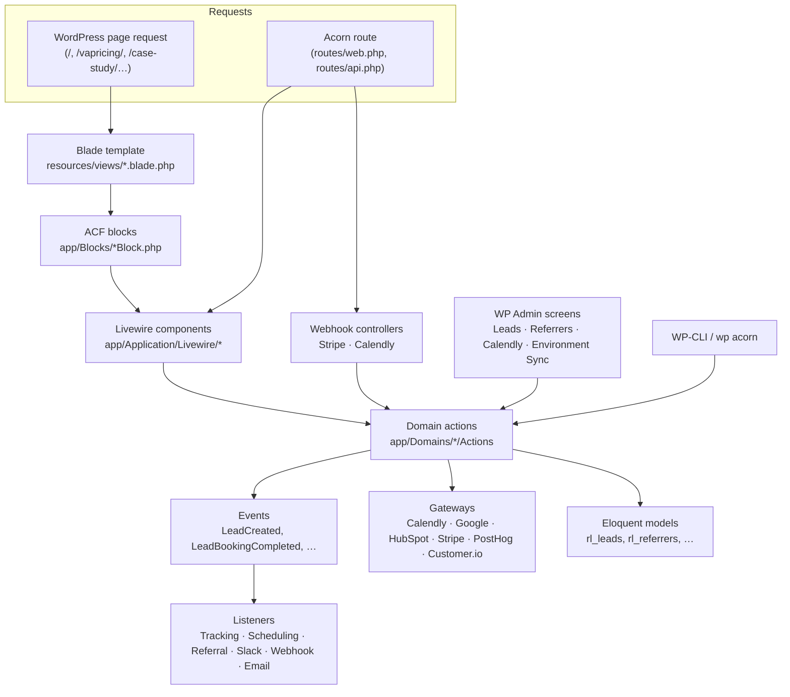

# Remote Leverage v2

A ground-up rebuild of [remoteleverage.com](https://remoteleverage.com) on **Roots Bedrock + Sage + Acorn**, replacing an Elementor site and eight bespoke plugins with one version-controlled WordPress application.

This repository *is* the new platform, and it **is** live: `remoteleverage.com` serves this theme as of 2026-09-17, verified by probing the origin (the REST index registers the `mcp` and `wp-abilities/v1` namespaces, which the old Elementor stack had no way to expose). [Replacing production](#replacing-production) below still describes the pre-cutover state and has not been re-verified since — treat its statuses as historical until someone re-audits them.

> **Status of this document.** Verified against the code and the local database on **2026-09-15**. Production-side counts come from the audit in [`docs/content-migration-checklist.md`](web/app/themes/remote-leverage/docs/content-migration-checklist.md) (2026-09-10), which counted **233** published pages; [`PAGE-MIGRATION-STATUS.md`](PAGE-MIGRATION-STATUS.md) says **235** as of 2026-09-15. The two-page gap has not been chased and does not affect scope — both agree on the 44 production URLs being migrated. Everything describing *local* state was re-queried directly (54 published pages + 1 draft, 56 blocks, 102 patterns, 774 passing tests, 198 redirect entries).

---

## Table of contents

- [What this is](#what-this-is)
- [Stack](#stack)
- [Repository layout](#repository-layout)
- [Quick start](#quick-start)
- [How it fits together](#how-it-fits-together)
- [The eight domains](#the-eight-domains)
- [Replacing production](#replacing-production)
- [Editing the site with Claude](#editing-the-site-with-claude)
- [Documentation index](#documentation-index)
- [Known issues](#known-issues)

---

## What this is

Production today is `hello-elementor` + Elementor Pro + eight in-house plugins (`rl-elementor-blocks`, `rl-referral-program`, `rl-customer-io`, `rl-partners-hub`, `rl-join-live-call`, `rl-posthog-feature-flags`, `rl-social-kit`, `rl-content-auditor`). Business logic lives in procedural hooks, each plugin talks to its own tables, and layout changes require the page builder.

v2 folds all of it into a single Sage theme with an Acorn (Laravel) container inside it:

- **Business logic** lives in eight bounded contexts under `app/Domains/`, each with its own actions, DTOs, events, models and gateways.
- **Content** is native Gutenberg — 56 code-first ACF blocks with Blade views, composed into 102 block patterns (plus 11 shared partials in `resources/patterns/`).
- **Interactive funnels** (booking wizard, live-call button, referrer portal, partner directory) are Livewire 4 components, not iframes or shortcodes.
- **Schema** is version-controlled Acorn migrations, applied automatically on deploy.
- **Everything is tested** — 774 Pest tests, 3677 assertions, green as of this writing, gated in CI on every PR.

## Stack

| Layer | Technology | Version | Notes |
| :--- | :--- | :--- | :--- |
| WordPress stack | Roots Bedrock | — | 12-factor layout, `.env` config, Composer-managed core |
| WordPress core | `roots/wordpress` | 7.1 | Abilities API (6.9+) is relied on by the sync/AI features |
| Theme | Roots Sage | 10.x | `web/app/themes/remote-leverage` |
| App container | Roots Acorn | ^6.0 | Laravel service container, Eloquent, events, Artisan inside WP |
| Reactive UI | Livewire | ^4.4 | 6 components |
| Blocks | Log1x ACF Composer | ^3.4 | 56 code-first blocks |
| Fields | ACF Pro | * | Licensed; `ACF_PRO_KEY` required to `composer install` |
| Styling | Tailwind CSS | ^4.0 | `@theme` tokens in `resources/css/app.css` |
| Build | Vite | ^8.0 | `@roots/vite-plugin` |
| Tests | Pest | ^5.1 | 774 tests |
| Lint | Laravel Pint | ^1.20 | `pint.json` at repo root |
| AI / MCP | `roots/acorn-ai`, `WordPress/mcp-adapter` | ^0.1.2 / ^0.6.1 | Abilities API–backed |
| Monitoring | Sentry Laravel | ^4.27 | Config present; **DSN not set in `.env`** — a cutover gate |
| Phone parsing | libphonenumber-for-php | ^9.0 | E.164 normalisation |

PHP **8.3+** (CI runs 8.4), Node **20.19+ / 22.12+**.

## Repository layout

```
remoteleverage-v2/
├── .github/workflows/          ci.yml (Pint + Pest + Vite build), deploy-staging.yml (ECR → ECS)
├── config/                     Bedrock environment config
├── doc/adr/                    ADR 0001–0008 — the decisions this build rests on
├── docker/                     entrypoint.sh, nginx.conf, php.ini, www.conf
├── scripts/                    seed-staging-secrets.sh (local .env → AWS Secrets Manager)
├── Dockerfile                  PHP-FPM + nginx image used by staging and docker-compose
├── docker-compose.yml          Local preview of the staging image (MySQL + Redis + app)
├── PAGE-MIGRATION-STATUS.md    Source of truth for migration scope and per-URL state
└── web/app/themes/remote-leverage/
    ├── app/                    240 PHP files — the application (see below)
    ├── config/                 services, redirects, post-types, rl-sync, ai, sentry
    ├── docs/                   ← all project documentation lives here
    ├── patterns/               102 Gutenberg block patterns
    ├── resources/              css, js, views (Blade), fonts, images
    ├── routes/                 web.php, api.php (Acorn routes, not WP rewrites)
    └── tests/                  Pest suite (Unit + Feature)
```

Inside the theme's `app/`:

```
app/
├── Ai/                 MCP-callable landing-page abilities + LandingPageComposer
├── Application/        Livewire components, HTTP controllers, middleware
├── Blocks/             56 ACF Composer block definitions
├── Domains/            ← business logic: 8 bounded contexts
├── Fields/             ACF field groups (PartnerHubFields)
├── Infrastructure/     Providers, migrations, console commands, WP admin & hooks
├── Support/            BlockDefaults, MediaLibrary, DocumentOutline, PageChrome, PageRobots,
│                    ResponsiveImage, CaseStudySubnav, HeaderMode, SocialKit, Pattern, ReadingTime
└── View/               Blade composers, nav walkers
```

## Quick start

```bash
# 1. Dependencies (ACF Pro is licensed — you need ACF_PRO_KEY in auth.json)
composer install
cd web/app/themes/remote-leverage && composer install && npm install

# 2. Environment
cp .env.example .env      # at the repo root; fill DB_*, WP_HOME, salts, APP_KEY, ACF_PRO_KEY

# 3. Schema
wp acorn migrate

# 4. Dev server (from the theme directory)
npm run dev               # Vite + HMR
npm run build             # production assets
```

Or run the staging image locally:

```bash
docker compose --env-file env up --build   # http://127.0.0.1:8080
```

Full detail, including the WP-CLI command inventory: [`docs/local-development.md`](web/app/themes/remote-leverage/docs/local-development.md).

## How it fits together

Acorn boots inside WordPress, so there are two request paths and they behave differently — this trips people up more than anything else in the codebase.



Two things worth knowing up front:

1. **WordPress pages do not pass through Acorn's HTTP kernel.** Anything that needs to run on a normal page load (the legacy 301 map, HTTPS redirect) hooks `template_redirect` in `app/setup.php` rather than being registered as Laravel middleware.
2. **Event listeners are synchronous.** No listener implements `ShouldQueue` and no queue worker is deployed — a deliberate decision recorded in ADR-0008 and [`docs/adr-status.md`](web/app/themes/remote-leverage/docs/adr-status.md). A slow HubSpot or Slack call is inside the user's request.

Deeper: [`docs/architecture.md`](web/app/themes/remote-leverage/docs/architecture.md).

## The eight domains

Each has its own document with the classes, the data it owns, the wiring and how to exercise it.

| Domain | Replaces | Owns | Doc |
| :--- | :--- | :--- | :--- |
| **Lead** | Gravity Forms + `GF_HubSpot` | `rl_leads`, `rl_lead_activity_logs`; capture, validation, attribution stamping, dual-write audit log, retention purge | [lead.md](web/app/themes/remote-leverage/docs/domains/lead.md) |
| **Scheduling** | Calendly embeds, `rl-join-live-call` | Calendly token pool + event-type routing, Google Meet creation, booking retry, `rl_live_call_sessions` | [scheduling.md](web/app/themes/remote-leverage/docs/domains/scheduling.md) |
| **Tracking** | `rl-customer-io`, `rl-posthog-feature-flags` | Dual dispatch to PostHog + Customer.io, server-side flag evaluation, script injection | [tracking.md](web/app/themes/remote-leverage/docs/domains/tracking.md) |
| **Referral** | `rl-referral-program` | `rl_referrers`, `rl_referrals`, `rl_referral_clicks`, `rl_referral_rewards`, `rl_payouts`; attribution cookie, Stripe Connect payouts | [referral.md](web/app/themes/remote-leverage/docs/domains/referral.md) |
| **PartnerHub** | `rl-partners-hub` | `rl_partner` CPT, 9-tab co-branded hubs, CPT-backed directory | [partner-hub.md](web/app/themes/remote-leverage/docs/domains/partner-hub.md) |
| **ContentAudit** | `rl-content-auditor` | Elementor AST audit/conversion, blog import, Yoast meta import, block-inventory generation | [content-audit.md](web/app/themes/remote-leverage/docs/domains/content-audit.md) |
| **Payment** | `rl-elementor-blocks` (Stripe half) | Stripe deposit/checkout gateway, PaymentIntent endpoint, checkout funnel telemetry | [stripe-payments.md](web/app/themes/remote-leverage/docs/stripe-payments.md) |
| **Sync** | *(new)* | Environment-to-environment dataset transfer over the Abilities REST API | [sync.md](web/app/themes/remote-leverage/docs/domains/sync.md) |

`rl-elementor-blocks` is replaced by the block/pattern library rather than by a domain — see [`docs/design-system.md`](web/app/themes/remote-leverage/docs/design-system.md).

---

## Replacing production

The engineering is largely done. **The cutover is blocked on content, not on code.**

> **Migration scope was closed on 2026-09-14.** A 44-URL transfer list, plus `/hire-va-4/` and
> the 4 partner-hub URLs, is the **entire** migration — 48 URLs. The other 191 published pages on
> production are **discarded**: not deferred, not "phase 2". They need a redirect-or-drop decision
> at cutover, not a migration plan. Source of truth:
> [`PAGE-MIGRATION-STATUS.md`](PAGE-MIGRATION-STATUS.md).

```mermaid
flowchart LR
    subgraph PROD["Production today — remoteleverage.com"]
        P1["Elementor + hello-elementor"]
        P2["8 bespoke plugins"]
        P3["235 pages · 119 posts · 2 partners"]
        P4["Yoast SEO Premium"]
    end

    subgraph V2["v2 — this repo"]
        direction TB
        V1["✅ Platform<br/>Bedrock · Sage · Acorn · 774 tests green"]
        V2b["✅ 8 domains<br/>all 8 plugins ported"]
        V3["✅ Design system<br/>56 blocks · 102 patterns"]
        V4["✅ CI + staging deploy<br/>GitHub Actions → ECR → ECS"]
        V5["✅ Content<br/>54 of 54 in-scope URLs built<br/>119 posts + 23 case studies done"]
        V6["🟡 SEO parity<br/>meta imported · 198 redirects<br/>OG image URLs still on production<br/>not yet run on staging"]
        V7["🔴 Cutover ops<br/>owned elsewhere<br/>perf measured locally, not on staging"]
    end

    PROD -.->|"must carry over"| V2
    V2 ==>|"blocked by 🟡 + 🔴"| GO["DNS flip"]

    style V1 fill:#d1fae5,stroke:#059669,color:#064e3b
    style V2b fill:#d1fae5,stroke:#059669,color:#064e3b
    style V3 fill:#d1fae5,stroke:#059669,color:#064e3b
    style V4 fill:#d1fae5,stroke:#059669,color:#064e3b
    style V5 fill:#fef3c7,stroke:#d97706,color:#78350f
    style V6 fill:#fef3c7,stroke:#d97706,color:#78350f
    style V7 fill:#fee2e2,stroke:#dc2626,color:#7f1d1d
    style GO fill:#e0e7ff,stroke:#4f46e5,color:#312e81
```



### Where each workstream stands

| Workstream | State | What remains |
| :--- | :--- | :--- |
| Platform & infrastructure | ✅ Done | — |
| Domain logic (8 plugins → 8 contexts) | ✅ Done | Real-time live-call availability is a cache flag, not a calendar (WR-104, on hold) |
| Block & pattern library | ✅ Done | Case-study sub-nav tab bar built 2026-09-15 (0.00% pixel diff vs production at 1440px and 400px) |
| Test suite + CI | ✅ Done | No visual-regression suite (WR-103, deliberately not built) |
| Staging deploy pipeline | ✅ Done | Production target does not exist yet |
| Environment sync | ✅ Done | Production is gated off by design, in four independent places |
| **In-scope URLs** | ✅ 54 of 54 built | Every priority cleared (P0–P4), plus 5 pages added by the non-indexed sweep and `/hire-va/` added by client direction. One page, `/virtual-assistant-hiring-manager-refundable-deposit/`, is visually complete but **cannot take a payment** until Stripe credentials and `STRIPE_DEFAULT_THANKYOU_URL` are set per environment. See [`PAGE-MIGRATION-STATUS.md`](PAGE-MIGRATION-STATUS.md) for the live count |
| **Case studies** | ✅ 23 of 23 | Migrated to a real `case_study` CPT |
| **Blog posts** | ✅ 119 of 119 | Imported clean; category counts match production |
| **Taxonomies** | ✅ 7 of 7 categories, 8 of 8 tags | `Live Sessions` shows 2 on production and 0 locally, but **nothing was dropped**: both items are `post_type=page`, not posts — production registers `category` on pages and a term count is not post-type-scoped. Verified 2026-09-15 |
| **Media** | ✅ Out of scope | **Production's media library is not being ported** (decided 2026-09-15). No reconciliation against production is planned; local art is sourced from `resources/images/pages/` and built by the `themeImages()` Vite plugin |
| **Partners** | ✅ 3 of 3 | Rebuilt CPT-backed 2026-09-15; content seeded from `resources/partners/partners.php` (in git). Three gaps remain that only the partners can fill: intake forms for Lexgo and Lano, a referral destination for Oyster, logos for all three |
| **SEO parity** | 🟡 Run locally, not yet on staging/production | Done 2026-09-15: `robots.txt`, real 404s, non-production `noindex`, **Yoast 28.5 active and configured**, `/blog/` settled as the canonical archive, Yoast's `/sitemap_index.xml` chosen over core's, **`content:import-seo` run for real — 190 items, 863 postmeta rows**, and a **198-entry redirect map** with every target verified 200. Remaining: re-point `company_logo` and 171 OpenGraph image URLs off production, and repeat the import and the Yoast config on staging and production |
| **Elementor retirement gate** | ✅ Met | Zero local posts carry `_elementor_data`. Nothing carries `_rl_conversion_status` either, and by recorded decision nothing will — the `content:import-posts` path made the review queue unnecessary ([cutover-decisions.md §11](web/app/themes/remote-leverage/docs/cutover-decisions.md)) |
| **Performance baseline** | 🟡 Targets partly met | [performance-baseline.md](web/app/themes/remote-leverage/docs/performance-baseline.md). After the 2026-09-15 font and image work: `/`, `/case-study/`, `/blog/` and blog posts all score **99–100** mobile (from 60–93), and the heaviest post fell **3.27MB → 0.59MB**. **LCP < 1.2s still passes on nothing** — best is 1.54s. Staging numbers, which is what the gate actually asks for, not yet taken |
| **Production cutover** | 🔴 Not started | **Owned elsewhere** (2026-09-15) — the production deploy pipeline, DNS runbook and rollback plan are being handled outside this workstream |

### What actually remains

**All 54 in-scope URLs are built** (verified against the local database on 2026-09-15). The three
business decisions that used to block ~107 pages — paid-traffic experiments, operational funnel
pages, the role/industry template question — were dissolved by scope closure: none of those sets is
being migrated. Every open decision was answered on 2026-09-15 and is recorded in
[`docs/cutover-decisions.md`](web/app/themes/remote-leverage/docs/cutover-decisions.md).

What is left is not page building. In rough order of cost to leave undone:

1. **Secrets that silently break paying customers.** `STRIPE_WEBHOOK_SECRET` and
   `CALENDLY_WEBHOOK_SIGNING_KEY` are empty everywhere and both endpoints now fail closed;
   `STRIPE_DEFAULT_THANKYOU_URL` is unset, so the deposit page emits an empty `success-url`.
   `/virtual-assistant-hiring-manager-refundable-deposit/` is visually complete but **cannot take a
   payment** until the Stripe credentials move off `rl-elementor-blocks` —
   see [`docs/stripe-payments.md`](web/app/themes/remote-leverage/docs/stripe-payments.md).
2. **Four Calendly redirect targets and the Stripe success URL** are configured outside WordPress
   and still point at `remoteleverage.com`.
3. **SEO leftovers:** `company_logo` and 171 OpenGraph image URLs still resolve against production;
   the Yoast configuration and `content:import-seo` have to be repeated on staging and production.
4. **Performance on staging.** Mobile scores are 99–100 locally and CLS is met, but **LCP < 1.2s
   passes on nothing** (best 1.54s), and the gate asks for staging numbers, which have not been taken.
5. **Sentry has no DSN; every `MAIL_*` value is empty.**
6. **Production infrastructure, DNS runbook and rollback plan** — owned outside this workstream as
   of 2026-09-15, and still a hard gate.

The four pages built before scope closed are all settled: `/vapricing/`, `/affiliate-program/` and
`/comparison-wing-assistant-ads/` are **kept** (decision 13 — note `/vapricing/` is VA role pricing,
not Contractor-of-Record pricing), and `/referral/` is **deleted** (decision 12), with
`'referral' => ''` now in `config/redirects.php`.

Per-URL status, the out-of-scope inventory and the open decisions: [`PAGE-MIGRATION-STATUS.md`](PAGE-MIGRATION-STATUS.md).

Full plan, per-page inventory and sequencing: [`docs/production-cutover.md`](web/app/themes/remote-leverage/docs/production-cutover.md).

---

## Editing the site with Claude

The marketing team edits live landing pages, reads enquiry data and uploads media by asking Claude,
without opening WordPress and without a deploy. This works from **claude.ai, Claude Desktop and
mobile** — any Claude, not just Claude Code — over MCP.

Full setup, both halves: [**connecting-claude-to-production.md**](web/app/themes/remote-leverage/docs/connecting-claude-to-production.md).

**What it exposes.** Ten abilities on the default MCP server, each permission-gated by its own
`permission()` method:

| Group | Abilities |
| :--- | :--- |
| Read | `list-pages`, `describe-page`, `list-patterns` |
| Write | `clone-page`, `update-page-sections`, `create-landing-page`, `update-landing-page-content` |
| Media | `upload-media` |
| Enquiries | `lead-stats`, `query-leads` |

**The identity.** A dedicated `ai-content-agent` WordPress user, provisioned and reconciled by
`ContentAgentProvisioner::ensure()` on every container start — never by hand. Deploy reconciles but
**never mints a credential**, because deploy output goes to CloudWatch and a password printed there
is a password leaked. `wp acorn rl:ai:agent --rotate` is the only thing that issues one.

**Everything is off by default.** All four capability flags default to `false`, so an environment
that sets nothing gets an agent that can draft a page and nothing else:

| Variable | Grants |
| :--- | :--- |
| `AI_AGENT_CAN_PUBLISH` | `publish_pages` — may publish a cloned page directly |
| `AI_AGENT_CAN_EDIT_PUBLISHED` | `edit_published_pages` — may change a page that is already live |
| `AI_AGENT_CAN_READ_LEADS` | `rl_read_business_data` — `lead-stats` and `query-leads` |
| `AI_AGENT_CAN_UPLOAD_MEDIA` | `upload_files` — `upload-media` |

Because `ensure()` runs every deploy, these **tighten as well as widen** — removing a flag revokes
the capability on the next release rather than leaving a stale grant behind.

**Connecting a client.** Three routes, detailed in the doc. A claude.ai custom connector using
`Authorization: Basic` under the Request-headers beta needs nobody to install anything but is gated
per organisation; Claude Desktop with the `@automattic/mcp-wordpress-remote` STDIO proxy always
works; and this repo's `.mcp.json` wires Claude Code from `PRODUCTION_MCP_APP_PASSWORD`.

**Two things to know before granting production access.** Edits to a published page are live the
moment they return, with no review step. And because most pages are a single `wp:pattern`
reference, the first edit **detaches the page from its `patterns/<slug>.php` file in git** and
leaves it as database-resident markup, which the next refresh overwrites — the ability returns a
`detached_from_patterns` warning naming the file, and that warning is a task, not a notification.

---

## Documentation index

Everything lives under [`web/app/themes/remote-leverage/docs/`](web/app/themes/remote-leverage/docs/) — start at its [README](web/app/themes/remote-leverage/docs/README.md).

| Area | Document |
| :--- | :--- |
| Application architecture, boot order, request paths | [architecture.md](web/app/themes/remote-leverage/docs/architecture.md) |
| Local setup, CLI inventory, testing | [local-development.md](web/app/themes/remote-leverage/docs/local-development.md) |
| Docker image, CI, ECS deploy, post-deploy tasks | [deployment.md](web/app/themes/remote-leverage/docs/deployment.md) |
| Verified environment-variable reference | [configuration.md](web/app/themes/remote-leverage/docs/configuration.md) |
| Tokens, blocks, patterns, templates | [design-system.md](web/app/themes/remote-leverage/docs/design-system.md) |
| WP Admin surfaces this theme adds | [admin-screens.md](web/app/themes/remote-leverage/docs/admin-screens.md) |
| **Connecting Claude to production (marketing)** | [**connecting-claude-to-production.md**](web/app/themes/remote-leverage/docs/connecting-claude-to-production.md) |
| MCP abilities, agent users, local↔remote sync | [ai-mcp-and-sync.md](web/app/themes/remote-leverage/docs/ai-mcp-and-sync.md) |
| Claude Desktop guide for non-technical editors | [claude-desktop-for-editors.md](web/app/themes/remote-leverage/docs/claude-desktop-for-editors.md) |
| **Migration scope & per-URL status** | [**PAGE-MIGRATION-STATUS.md**](PAGE-MIGRATION-STATUS.md) |
| Cutover plan & content inventory | [production-cutover.md](web/app/themes/remote-leverage/docs/production-cutover.md) |
| Domain guides (8) | [domains/](web/app/themes/remote-leverage/docs/domains/) |
| Bugs, dead config, stale docs | [known-issues.md](web/app/themes/remote-leverage/docs/known-issues.md) |
| Architecture decisions | [`doc/adr/`](doc/adr/) 0001–0008 |

## Known issues

A short list of things that are wrong right now and are worth knowing before you touch the code. Detail and proposed fixes in [`docs/known-issues.md`](web/app/themes/remote-leverage/docs/known-issues.md).

- **Both webhook endpoints now fail closed, and neither secret is set.** As of 2026-09-15 `/api/webhooks/stripe` and `/api/webhooks/calendly` return **503** with no signing secret configured, rather than processing unverified payloads. `STRIPE_WEBHOOK_SECRET` and `CALENDLY_WEBHOOK_SIGNING_KEY` are empty in every environment, so **both endpoints are dark until someone sets them** — Stripe Connect payout events included. Set them before this reaches staging.
- **Sentry is configured but has no DSN**, so nothing is reported.
- **`/referral/` was deleted (2026-09-15).** It held the wrong content — the `hire-va-4` landing page, where production's `/referral/` is a homepage variant. Out of scope, so the call was delete, not rework. Page 213 is trashed and recoverable; nothing linked to it. `'referral' => ''` is in `config/redirects.php`, so the live production URL will not 404 at cutover.
- **`/robots.txt` and `/favicon.ico` report 404 locally** while serving correct content. A Herd/nginx artifact affecting only those two filenames; production returns 200. Do not chase it.

**Fixed on 2026-09-14** (kept here briefly because they changed behaviour you may remember differently):

- ~~`/partner-dashboard` throws~~ — the route, the redirect map and both partner-directory links now point at the real `referrer.portal` / `referrer.register`.
- ~~Every unknown URL served the homepage with a 200~~ — caused by WordPress's verbose page rules silently emptying the query. Unresolved paths now return a real 404.
- ~~Every environment forced itself to be indexable~~ — the theme override was removed entirely, so `DISALLOW_INDEXING` works again and non-production emits `noindex`.
- ~~`PAGE-MIGRATION-STATUS.md` contradicts the migration checklist~~ — it was rewritten against the live database and is now the source of truth for migration scope; the checklist was demoted to a read-only production inventory.

---

Maintained by the Remote Leverage engineering team. Built on Roots Sage (MIT); domain logic and brand assets are proprietary.
