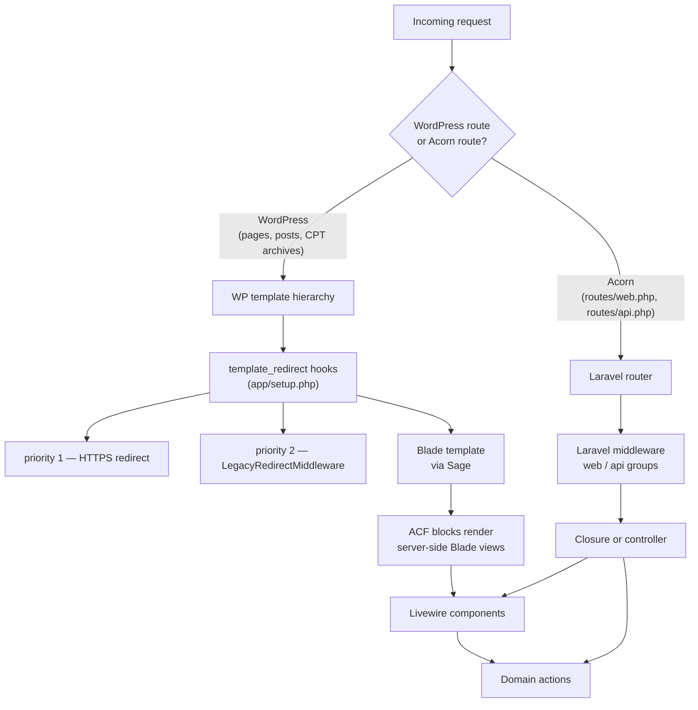
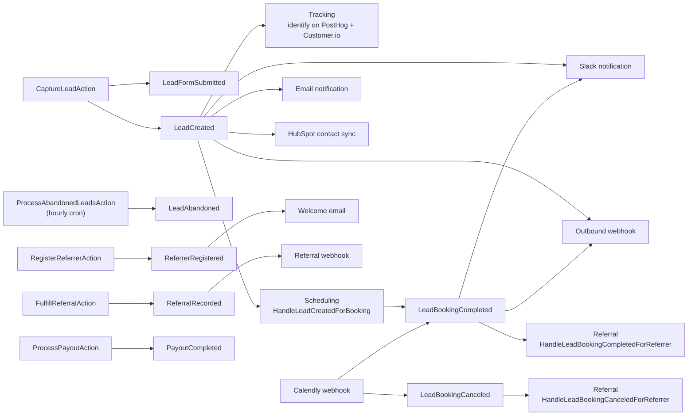

# Architecture

How the application is put together: what boots when, the two request paths, how domains talk to each other, and where the data lives.

Verified against the code on 2026-09-14.

---

## 1. Boot order

There is no separate application — Acorn boots *inside* WordPress, from the theme's `functions.php`.

```
WordPress loads the theme
  └─ functions.php
      ├─ require vendor/autoload.php
      ├─ Application::configure()->withProviders([ThemeServiceProvider::class])->boot()
      │    └─ ThemeServiceProvider::register()
      │         └─ DomainServiceProvider::register()
      │              ├─ registers 9 providers (below)
      │              ├─ binds 9 singletons (CPTs + admin screens)
      │              └─ registers RunDeployTasksCommand (console only)
      │         DomainServiceProvider::boot()
      │              ├─ loadMigrationsFrom(app/Infrastructure/Database/Migrations)
      │              └─ ->register() on every CPT and admin screen
      └─ includes app/setup.php and app/filters.php  (plain WordPress hooks)
```

### The nine domain providers

Registered in order by `DomainServiceProvider::$providers`:

| Provider | Responsibility |
| :--- | :--- |
| `ReferralServiceProvider` | Binds `ReferrerRepositoryInterface` → Eloquent; listens for `ReferrerRegistered`, `ReferralRecorded`; registers `ReferralAttributionMiddleware` |
| `SchedulingServiceProvider` | Calendly/Google gateways; `LeadCreated` → `HandleLeadCreatedForBooking`; three WP-Cron hooks (cache warm, question refresh, booking retry) |
| `TrackingServiceProvider` | PostHog + Customer.io clients; `LeadCreated` → tracking identify; `TrackingHooks` script injection |
| `LeadServiceProvider` | The event hub — nine `Event::listen` registrations plus the hourly abandoned-lead cron |
| `ContentAuditServiceProvider` | Elementor audit/convert services and their commands |
| `LivewireServiceProvider` | Component namespace, view path, and 14 component aliases (7 components × 2 names) |
| `RouteServiceProvider` | Loads `routes/web.php` (web middleware) and `routes/api.php` (api middleware, `/api` prefix) |
| `SyncServiceProvider` | Sync abilities, commands, `EnvironmentSyncAdmin` |
| `AiServiceProvider` | MCP landing-page abilities |

`ThemeServiceProvider` itself also registers Sage's Blade view composers (`app/View/Composers`).

## 2. Two request paths

This is the single most important thing to understand about the codebase.



**WordPress page requests never pass through Laravel middleware.** That is why:

- The legacy 301 map is applied by calling `LegacyRedirectMiddleware::handle()` from a `template_redirect` hook in `app/setup.php`, not by registering it in a middleware group.
- `ReferralAttributionMiddleware` is registered in `ReferralServiceProvider`, but only affects Acorn-routed requests; the cookie is also set on ordinary page loads through the same hook pattern.

Acorn routes (`routes/web.php`) are genuinely separate application pages: `/book-consultation`, `/live-call/connect`, `/referrer-portal`, `/referrer-register`, `/referral-dashboard`, `/social-media-kit`. Webhooks live at `/api/webhooks/stripe` and `/api/webhooks/calendly`, with `/api/health` for load-balancer checks.

## 3. Layering

```
Application/            ← delivery: what a user or an external system touches
├── Livewire/           7 components — hold UI state, call domain actions
├── Http/Controllers/   2 webhook controllers
└── Http/Middleware/    attribution, legacy redirects, PostHog redirects

Domains/<Context>/      ← the business logic, framework-light
├── Actions/            one public method, the unit of work
├── Data/               readonly DTOs crossing the boundary
├── Events/             past-tense facts
├── Listeners/          cross-domain reactions
├── Models/             Eloquent, on rl_* tables
├── Services/           stateful helpers and policy
├── Gateways/           HTTP clients for third parties
└── Commands/           WP-CLI entry points

Infrastructure/         ← the WordPress and framework edges
├── Providers/          wiring
├── Database/Migrations 12 migrations
├── WordPress/Admin/    10 admin classes
├── WordPress/PostTypes rl_partner, case_study
├── WordPress/Hooks/    TrackingHooks
└── Console/Commands/   rl:deploy
```

**The rule that holds it together:** domains never reference each other's classes directly. They communicate through events. `Scheduling` learns about a new lead because it listens for `Lead`'s `LeadCreated`, not because it imports `CaptureLeadAction`.

## 4. The event graph

Every cross-domain interaction goes through here. Listeners are wired in the providers, mostly as closures in `LeadServiceProvider`.



### Listeners are synchronous

No listener implements `ShouldQueue`, and no queue worker is deployed (WR-106, on hold). ADR-0008's open transport question was resolved as "synchronous subscriber" to match.

The consequence is real and worth stating plainly: a lead submission makes outbound HTTP calls to HubSpot, Slack, PostHog, Customer.io and the configured webhook **inside the user's request**. If one of those is slow, the booking wizard is slow. Each gateway is individually defensive, but the latency is additive.

### The dual-write audit contract

Every event participant writes twice to `rl_lead_activity_logs`, via `LeadActivityLogger`:

- **Stage 1 — dispatch** (`dispatch_initiated`): the dispatcher records that it fired, with the payload.
- **Stage 2 — consumption** (`consumed_by_tracking`, `consumed_by_crm`, `consumed_by_webhook`, …): each listener records that it ran, and with what outcome.

A Stage 1 row without its matching Stage 2 row is how you find a listener that silently failed. The Leads admin renders both as a timeline — see [admin-screens.md](admin-screens.md).

## 5. Data

### Custom tables (12 migrations, `app/Infrastructure/Database/Migrations`)

| Table | Domain | Created |
| :--- | :--- | :--- |
| `rl_referral_clicks` | Referral | 2026-09-01 |
| `rl_referrals` | Referral | 2026-09-01 |
| `rl_referral_rewards` | Referral | 2026-09-01 |
| `rl_live_call_sessions` | Scheduling | 2026-09-01 |
| `rl_leads` | Lead | 2026-09-07 |
| `rl_lead_activity_logs` | Lead | 2026-09-07 |
| `rl_referrers` | Referral | 2026-09-09 |
| `rl_payouts` | Referral | 2026-09-09 |

Plus four alter migrations: tracking columns and a fulltext/search index on leads, `referrer_id` on the referral tables, and booking-retry columns on leads.

All use the WordPress table prefix (so `wp_rl_leads` on a default install). Migrations run through `wp acorn migrate`, and automatically on container start via `wp acorn rl:deploy` — see [deployment.md](deployment.md).

### Post types

| Type | Registered by | Route |
| :--- | :--- | :--- |
| `rl_partner` | `PartnerPostType` | `/partners/{slug}/{tab}/` via custom rewrite + `rl_tab` query var |
| `case_study` | `CaseStudyPostType` | `/case-study/` archive + `/case-study/{slug}/` |

Configured in `config/post-types.php`.

### Options

Stateful configuration that is not in `.env` lives in `wp_options`, each behind a service:

| Option key | Owner |
| :--- | :--- |
| `rl_lead_settings` | `LeadSettingsService` |
| `rl_referral_settings` | `ReferralSettingsService` |
| `rl_calendly_token_pool` | `CalendlyTokenPool` |
| `rl_calendly_event_type_roles` | `CalendlyEventTypeRoleResolver` |
| `rl_calendly_event_types_backup` | `CalendlyEventTypeDiscoveryService` |
| `rl_lead_webhook_url`, `rl_slack_webhook_url`, `rl_jlc_slack_webhook_url`, `rl_custom_webhook_url` | admin screens |

The list in `config/rl-sync.php` is exactly the set the sync feature is allowed to move between environments — deliberately a whitelist, never a full options dump.

## 6. Scheduled work

WP-Cron, registered in the providers. There is no queue worker and no system cron beyond WordPress's own.

| Hook | Schedule | Does |
| :--- | :--- | :--- |
| `rl_process_abandoned_leads` | hourly | `ProcessAbandonedLeadsAction` — marks stalled leads abandoned |
| `rl_calendly_warm_cache_cron` | twice daily | `WarmCalendlyMetadataCacheAction` |
| `rl_calendly_refresh_questions` | single event | Refresh one event type's questions |
| `rl_calendly_retry_booking` | single event | `RetryFailedBookingAction`, with backoff |

## 7. Front-end

- **Tailwind v4**, tokens declared with `@theme` in `resources/css/app.css`. No `tailwind.config.js`.
- **Vite 8** via `@roots/vite-plugin`; `resources/js/app.js` and `editor.js` are the entry points.
- **Alpine.js** for local interactivity (accordions, tickers, video modals) — it ships with Livewire, not as a separate dependency.
- **Livewire's script tag is deferred and lazily cloned.** `resources/js/app.js` clones `livewire.min.js` from a `<template id="rl-livewire-scripts">` when a Livewire island approaches the viewport; `defer` is the fallback. This is why Livewire does not cost anything on pages that have no components.
- Core block library CSS (`wp-block-library`, `classic-theme-styles`, `global-styles`) is dequeued on the front end, and `should_load_separate_core_block_assets` is forced off.

### Pages that describe their own chrome

Two page-level decisions are made by the page rather than by a template assignment or a slug list,
because page content here is a single `wp:pattern` reference and the thing being decided lives
inside the pattern. Both work by walking the pattern registry from `post_content`
(`PageChrome::contentHasMarker()`, capped at four levels of pattern reference).

| Decision | Declared by | Resolved by |
| :--- | :--- | :--- |
| Drop the site nav for a conversion page | `acf/hire-va-hero` or `acf/consult-landing-hero` in the page, **or** the marker `rl:cta-only-header` | `App\Support\PageChrome::usesCtaOnlyHeader()` → `layouts/app.blade.php` picks `sections.header-cta` over `sections.header` |
| Keep a page out of search results | the marker `rl:noindex` | `App\Support\PageRobots::filter()` on `wp_robots` (registered in `app/setup.php`) |

The marker form exists for pages whose hero is hand-written rather than a block — the P4 campaign
families in `resources/patterns/steal-campaign.php` and `va-roles-landing.php` emit
`rl:cta-only-header` inside their opening banner comment. A block-backed page needs no marker;
listing its block in `PageChrome::CTA_ONLY_HEADER_BLOCKS` is enough.

**`rl:noindex` has no visible effect locally.** Bedrock's `bedrock-disallow-indexing` mu-plugin
already noindexes every non-production environment, so a local page looks correctly excluded
whether or not the filter runs. It exists so the exclusion survives into production, where that
mu-plugin stops applying. Verify it with
`wp eval '…PageRobots::currentPageIsNoindex()'` rather than by reading the local `<meta>` tag.
It controls indexing only — a noindex page is still served to anyone holding the URL, so it is
**not** access control. Two pages use it:

- `/vastore5/` — internal sales collateral. Marker lives in `patterns/vastore5.php`, so it is in git.
- `/comparison/` (page 323) — production's own `/comparison/` was never filled in (literal `[X]`
  placeholders, "Text here Text here", a stray "NEW SECTION" label) and v2 reproduces it verbatim
  under the strict-fidelity rule. Shipped so the URL resolves, noindexed until real copy is written.
  **Caveat:** page 323 is one of the pages whose `post_content` holds expanded block markup rather
  than a pattern reference, so its marker lives in the database and will not survive a database
  refresh. Re-add it, or promote the page into a pattern, if 323 is ever rebuilt.

## 8. Testing

672 Pest tests, 2525 assertions, in `tests/Unit` and `tests/Feature` (2026-09-15). `tests/stubs.php` and `tests/bootstrap.php` provide WordPress function stubs so the suite runs with **no WordPress and no database** — which is why it is fast (~8s) and why it can gate every PR in CI.

That also bounds what it can prove: it verifies domain logic, DTOs, attribution, block/pattern grammar and sync mechanics, not real WordPress integration. There is no browser or visual-regression layer (WR-103, deliberately not built — see [adr-status.md](adr-status.md)).
