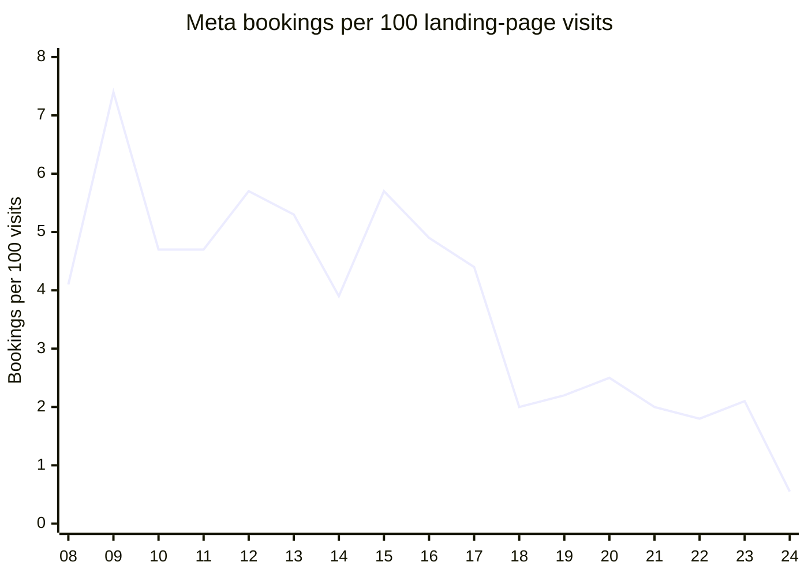
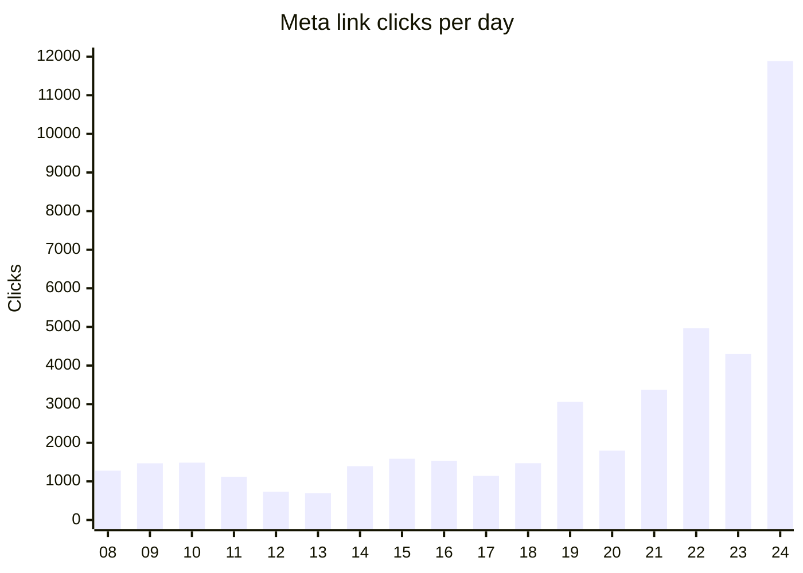
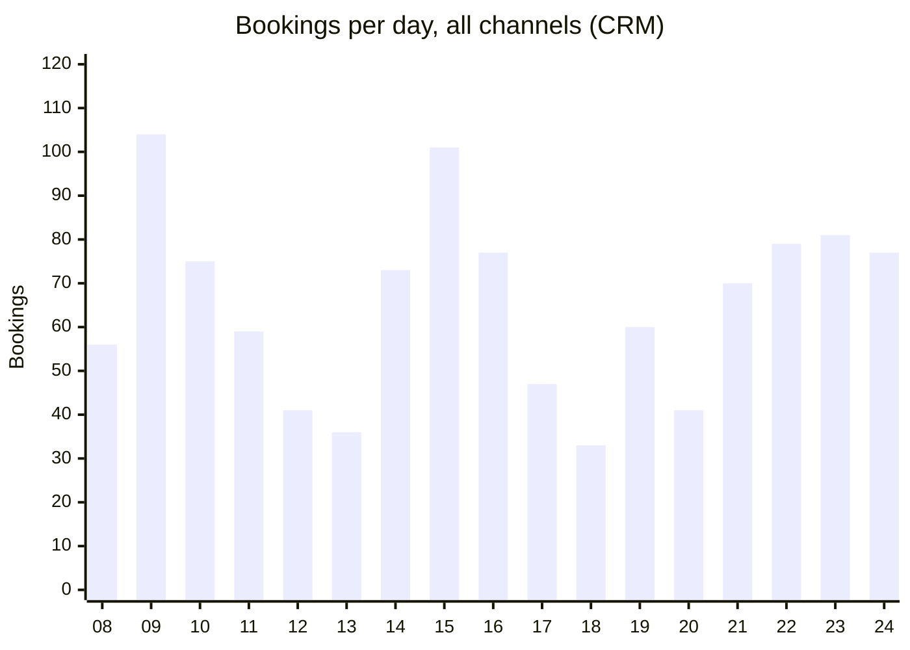
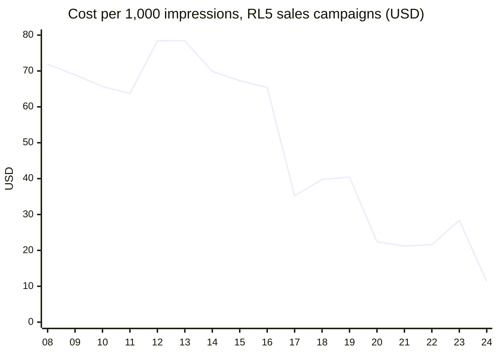
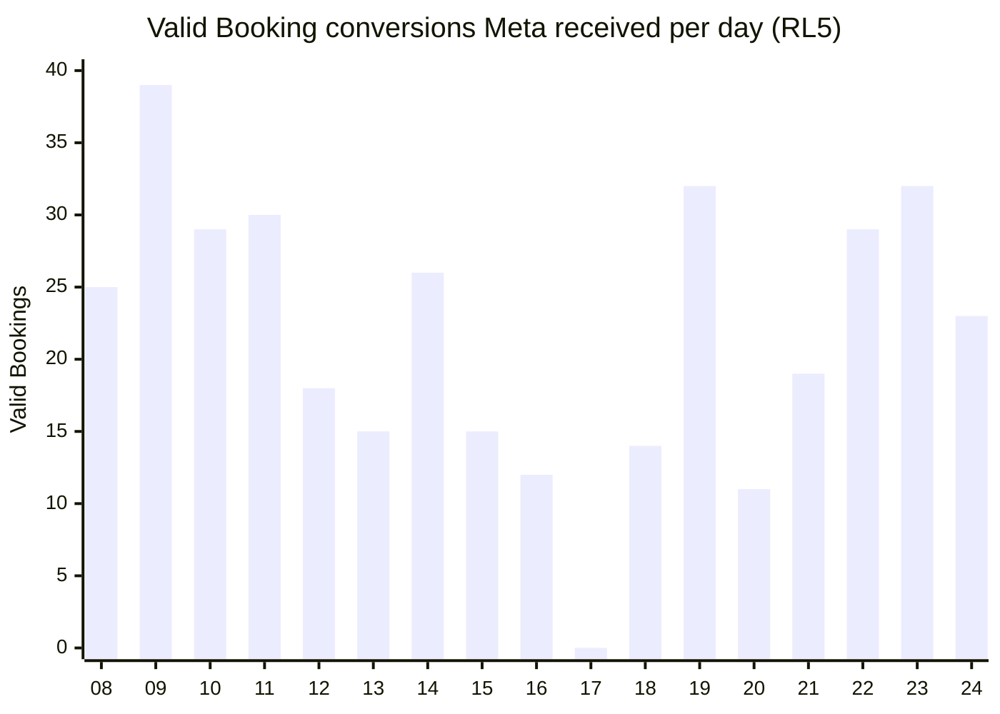
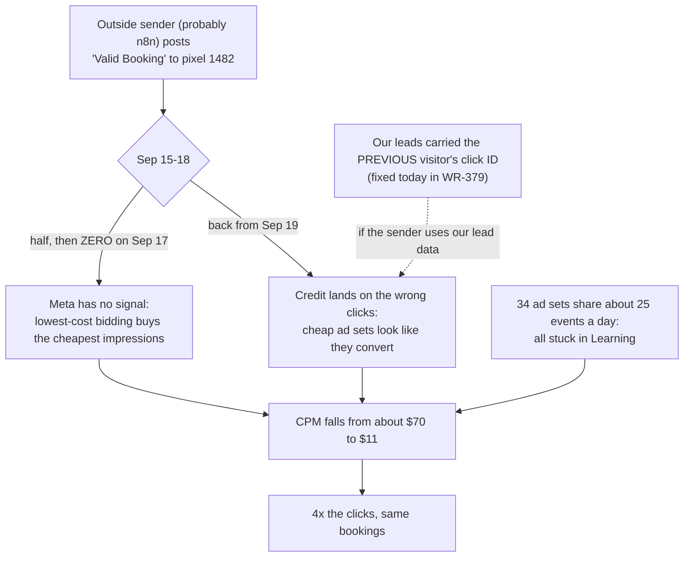
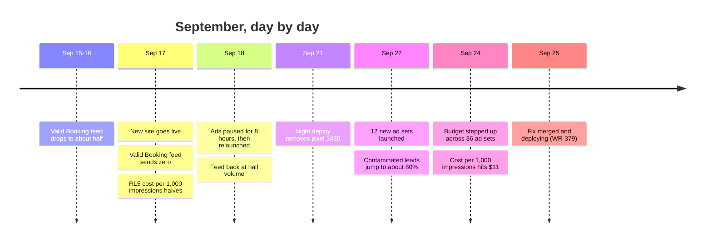

# Booking rate: what happened and what we fixed

2026-09-25, revision 3. Rebuilt from Meta's own ad and conversion data. Pixel 1430 is not the main account's pixel. The full analysis is in `booking-rate-diagnostic-2026-09-25.md`.

## The answer

- **Fewer people are booking, but only modestly.** CRM bookings are down about 5%, and unique first-time bookers are down about 12%.
- **Qualified bookings ($10k+/month) are up 13–17%.** All of the loss is from companies under $10k.
- **What collapsed is the booking *rate*.** Meta sent 4x the clicks for 14% more money, and those extra clicks almost never book.
- **Why, confirmed from Meta's own data:** every ad set optimises on one custom event, **"Valid Booking"**, on pixel 1482. A system outside the website sends it.
  - That feed failed during the cutover: **zero on Sep 17**, and half its normal volume on Sep 15, 16 and 18. With no signal, Meta's lowest-cost bidding drifted to cheap inventory.
  - When the feed came back, Meta credited it disproportionately to the cheapest-click ad sets. That kept pushing delivery cheaper.
- **Fixed today (WR-379):** every lead now carries its own visitor's click data. **Still to do:** find and harden the Valid Booking sender, and fix the account's fragile structure. See the asks in section 8.

| Meta, weekday average | Before (Sep 8–16) | After (Sep 21–24) | Change |
|---|---|---|---|
| Spend per day | $15,761 | $17,954 | +14% |
| Clicks per day | 1,457 | 6,131 | **4.2x** |
| Bookings per day | 66.8 | 63.8 | −5% |
| Bookings per 100 visits | 5.2 | 1.2 | **−76%** |
| Cost per booking | $236 | $282 | +19% |
| Cost per qualified booking | $446 | $443 | flat |

## 1. The rate collapsed

The x-axis is the day of September. The site cutover was on the 17th.

## 2. Because Meta flooded us with clicks...

## 3. ...while bookings barely moved

The dip on the 17th and 18th is the cutover itself. Ads were also paused for 8 hours on the 18th. Weekends (the 12th, 13th, 19th and 20th) are always lower.

## 4. The tell: Meta started buying the cheapest audiences

This is the price Meta paid per 1,000 impressions on our main ad account (RL5) sales campaigns. It held around $70 for weeks, then fell to $11. Flat spend buying 4x the impressions at a quarter of the price means Meta moved to cheaper people.

## 5. What Meta optimises on, and what went wrong with it

This section is read directly from Meta's API: ad set settings, the custom conversion's definition, and the change log.

| Fact | Evidence |
|---|---|
| Every active ad set in both accounts optimises for **"Valid Booking"** on pixel **1482937899395718** | 34 of 34 RL5 ad sets and 3 of 3 RL7 ad sets. `promoted_object` points either at custom conversion `1361003065662161` ("Valid Booking CC") or at the raw event. |
| Neither the old site nor the new one sends "Valid Booking" | Not in either site's code. An outside system sends it, most likely an n8n flow fed by Calendly and our lead data. |
| Pixel 1430 plays no part | The main account never registered its events |
| View-through is not a factor | 0–6 a day of the credit, both before and after. It is nearly all click-through. |
| The account is fragile | 34 ad sets share about 25 Valid Bookings a day. Each has 0–13 events, against the roughly 50 a week needed to leave learning, so all are stuck in "Learning". Bidding is lowest-cost with no cap. |
| Ad-team editing was normal | 70–175 changes a day through August and September, the same before and after the cutover |

**Two things went wrong with that signal.**

1. **It stopped.** It fell to about half on Sep 15–16, zero on Sep 17, and half again on Sep 18. Lowest-cost bidding with no signal buys the cheapest impressions available: RL5 sales CPM halved on the 17th.
2. **When it came back, the credit went to the wrong ad sets.** Real bookings are measured from each visitor's own browser:

| Ad sets, by cost per click | Meta credit per real booking, before | After |
|---|---|---|
| Cheapest third | 0.55 | **0.68** |
| Middle third | 0.58 | 0.40 |
| Priciest third | 0.46 | **0.36** |

Cheap-click ad sets now get almost twice the credit per real booking that pricey ones get. So Meta keeps buying cheaper traffic, and CPM went from about $35 to $11.

## 6. How it unfolded

## 7. What we fixed today

| Fix | Effect |
|---|---|
| **Every lead now carries its own visitor's data** | Click ID, IP and browser are re-read from the visitor's own submission, never from the cached page. This removes the one confirmed source of wrong click IDs in our data. |
| Pixel 1430 restored | Not the main account's pixel, but we keep tracking both pixels as before |
| "Add to calendar" link restored | All 1,585 links in the CRM work again, and new bookings get one. This helps show rate. |
| Booking link sent to HubSpot again | Confirmation emails and texts can include it, as they did before |

All tests pass, and the change was reviewed and merged. It is deploying as release `v-20260925-v1`.

## 8. What we need this week

1. **Whoever owns n8n: find the flow that sends "Valid Booking" to pixel 1482.** We need three things from it:
   - What changed on Sep 15–17, and why it sent nothing on the 17th. New n8n Calendly webhooks were created on Sep 10, 15 and 22.
   - Where it gets the click ID, fbp, IP and browser it sends to Meta: our lead webhook, HubSpot, or Calendly.
   - An alert for when it sends nothing for an hour during business hours.
2. **Marketing: consolidate ad sets** so each can reach about 50 Valid Bookings a week and leave learning. Freeze significant edits for 5–7 days.
3. **Marketing: consider a cost cap on the sales ad sets.** Lowest-cost with no cap is what let delivery race down to $11 CPM.
4. **Hold budget increases** until the signal has been steady for a few days.

## 9. How we'll know it worked

| Signal | Now | Target |
|---|---|---|
| Valid Bookings received per weekday (RL5) | 19–32, with a zero day on Sep 17 | Steady about 25+, never a zero day |
| Meta credit per real booking, cheapest vs priciest third | 0.68 vs 0.36 | Back to roughly even (0.55 vs 0.46 before) |
| RL5 sales cost per 1,000 impressions | $11–28 | Back toward $60–70 |
| Meta bookings per 100 visits | 0.55–2.1 | Back toward 4–5 |
| Meta cost per booking | $282 | Back toward $236 |

The first two can be checked from our warehouse daily, and we'll track them. We expect movement over 3–7 days, as the ad sets re-learn on correctly credited conversions.

## What is proven and what is not

| Status | Items |
|---|---|
| **Proven (Meta API and warehouse)** | That all ad sets optimise on "Valid Booking" (pixel 1482). The feed outage on Sep 15–18 (zero on the 17th). That credit shifted toward cheap-click ad sets. The CPM collapse. That leads carried other visitors' click IDs. The fragile structure (34 ad sets, all in Learning). That view-through is negligible. |
| **Not yet proven** | Who sends "Valid Booking", and whether it uses our lead data for click IDs. If it does, today's fix also fixes the mis-crediting. If it doesn't, the credit shift has another cause inside that sender. Action 1 closes this. |
