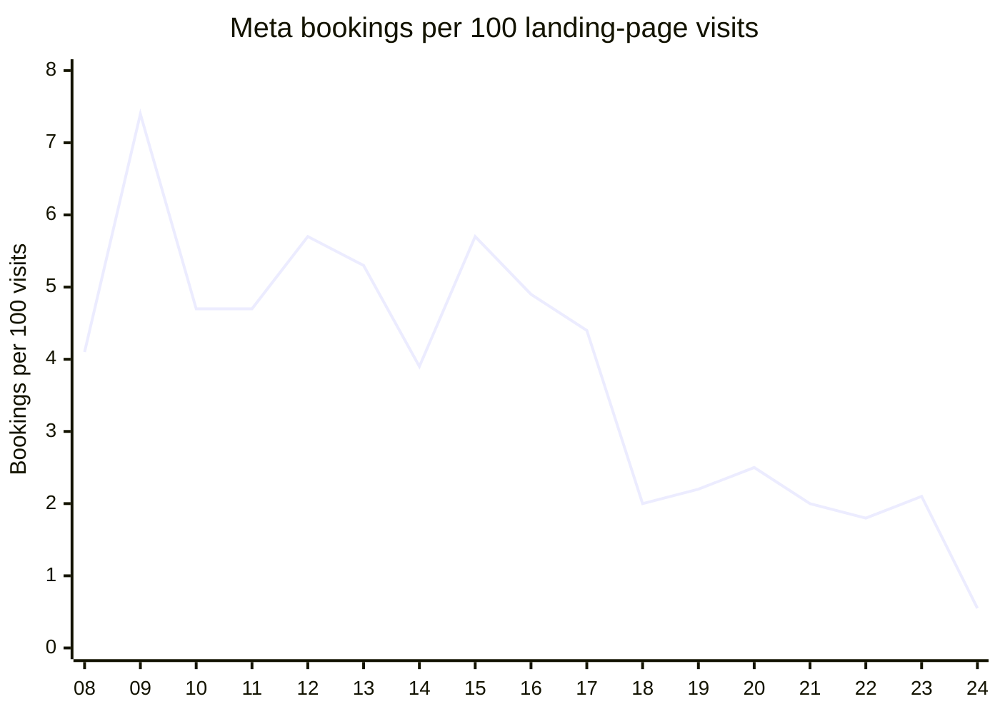
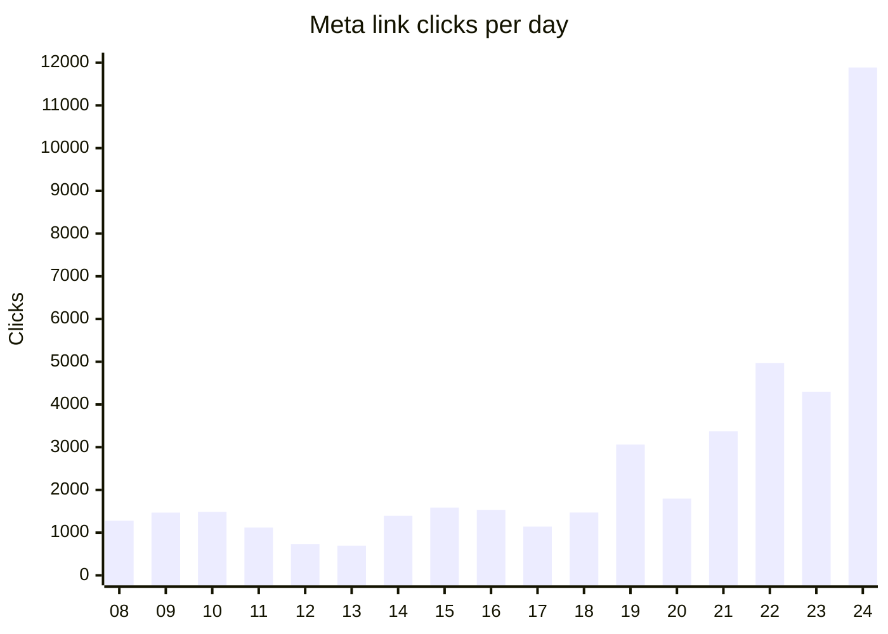
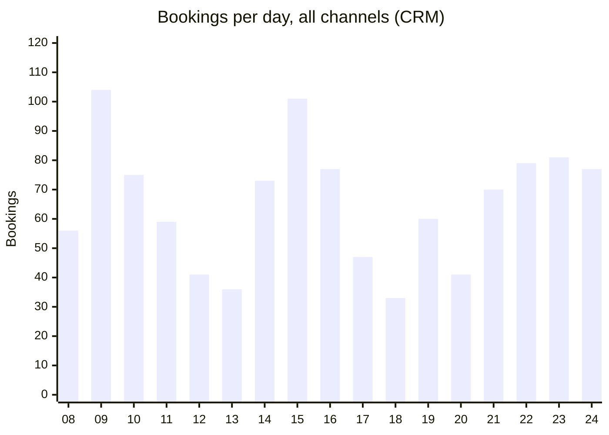
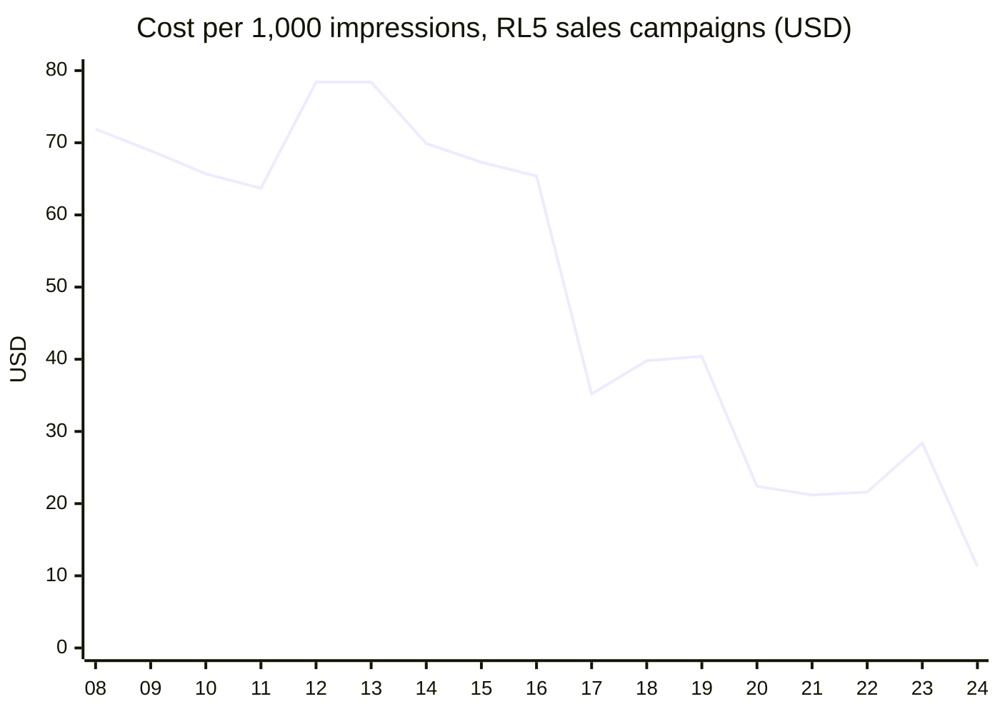
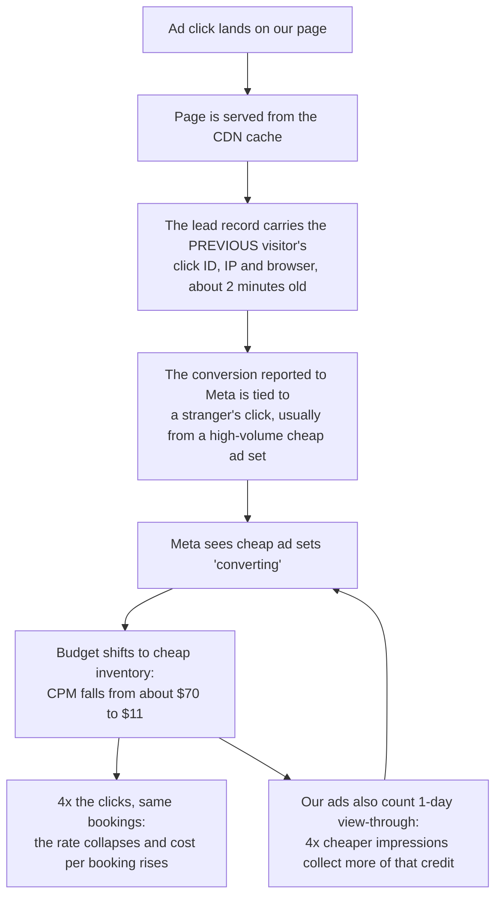
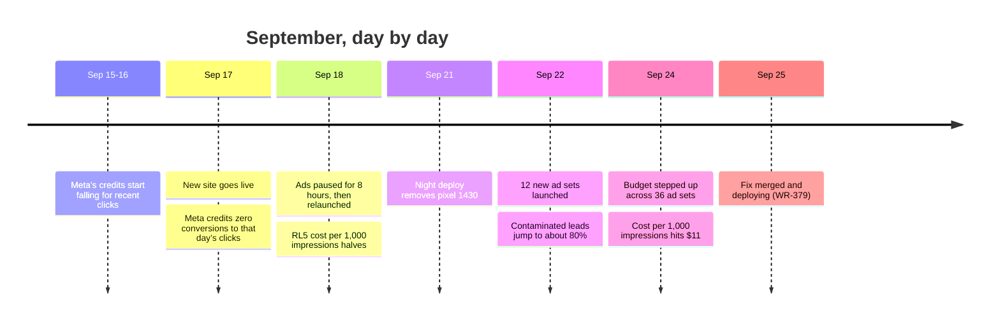

# Booking rate: what happened and what we fixed

2026-09-25, revision 2. Rewritten after confirming that pixel 1430 is not the main account's pixel. The full analysis is in `booking-rate-diagnostic-2026-09-25.md`.

## The answer

- **Fewer people are booking, but only modestly.** CRM bookings are down about 5%, and unique first-time bookers are down about 12%.
- **Qualified bookings ($10k+/month) are up 13–17%.** All of the loss is from companies under $10k.
- **What collapsed is the booking *rate*.** Meta sent 4x the clicks for 14% more money, and those extra clicks almost never book.
- **Why:** every one of our Meta ad sets optimises on a single custom conversion, `1361003065662161`. That conversion still arrives in the same numbers. Since the cutover, though, **Meta credits it to the wrong ad sets**, disproportionately the ones with the cheapest clicks. So Meta concludes cheap traffic converts and buys more of it.
- **The website change is the likeliest cause of the mis-crediting.** Each lead carried the click ID of whoever loaded the page before them. That fix is merged and deploying today (WR-379).

| Meta, weekday average | Before (Sep 8–16) | After (Sep 21–24) | Change |
|---|---|---|---|
| Spend per day | $15,761 | $17,954 | +14% |
| Clicks per day | 1,457 | 6,131 | **4.2x** |
| Bookings per day | 66.8 | 63.8 | −5% |
| Bookings per 100 visits | 5.2 | 1.2 | **−76%** |
| Cost per booking | $236 | $282 | +19% |
| Cost per qualified booking | $446 | $443 | flat |

## 1. The rate collapsed

The x-axis is the day of September. The site cutover was on the 17th.

## 2. Because Meta flooded us with clicks...

## 3. ...while bookings barely moved

The dip on the 17th and 18th is the cutover itself. Ads were also paused for 8 hours on the 18th. Weekends (the 12th, 13th, 19th and 20th) are always lower.

## 4. The tell: Meta started buying the cheapest audiences

This is the price Meta paid per 1,000 impressions on our main ad account (RL5) sales campaigns. It held around $70 for weeks, then fell to $11. Flat spend buying 4x the impressions at a quarter of the price means Meta moved to cheaper people.

## 5. What Meta optimises on, and what went wrong with it

These findings come from Meta's own reporting, as stored in our data warehouse.

- **Every ad set in both ad accounts, sales and "engagement" alike, optimises for one conversion: custom conversion `1361003065662161`.** It is not the standard Lead event and not pixel 1430. The main account never received the old site's Lead events on pixel 1430.
- **That conversion did not dry up.** Meta credited about 27 a day before the cutover and about 28 a day after. So this was not a starved signal.
- **What changed is *which* ad sets get the credit.** Real bookings are measured independently, from each visitor's own browser.

| Ad sets, by cost per click | Meta credit per real booking, before | After |
|---|---|---|
| Cheapest third | 0.55 | **0.68** |
| Middle third | 0.58 | 0.40 |
| Priciest third | 0.46 | **0.36** |

Before the cutover, Meta credited ad sets in proportion to the bookings they really produced. After it, **the cheapest-click ad sets get almost twice the credit per real booking that the priciest ones get**. The optimiser does exactly what that data tells it: it moves budget into cheap traffic.

The same pattern shows at ad-set level. **Sales ad sets whose click volume never changed converted 58% worse from Sep 18.** Engagement ad sets at unchanged volume held their rate. So the landing page and the form are working; the targeting is not.

## 6. How it unfolded

## 7. What we fixed today

| Fix | Effect |
|---|---|
| **Every lead now carries its own visitor's data** | Click ID, IP and browser are re-read from the visitor's own submission, never from the cached page. **This is the fix for the mis-crediting.** |
| Pixel 1430 restored | Not the main account's pixel, but we keep tracking both pixels as before |
| "Add to calendar" link restored | All 1,585 links in the CRM work again, and new bookings get one. This helps show rate. |
| Booking link sent to HubSpot again | Confirmation emails and texts can include it, as they did before |

All tests pass, and the change was reviewed and merged. It is deploying as release `v-20260925-v1`.

## 8. What we need from marketing this week

1. **Tell us what custom conversion `1361003065662161` is.** In Events Manager → Custom Conversions, we need its rule, its data source (which pixel or dataset), and the event it's built on. This is the one fact we can't read from here. It confirms whether the lead data we just fixed is what feeds it.
2. **Hold new ad sets and budget increases for 3–5 days** while Meta re-learns on clean data.
3. **Consider 7-day click attribution only (no 1-day view) on the sales ad sets while they recover.** View-through credit is what lets cheap impressions claim conversions they didn't cause.
4. **Review the ad sets added or scaled since Sep 18.** They buy clicks at $1.44–$4 that almost never book.

## 9. How we'll know it worked

| Signal | Now | Target |
|---|---|---|
| Meta credit per real booking, cheapest vs priciest third | 0.68 vs 0.36 | Back to roughly even (0.55 vs 0.46 before) |
| RL5 sales cost per 1,000 impressions | $11–28 | Back toward $60–70 |
| Meta bookings per 100 visits | 0.55–2.1 | Back toward 4–5 |
| Meta cost per booking | $282 | Back toward $236 |

The first two can be checked from our warehouse daily, and we'll track them. We expect movement over 3–7 days, as the ad sets re-learn on correctly credited conversions.

## What is proven and what is not

| Status | Items |
|---|---|
| **Proven** | Which conversion every ad set optimises on. That its volume held. That credit shifted toward cheap-click ad sets. That leads carried other visitors' click IDs. The CPM collapse. |
| **Strongly supported, not yet proven** | That the contaminated lead data is what feeds custom conversion `1361…`. Closing this needs its definition from Events Manager (action 1). |
| **Also contributing** | The ad sets and budget added at the same time, and 1-day view-through attribution. Together they amplify the mis-crediting. |
