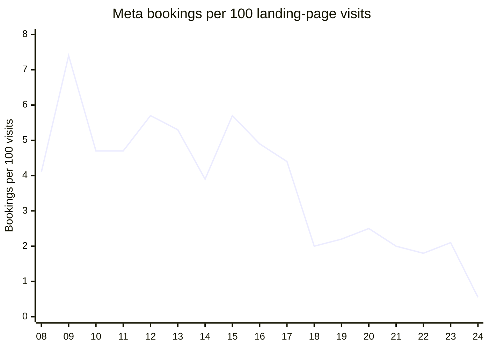
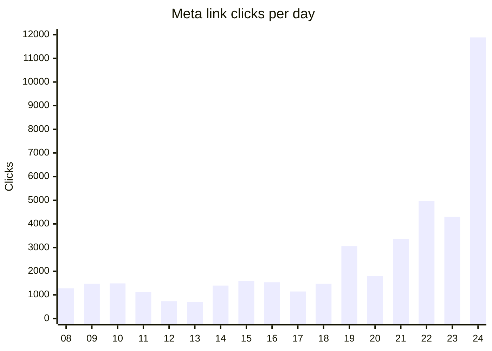
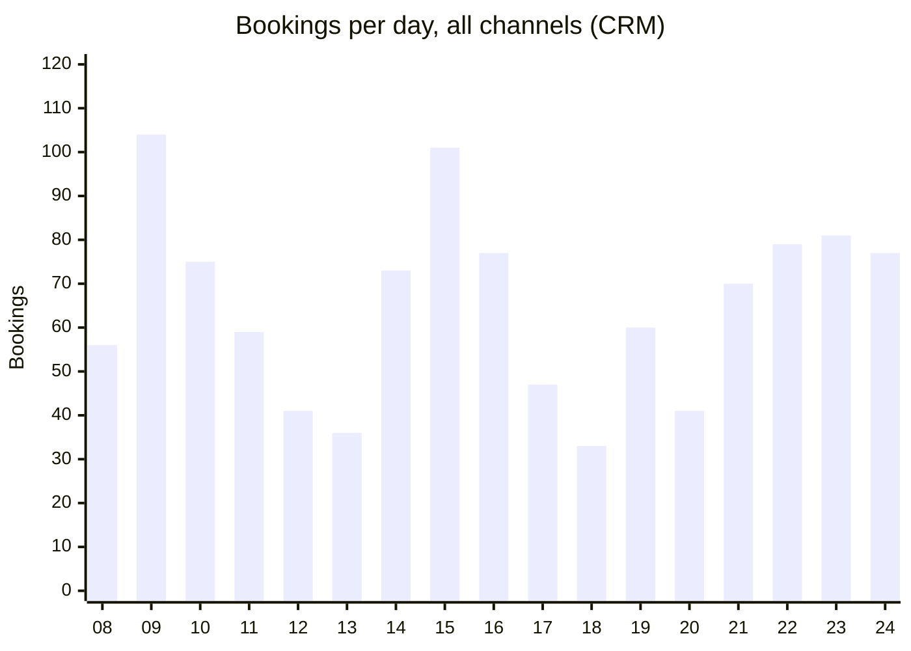
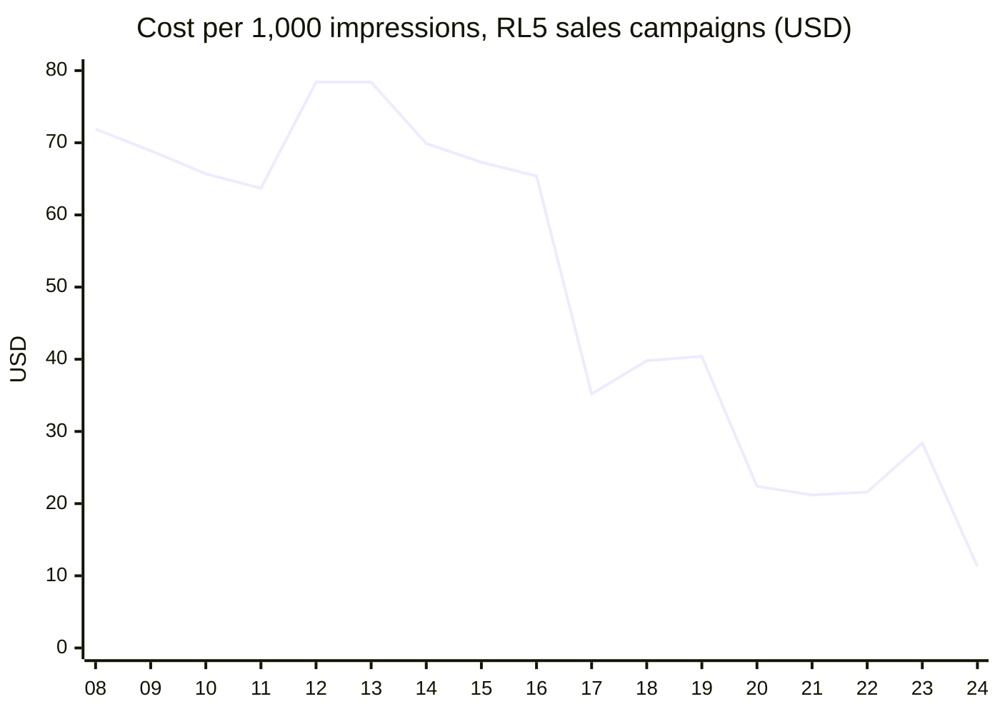
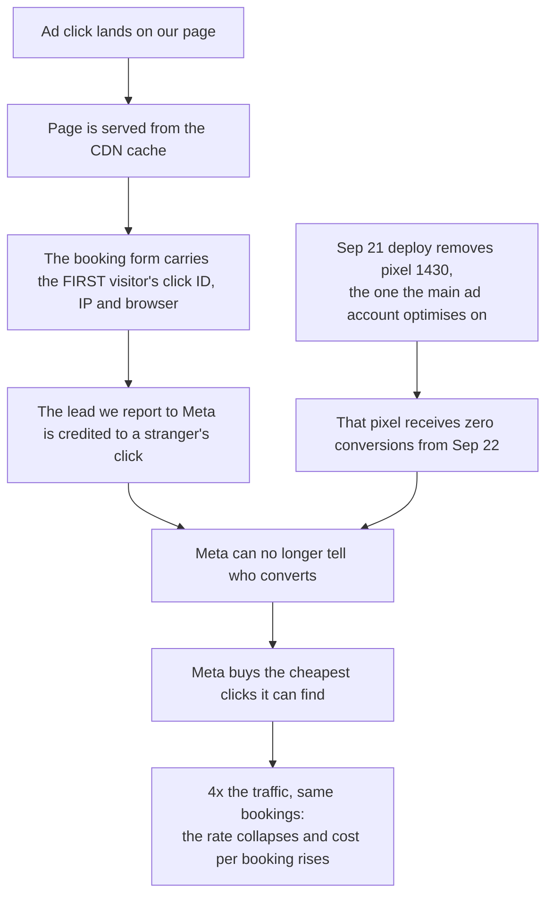
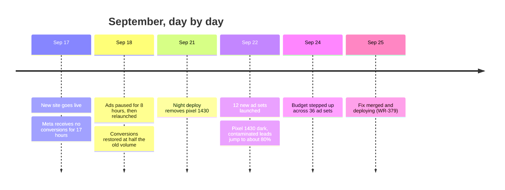
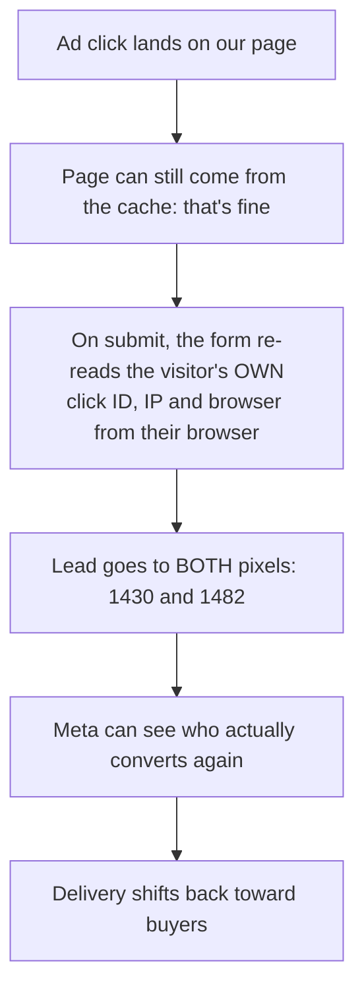

# Booking rate: what happened and what we fixed

2026-09-25. The full analysis is in `booking-rate-diagnostic-2026-09-25.md`.

## The answer

- **Fewer people are booking, but only modestly.** CRM bookings are down about 5%, and unique first-time bookers are down about 12%.
- **Qualified bookings ($10k+/month) are up 13–17%.** All of the loss is from companies under $10k.
- **What collapsed is the booking *rate*.** Meta sent 4x the clicks for 14% more money, and those extra clicks almost never book.
- **The cause was on our side.** The new website broke the signal Meta uses to find buyers, so Meta started buying the cheapest clicks it could find.
- **The fix is merged and deploying today.** Ticket WR-379, release `v-20260925-v1`.

| Meta, weekday average | Before (Sep 8–16) | After (Sep 21–24) | Change |
|---|---|---|---|
| Spend per day | $15,761 | $17,954 | +14% |
| Clicks per day | 1,457 | 6,131 | **4.2x** |
| Bookings per day | 66.8 | 63.8 | −5% |
| Bookings per 100 visits | 5.2 | 1.2 | **−76%** |
| Cost per booking | $236 | $282 | +19% |
| Cost per qualified booking | $446 | $443 | flat |

## 1. The rate collapsed

The x-axis is the day of September. The site cutover was on the 17th.

## 2. Because Meta flooded us with clicks...

## 3. ...while bookings barely moved

The dip on the 17th and 18th is the cutover itself. Ads were also paused for 8 hours on the 18th. Weekends (the 12th, 13th, 19th and 20th) are always lower.

## 4. The tell: Meta started buying the cheapest audiences

This is the price Meta paid per 1,000 impressions on our main ad account's sales campaigns. It held around $70 for weeks, then fell to $11. When Meta can't see who converts, it buys the cheapest inventory it can find.

## 5. What broke

Measured, not estimated:

- From Sep 22, **75–80% of the leads we sent Meta carried another visitor's click**.
- Clean conversions reaching Meta fell from about 65 a day to about 15–22.
- Meta's own dashboards could not show this. The fields were present; they just belonged to the wrong person.

## 6. How it unfolded

Two things happened in the same days. **The site broke Meta's signal**, which is our side, and it is fixed now. At the same time, **ad delivery was scaled up**. Sales ad sets whose volume never changed still converted 58% worse from Sep 18. That shows the signal break, not just the extra traffic.

## 7. What we fixed today

| Fix | Effect |
|---|---|
| Pixel 1430 restored | The main ad account's pixel gets page views and leads again |
| Every lead carries its own visitor's data | Meta credits the right click, so it can learn who buys |
| "Add to calendar" link restored | All 1,585 links in the CRM work again, and new bookings get one. This helps show rate. |
| Booking link sent to HubSpot again | Confirmation emails and texts can include it, as they did before |

All tests pass, and the change was reviewed and merged. It is deploying now as release `v-20260925-v1`.

## 8. What we need from marketing this week

1. **Confirm in Ads Manager** which pixel each sales ad set optimises on. We expect pixel 1430.
2. **Hold new ad sets and budget increases for 3–5 days** while Meta re-learns on clean data.
3. **Review the ad sets added or scaled since Sep 18.** They buy clicks at $1.44–$4 that almost never book.

## 9. How we'll know it worked

| Signal | Now | Target |
|---|---|---|
| Pixel 1430 events (Events Manager) | 0 | Page views and leads flowing within hours of deploy |
| RL5 sales cost per 1,000 impressions | $11–28 | Back toward $60–70 |
| Meta bookings per 100 visits | 0.55–2.1 | Back toward 4–5 |
| Meta cost per booking | $282 | Back toward $236 |

We expect the first sign within a day (pixel events) and the business effect over 3–7 days, as the ad sets re-learn.
