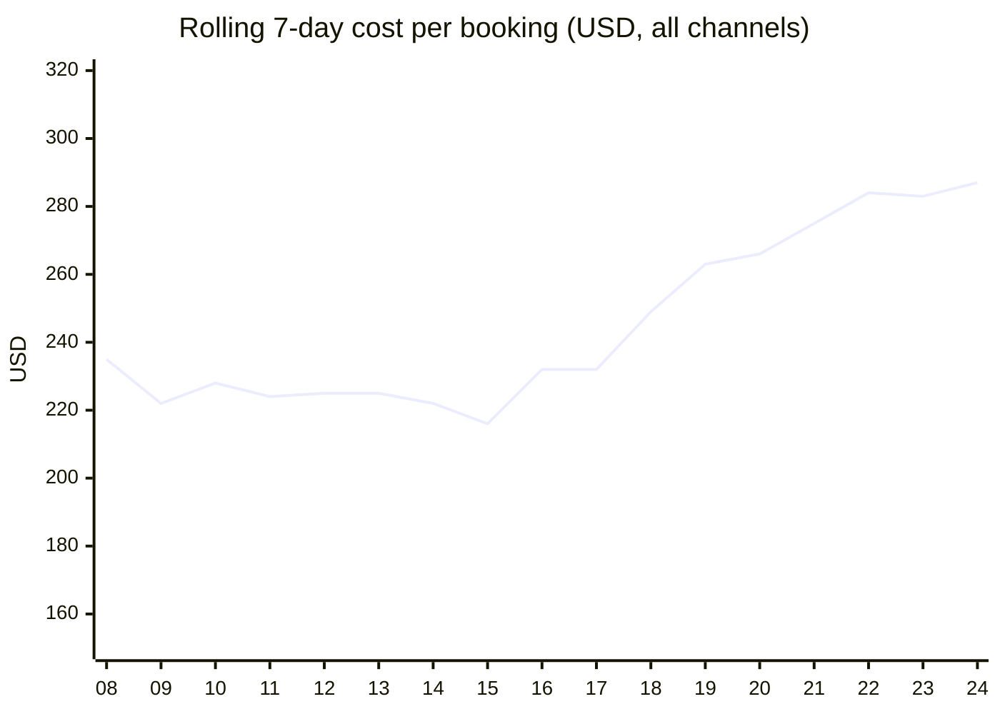
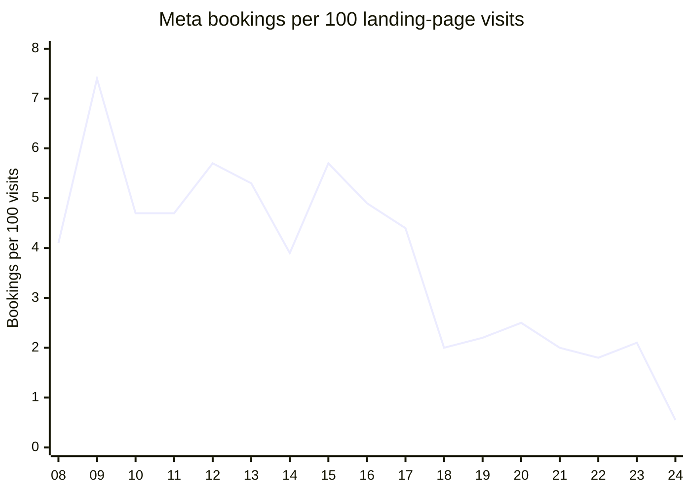
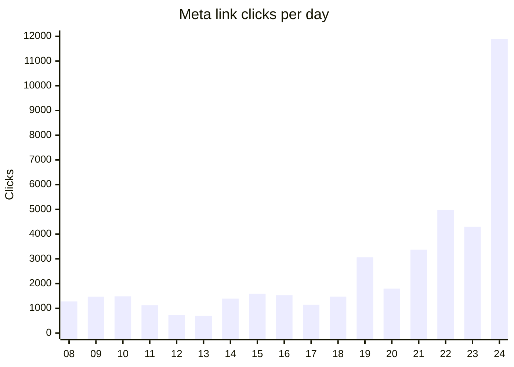
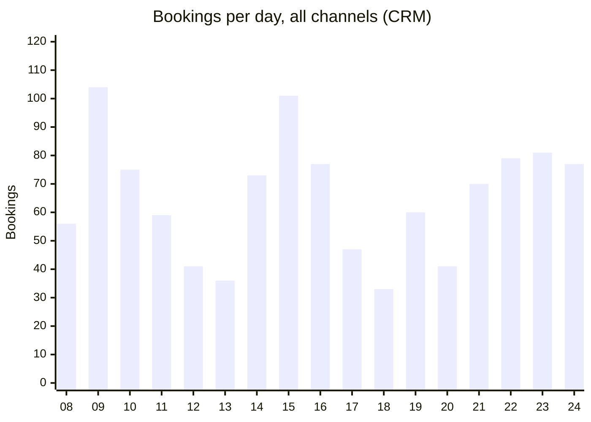
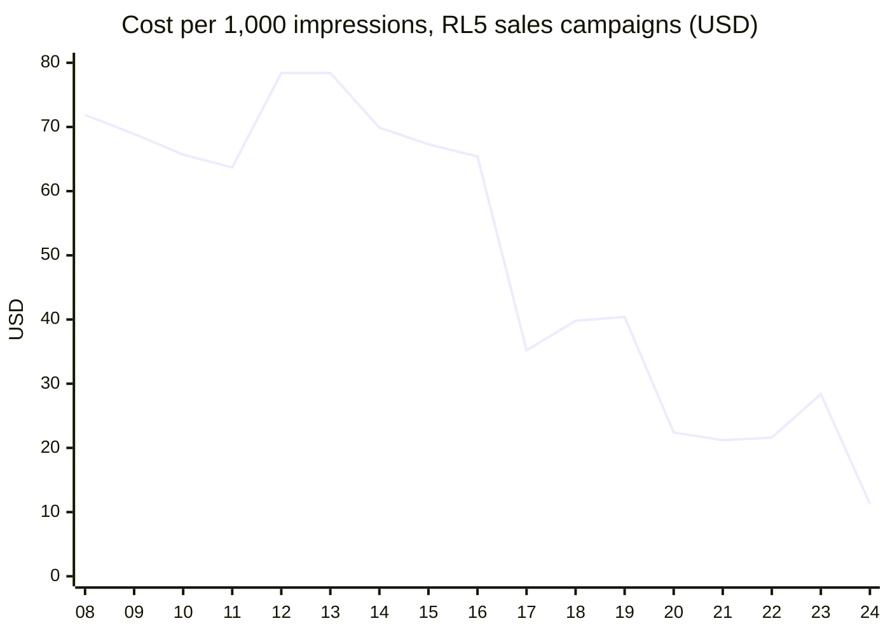
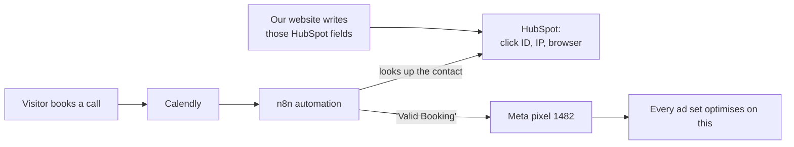
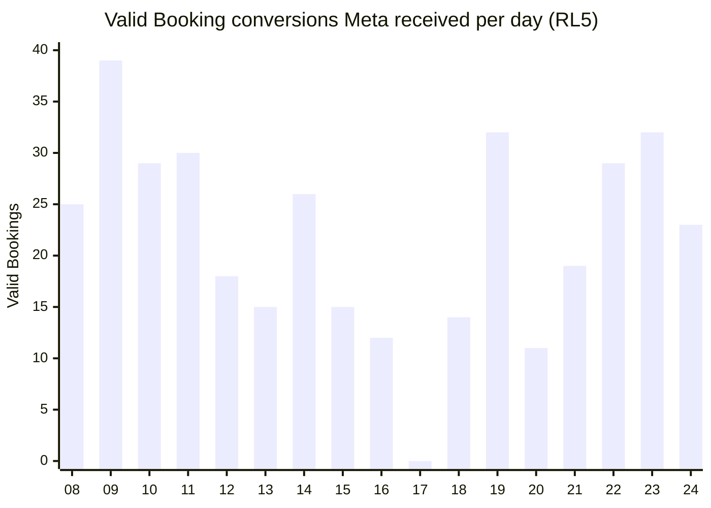

# Booking rate: what happened, what we fixed, what to expect

2026-09-25, revision 5 (cost figures corrected to rolling 7-day, all channels). Based on Meta's own ad and conversion data, our data warehouse, Calendly, PostHog and the production lead records. The full analysis is in `booking-rate-diagnostic-2026-09-25.md`.

## The answer

- **Fewer people are booking, but only modestly.** CRM bookings are down about 5%, and unique first-time bookers are down about 12%.
- **Qualified bookings ($10k+/month) held up in volume, but they cost more.** On a rolling 7-day basis:
  - Cost per qualified booking is **$445**, against about $415 before the cutover (**+7%**).
  - Cost per booking is **$287**, against about $226 (**+27%**).
  - The lost bookings are all from companies under $10k.
- **What collapsed is the booking *rate*.** Meta sent 4x the clicks for 14% more money, and those extra clicks almost never book.
- **Why:** every Meta ad set optimises on one event, **"Valid Booking"**. An n8n automation sends it to Meta when someone books in Calendly, taking the visitor's click data **from HubSpot**.
  - That feed faltered on Sep 15–17, before our cutover.
  - From the evening of Sep 17, **our new site filled HubSpot with the wrong visitor's click data**.
  - So Meta credited bookings to the wrong ads and moved budget into cheap, low-intent traffic.
- **Fixed and live since 11:17 ET today (WR-379).** New leads are clean. We expect Meta to be back to its pre-cutover efficiency **around Oct 1–2**.

| Meta, weekday average | Before (Sep 8–16) | After (Sep 21–24) | Change |
|---|---|---|---|
| Spend per day | $15,761 | $17,954 | +14% |
| Clicks per day | 1,457 | 6,131 | **4.2x** |
| Bookings per day | 66.8 | 63.8 | −5% |
| Bookings per 100 visits | 5.2 | 1.2 | **−76%** |
| Cost per booking | $236 | $282 | +19% |
| Cost per qualified booking | $446 | $443 | flat on this Facebook-only weekday view, **+7% on the rolling all-channel view below** |

### Cost trend (all channels, rolling 7 days)

Single days swing a lot. Before the cutover, cost per qualified booking ranged from $336 to $618 on individual days, and Sep 16 was $516, the same as Sep 24. So judge by the rolling week.

| Rolling 7 days | Aug 24–28 | Sep 8–17 (before cutover) | Sep 24 |
|---|---|---|---|
| Cost per booking | $247–266 | $216–235 (avg ~$226) | **$287** |
| Cost per qualified booking | $411–434 | $389–443 (avg ~$415) | **$445** (peak $461 on Sep 22) |

## 1. The rate collapsed

The x-axis is the day of September. The site cutover was on the 17th.

## 2. Because Meta flooded us with clicks...

## 3. ...while bookings barely moved

The dip on the 17th and 18th is the cutover itself. Ads were also paused for 8 hours on the 18th. Weekends (the 12th, 13th, 19th and 20th) are always lower.

## 4. The tell: Meta started buying the cheapest audiences

This is the price Meta paid per 1,000 impressions on our main ad account (RL5) sales campaigns. It held around $70 for weeks, then fell to $11. Flat spend buying 4x the impressions at a quarter of the price means Meta moved to cheaper people.

## 5. How Meta learns who converts

From Meta's API:

| Fact | Evidence |
|---|---|
| All 34 RL5 ad sets and all 3 RL7 ad sets optimise on **"Valid Booking"** (pixel 1482) | Ad set settings |
| Pixel 1430 plays no part in optimisation | The main account never registered its events |
| The account is fragile | 34 ad sets share about 25 Valid Bookings a day, and all are stuck in "Learning". Bidding is lowest-cost with no cap. |
| Ad-team editing was normal | 70–175 changes a day through August and September |

## 6. What caused what

| Period | What happened | Cause |
|---|---|---|
| **Sep 15 – Sep 17 evening** | Valid Bookings fell to about half, then **zero on Sep 17**. CPM halved on the 17th. | **Not the new website.** The old site was still live, its HubSpot data was correct, and our first HubSpot write was at 21:54 ET on the 17th. Something in the Calendly → n8n → HubSpot → Meta chain changed. A new n8n Calendly trigger was created on Sep 15 at 14:23 ET. Still unexplained. |
| **Sep 17 evening – Sep 25 11:17 ET** | Meta credited the wrong ads. CPM slid from about $40 to $11. | **Our website.** Cached pages made **75–80% of Meta leads carry the previous visitor's click ID**. Our site wrote that into HubSpot, and n8n passed it to Meta. |
| **Throughout** | 4x the clicks for the same bookings | **Amplified on the media side:** budget and ad sets were scaled onto a broken signal, with no-cap bidding and a fragmented account |

Credit per real booking, before and after, shows the mis-crediting directly:

| Ad sets, by cost per click | Meta credit per real booking, before | After |
|---|---|---|
| Cheapest third | 0.55 | **0.68** |
| Middle third | 0.58 | 0.40 |
| Priciest third | 0.46 | **0.36** |

## 7. What we fixed

Live since **11:17 ET, Sep 25**, release `v-20260925-v1`, ticket WR-379.

| Fix | Effect |
|---|---|
| Every lead carries its own visitor's click ID, IP and browser | HubSpot, and therefore n8n and Meta, get the right click again |
| Pixel 1430 restored | Both pixels tracked, as before the cutover |

**Verified in production, first hour after the fix:**

| Check | Before the fix | After |
|---|---|---|
| Leads carrying another visitor's data | 77% yesterday, 82% this morning | **0 of 7** |
| Meta server-side leads reaching both pixels | 1 of 65 this morning reached 1430 | **11 of 11, 0 failed** |

## 8. What to expect, and when

Meta's delivery has not changed yet. Today it is still buying $4–8 CPM traffic at 1,000+ clicks an hour. That's expected: **Meta counts conversions for 7 days after a click**, so wrongly credited conversions from the past week keep steering it until they age out.

| When | Expect |
|---|---|
| **Now** | Clean data on every new lead (done) |
| **Sep 26** | Meta starts crediting the right ads again |
| **Sep 28–29** | First signs: CPM climbs off the floor, clicks fall at the same spend, bookings per 100 visits rise toward 2–3 |
| **Around Oct 1–2** | Back to pre-cutover efficiency |

| Meta metric | Before cutover | Now | Expected around Oct 2 |
|---|---|---|---|
| Bookings per 100 visits | 5.2 | 1.2 | **4–5** |
| RL5 sales cost per 1,000 impressions | ~$68 | $4–28 | **$50–70** |
| Cost per booking, rolling 7 days, all channels | ~$226 | $287 | **~$226–235** |
| Cost per qualified booking, rolling 7 days, all channels | ~$415 | $445 | **~$400–420** |
| Meta bookings per weekday | 67 | 64 | **~72–76** at today's spend |

**This is a return to the old baseline, not an improvement on it.** The recovery is about 10 more Meta bookings a weekday, total cost per booking back to about $226–235, and qualified cost back to about $400–420.

Beating the old baseline is a media decision: consolidate ad sets and consider a cost cap. The account was already fragile before the cutover.

**If the numbers are not recovering by about Oct 2, the remaining cause is the account setup, not the data.**

## 9. What we need this week

1. **Marketing: consider pulling back the Sep 24 evening budget increase** until Meta re-learns. Extra budget is currently buying traffic that doesn't book.
2. **Marketing: freeze significant ad-set edits for 5–7 days, and consolidate ad sets** so each can reach about 50 Valid Bookings a week.
3. **n8n owner: check the execution history for Sep 15–18.** Why did "Valid Booking" drop, and why did it send nothing on the 17th? Add an alert for when it sends nothing for an hour during business hours.
4. **Us:** clear or re-sync the click fields on HubSpot contacts written between Sep 17 21:54 ET and Sep 25 11:17 ET. Otherwise a returning booker from that window would still send the wrong click to Meta.

## What is proven and what is not

| Status | Items |
|---|---|
| **Proven** | That all ad sets optimise on Valid Booking. The chain from Calendly to n8n to HubSpot to Meta. That our site wrote other visitors' click IDs into HubSpot (75–80% of Meta leads). That credit shifted to cheap-click ad sets. The CPM collapse. That the fix works on new leads. |
| **Not yet explained** | Why the Valid Booking feed dropped on Sep 15–17, before the cutover. The n8n execution history will show it. |
| **Forecast** | The recovery timeline in section 8. It depends on budget and edit discipline over the next week. |
