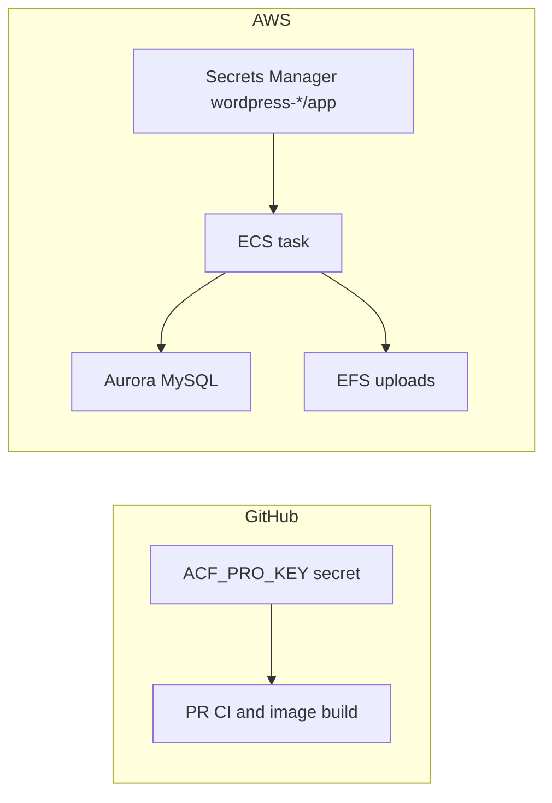
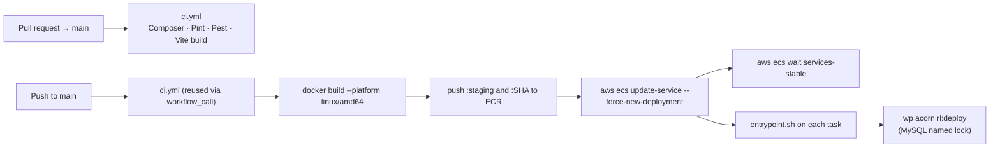

# Deployment

Two AWS environments exist: **staging** (`staging.remoteleverage.com`) and a production **preview** host (`production.remoteleverage.com`). Apex `remoteleverage.com` stays on the legacy site until DNS is under our control and we cut over.

Runtime secrets live in **Secrets Manager**, not GitHub. The only GitHub repo secret is `ACF_PRO_KEY` (Composer auth for CI and image builds). Pull requests have no AWS OIDC.



---

## Pipeline



Nothing deploys without CI passing — both deploy workflows declare `needs: ci`.

| Workflow | Trigger | GitHub Environment | Image tag |
| :--- | :--- | :--- | :--- |
| `deploy-staging.yml` | Push to `main` or `workflow_dispatch` | `staging` | `staging` |
| `deploy-production.yml` | Git tag `v-YYYYMMDD-v{1,2,3,4}` | `production` (required reviewers) | `production` plus the release tag |

Production is not auto-deployed from `main`. Push a tag such as `v-20260916-v1` (then `v2`…`v4` for later deploys that day). CI runs first; the **Build and deploy** job waits for a GitHub Environment approval before it builds or touches ECS. The image is pushed as `:production` (what ECS runs), `:<release tag>`, and `:<git sha>`.

## CI (`.github/workflows/ci.yml`)

Runs on every PR to `main`, and is reused by the deploy workflows via `workflow_call`.

**Job `php`** — PHP 8.4, Composer cache keyed on both lockfiles:

1. Configure ACF Pro Composer auth from the `ACF_PRO_KEY` secret — **fails fast if the secret is missing**, because a silent ACF install failure produces a broken image.
2. `composer install` at the Bedrock root, then in the theme.
3. `vendor/bin/pint --test`
4. `vendor/bin/pest`

**Job `assets`** — Node 22, npm cache, `npm ci`, `npm run build`.

Concurrency is `ci-${{ github.ref }}` with `cancel-in-progress: true`, so superseded PR runs stop.

## Deploy staging (`.github/workflows/deploy-staging.yml`)

Triggers on push to `main` or manually (`workflow_dispatch`). Concurrency group `deploy-staging` with `cancel-in-progress: false` — deploys queue rather than cancelling each other.

AWS auth is OIDC (`id-token: write`), assuming `AWS_ROLE_ARN`; there are no long-lived AWS keys in the repo. GitHub Actions does **not** have `GetSecretValue` on the app secret.

| Variable | Default |
| :--- | :--- |
| `AWS_REGION` | `us-east-1` |
| `AWS_ROLE_ARN` | `arn:aws:iam::742621604050:role/wordpress-staging-github-actions` |
| `ECR_REPOSITORY` / `ECS_CLUSTER` / `ECS_SERVICE` | `wordpress-staging` |
| `IMAGE_TAG` | `staging` |

Each image is pushed twice — `:staging` and `:<git sha>` — so a rollback is a tag change, not a rebuild.

## Deploy production (`.github/workflows/deploy-production.yml`)

Triggered only by a git tag matching **`v-YYYYMMDD-v{1,2,3,4}`** — for example `v-20260916-v1`. Same-day follow-ups are `v2`, `v3`, `v4`. Tags that do not match are ignored (and a matching glob that is not eight digits still fails the validate job).

```bash
git tag v-20260916-v1
git push origin v-20260916-v1
```

The **Build and deploy** job uses GitHub Environment `production`, so it does not start until a required reviewer approves it in the Actions UI. Reviewers must have write access on the repo. Environment vars: `AWS_ROLE_ARN`, `ECR_REPOSITORY`, `ECS_CLUSTER`, `ECS_SERVICE`. Both builds keep using `secrets.ACF_PRO_KEY`.

OIDC for this stack is limited to `environment:production` (not `ref:refs/heads/main`). Reuse the account provider `arn:aws:iam::742621604050:oidc-provider/token.actions.githubusercontent.com`.

## The image (`Dockerfile`)

Three stages:

1. **`assets`** — `node:22-bookworm`, `npm ci` then `npm run build`. Assets are built once and copied in; the runtime image has no Node.
2. **`php-base` / `build`** — `php:8.4-fpm-bookworm` with `bcmath`, `exif`, `gd` (freetype/jpeg/webp), `intl`, `mysqli`, `opcache`, `pdo_mysql`, `soap`, `zip`, plus the `redis` PECL extension. Composer installs `--no-dev` at both roots, with ACF Pro credentials supplied as a **BuildKit secret** (`--secret id=composer_auth`) so the licence key never lands in a layer. `redis-cache` 2.8.0 is downloaded here and its `object-cache.php` drop-in copied into `web/app/`.
3. **`runtime`** — `php-base` plus nginx, WP-CLI, `default-mysql-client`, and `awscli` (the last two are for ECS Exec content import). `WP_ENV=staging` by default; ECS overrides it. The built application is copied in owned by `www-data`.

nginx and PHP-FPM run in the same container (`docker/nginx.conf`, `docker/www.conf`, `docker/php.ini`).

## Container start (`docker/entrypoint.sh`)

```sh
mkdir cache dirs; chown
if wp core is-installed; then
  wp plugin activate redis-cache
  wp acorn rl:deploy        # fatal on failure — refuses to start
  wp acorn optimize
  [ -n "$REDIS_HOST" ] && wp redis enable
fi
php-fpm -D
exec nginx -g "daemon off;"
```

`rl:deploy` failing is **fatal on purpose**. A container serving against a schema the code does not expect fails quietly and can corrupt data; refusing to start fails the ECS deployment loudly and leaves the previous tasks serving.

`SKIP_CHOWN=1` skips the uploads chown — set in `docker-compose.yml`, because chowning a bind-mounted host directory is slow and unnecessary locally. Production ECS also sets it because uploads live on EFS.

On the production preview host, `DISALLOW_INDEXING=true` is injected by Terraform. `config/environments/production.php` turns that env var into Bedrock's constant so Google does not index a second copy of the site. After apex cutover, set `disallow_indexing = false` and redeploy.

## Post-deploy tasks (`wp acorn rl:deploy`)

`App\Infrastructure\Console\Commands\RunDeployTasksCommand` — migrations plus a rewrite-rule flush, serialised across containers by a **MySQL named lock** (`rl_deploy_tasks`).

Why a named lock and not `migrate --isolated`: ECS rolling deploys start several tasks at once, and Acorn's cache store is `file` — `--isolated` locks per-container and gives no cross-task protection at all. A MySQL named lock is held on the connection, visible to every task pointing at the same database, and released automatically if the container dies mid-run.

A task that cannot acquire the lock within `--timeout` (default 120s) logs and exits successfully: another container is running the same code, so the work will be done — this task just must not race it.

## Secrets

Runtime configuration comes from AWS Secrets Manager (`/wordpress-staging/app` or `/wordpress-production/app`), injected into the task definition. Terraform creates the secret with empty placeholders; values never live in Terraform state.

`scripts/seed-staging-secrets.sh` (a Python script despite the extension) pushes local env values up into that secret:

```bash
# Staging — Stripe test keys
APP_SECRET_ARN=arn:aws:secretsmanager:us-east-1:...:secret:/wordpress-staging/app \
AWS_REGION=us-east-1 STRIPE_MODE=test ./scripts/seed-staging-secrets.sh env

# Production preview — Stripe live keys; webhook secret stays empty until a
# live-mode endpoint exists for https://production.remoteleverage.com/api/webhooks/stripe
APP_SECRET_ARN=arn:aws:secretsmanager:us-east-1:...:secret:/wordpress-production/app \
AWS_REGION=us-east-1 STRIPE_MODE=live ./scripts/seed-staging-secrets.sh env
```

It deliberately skips `DB_*`, `WP_HOME` and `WP_SITEURL` — those are environment-specific and set in the task definition. Do not copy the staging secret into production.

**Stripe, per environment (settled 2026-09-15).** Staging runs Stripe **test** keys with its own
**test-mode** webhook signing secret; production runs the live Connect pair with its live secret.
Stripe issues a separate signing secret per webhook endpoint, so `STRIPE_WEBHOOK_SECRET` is a
genuinely different value in each environment — copying one between them produces a 403, not a
subtle bug. This matters more than it used to: `/api/webhooks/stripe` and `/api/webhooks/calendly`
now **fail closed**, returning 503 with no secret configured and 403 on a bad signature, so an
environment missing its secret processes nothing at all rather than accepting unverified events.
See [cutover-decisions.md](cutover-decisions.md) §5b and [known-issues.md](known-issues.md) #7.

> **Note:** the secret is injected into the ECS **task definition**, so writing it into Secrets
> Manager is not enough on its own — the service needs a new deployment (or a forced update)
> before a running task sees it.

**Do not add the `*_SYNC_*` keys to this script.** They point in the opposite direction: they are read *locally* so the sync commands can call out to a remote environment's REST API, and are never baked into a container. See [domains/sync.md](domains/sync.md#configuration).

## Infrastructure

| Piece | Staging | Production preview |
| :--- | :--- | :--- |
| Compute | ECS `wordpress-staging` (1 task) | ECS `wordpress-production` (2 tasks, ECS Exec on) |
| Registry | ECR `wordpress-staging` | ECR `wordpress-production` |
| VPC / VPN | `10.91.0.0/16` / `10.92.0.0/22` | `10.93.0.0/16` / `10.94.0.0/22` |
| Uploads | EFS | EFS |
| Cache | Redis `WP_REDIS_*` | Redis `WP_REDIS_*` |
| Secrets | `/wordpress-staging/app` | `/wordpress-production/app` |
| `WP_ENV` | `staging` | `production` |
| Indexing | noindex | noindex (`DISALLOW_INDEXING`) until apex cutover |
| URL | <https://staging.remoteleverage.com> | <https://production.remoteleverage.com> |

Terraform: `terraform/envs/wordpress-staging` and `terraform/envs/wordpress-production`. State keys `envs/wordpress-staging/terraform.tfstate` and `envs/wordpress-production/terraform.tfstate`.

## DNS (preview hostname)

ACM validation and the `production` CNAME go at **whoever currently hosts `remoteleverage.com` DNS**. That does not have to be GoDaddy yet. Do **not** change apex or `www`.

After `terraform apply` in `terraform/envs/wordpress-production`, `terraform output acm_validation_cnames` and `terraform output godaddy_records` print the records. Current values (add these at the current DNS host; do **not** change apex/`www`):

| Type | Name | Value | TTL |
| :--- | :--- | :--- | :--- |
| CNAME | `_03b9414e55c61d994eb25c115f1ed56c.production` | `_12bc8663db45c0d8504ac4893bd7ec4c.wzccmgtwzk.acm-validations.aws.` | 600 |
| CNAME | `production` | CloudFront domain from `terraform output cloudfront_domain_name` (after the cert is issued) | 600 |

Until the ACM record exists, CloudFront and the ALB HTTPS listener cannot be created — the certificate is `PENDING_VALIDATION`. The rest of the stack (VPC, Aurora, EFS, Redis, ECR, ECS) is already up. Add the ACM CNAME, wait for ISSUED, then `terraform apply` again.

### Later cutover to `remoteleverage.com` (not this pass)

When you control DNS:

- Add CloudFront aliases `remoteleverage.com` and `www.remoteleverage.com` (ACM SAN).
- `wp search-replace 'https://production.remoteleverage.com' 'https://remoteleverage.com' --all-tables --precise`
- Point apex/`www` at CloudFront.
- Set `disallow_indexing = false` in Terraform and redeploy.
- Point the Stripe live webhook at the apex URL.

## First production bring-up

Empty ECR will not stay healthy. Order:

1. Apply Terraform + add ACM/CNAME for `production.remoteleverage.com`.
2. Seed Secrets Manager (`STRIPE_MODE=live`; webhook secret can wait — Stripe webhooks 503 until set).
3. Push a release tag (`v-YYYYMMDD-v1`) and approve the production environment job.
4. Import SQL + extract uploads (below).
5. Smoke-test the booking form, media, and admin on the preview host.

## Content import (one-time)

Local artifacts at the website repo root (gitignored):

- SQL: `remoteleveragev2-2026-09-15-534bed7.sql`
- Media: `uploads.zip` — extract into EFS `web/app/uploads`. The zip has a top-level `uploads/` directory; the import script strips that so `2026/09/...` and `home/` land on the mount, not `uploads/uploads/...`.

Aurora and EFS allow **tasks only**, not the VPN. After the first production image is running:

```bash
AWS_REGION=us-east-1 ./scripts/import-production-content.sh
```

That uploads the dump and zip to a short-lived prefix on `remote-leverage-wordpress-backups`, runs a one-off Fargate task (same VPC/EFS/Aurora as the service), imports with `wp db import`, rewrites hosts, unzips onto EFS, then deletes the S3 objects. ECS Exec also works if the Session Manager plugin is installed; the script uses `RunTask` so it does not depend on that plugin.

### URL rewrite after import

The dump is a local Herd snapshot with baked `remoteleverage-v2.test` URLs plus `home`/`siteurl`. A raw import 404s images and mixed-content CSS backgrounds. Attachment *files* in the zip use relative paths and are fine; the broken part is absolute URLs in `wp_posts` / `wp_postmeta` / `wp_options`.

WP-CLI `search-replace` rewrites PHP serialized Gutenberg/ACF data (a naive SQL replace would corrupt it):

```text
wp search-replace 'http://remoteleverage-v2.test' 'https://production.remoteleverage.com' --all-tables --precise
wp search-replace 'https://remoteleverage-v2.test' 'https://production.remoteleverage.com' --all-tables --precise
```

Also set `home` / `siteurl` to `https://production.remoteleverage.com` and `https://production.remoteleverage.com/wp`.

Do **not** rewrite `https://remoteleverage.com` in post body during the preview period — those are live-site links and still resolve.

`wp acorn rl:deploy` already runs on container start and applies migrations after the import. Leftover `.test` / localhost hosts in `the_content` still get rewritten by `BlockDefaults::rewriteLocalAbsoluteUrls`.
