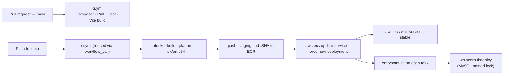

# Deployment

One environment exists today: **staging**, on AWS ECS. Production is still the legacy site, and no production target for this codebase has been built.

---

## Pipeline



Nothing deploys without CI passing — `deploy-staging.yml` declares `needs: ci`.

## CI (`.github/workflows/ci.yml`)

Runs on every PR to `main`, and is reused by the deploy workflow via `workflow_call`.

**Job `php`** — PHP 8.4, Composer cache keyed on both lockfiles:

1. Configure ACF Pro Composer auth from the `ACF_PRO_KEY` secret — **fails fast if the secret is missing**, because a silent ACF install failure produces a broken image.
2. `composer install` at the Bedrock root, then in the theme.
3. `vendor/bin/pint --test`
4. `vendor/bin/pest`

**Job `assets`** — Node 22, npm cache, `npm ci`, `npm run build`.

Concurrency is `ci-${{ github.ref }}` with `cancel-in-progress: true`, so superseded PR runs stop.

## Deploy (`.github/workflows/deploy-staging.yml`)

Triggers on push to `main` or manually (`workflow_dispatch`). Concurrency group `deploy-staging` with `cancel-in-progress: false` — deploys queue rather than cancelling each other.

AWS auth is OIDC (`id-token: write`), assuming `AWS_ROLE_ARN`; there are no long-lived AWS keys in the repo.

| Variable | Default |
| :--- | :--- |
| `AWS_REGION` | `us-east-1` |
| `AWS_ROLE_ARN` | `arn:aws:iam::742621604050:role/wordpress-staging-github-actions` |
| `ECR_REPOSITORY` / `ECS_CLUSTER` / `ECS_SERVICE` | `wordpress-staging` |
| `IMAGE_TAG` | `staging` |

Each image is pushed twice — `:staging` and `:<git sha>` — so a rollback is a tag change, not a rebuild.

## The image (`Dockerfile`)

Three stages:

1. **`assets`** — `node:22-bookworm`, `npm ci` then `npm run build`. Assets are built once and copied in; the runtime image has no Node.
2. **`php-base` / `build`** — `php:8.4-fpm-bookworm` with `bcmath`, `exif`, `gd` (freetype/jpeg/webp), `intl`, `mysqli`, `opcache`, `pdo_mysql`, `soap`, `zip`, plus the `redis` PECL extension. Composer installs `--no-dev` at both roots, with ACF Pro credentials supplied as a **BuildKit secret** (`--secret id=composer_auth`) so the licence key never lands in a layer. `redis-cache` 2.8.0 is downloaded here and its `object-cache.php` drop-in copied into `web/app/`.
3. **`runtime`** — `php-base` plus nginx and WP-CLI. `WP_ENV=staging` by default; the built application is copied in owned by `www-data`.

nginx and PHP-FPM run in the same container (`docker/nginx.conf`, `docker/www.conf`, `docker/php.ini`).

## Container start (`docker/entrypoint.sh`)

```sh
mkdir cache dirs; chown
if wp core is-installed; then
  wp plugin activate redis-cache
  wp acorn rl:deploy        # fatal on failure — refuses to start
  wp acorn optimize
  [ -n "$REDIS_HOST" ] && wp redis enable
fi
php-fpm -D
exec nginx -g "daemon off;"
```

`rl:deploy` failing is **fatal on purpose**. A container serving against a schema the code does not expect fails quietly and can corrupt data; refusing to start fails the ECS deployment loudly and leaves the previous tasks serving.

`SKIP_CHOWN=1` skips the uploads chown — set in `docker-compose.yml`, because chowning a bind-mounted host directory is slow and unnecessary locally.

## Post-deploy tasks (`wp acorn rl:deploy`)

`App\Infrastructure\Console\Commands\RunDeployTasksCommand` — migrations plus a rewrite-rule flush, serialised across containers by a **MySQL named lock** (`rl_deploy_tasks`).

Why a named lock and not `migrate --isolated`: ECS rolling deploys start several tasks at once, and Acorn's cache store is `file` — `--isolated` locks per-container and gives no cross-task protection at all. A MySQL named lock is held on the connection, visible to every task pointing at the same database, and released automatically if the container dies mid-run.

A task that cannot acquire the lock within `--timeout` (default 120s) logs and exits successfully: another container is running the same code, so the work will be done — this task just must not race it.

## Secrets

Runtime configuration comes from AWS Secrets Manager (`/wordpress-staging/app`), injected into the task definition.

`scripts/seed-staging-secrets.sh` (a Python script despite the extension) pushes local env values up into that secret:

```bash
APP_SECRET_ARN=arn:aws:secretsmanager:us-east-1:...:secret:/wordpress-staging/app \
AWS_REGION=us-east-1 ./scripts/seed-staging-secrets.sh env
```

It deliberately skips `DB_*`, `WP_HOME` and `WP_SITEURL` — those are environment-specific and set in the task definition. Staging uses Stripe test keys.

**Do not add the `*_SYNC_*` keys to this script.** They point in the opposite direction: they are read *locally* so the sync commands can call out to a remote environment's REST API, and are never baked into a container. See [domains/sync.md](domains/sync.md#configuration).

## Infrastructure

| Piece | Staging |
| :--- | :--- |
| Compute | ECS service `wordpress-staging`, cluster `wordpress-staging` |
| Registry | ECR `wordpress-staging` |
| Uploads | EFS (referenced by the sync design's retention note) |
| Cache | Redis via the `redis-cache` drop-in, `WP_REDIS_*` env |
| Secrets | Secrets Manager `/wordpress-staging/app` |
| URL | <https://staging.remoteleverage.com> |

## Production — what does not exist yet

Everything below is unbuilt. It is the infrastructure half of the cutover gap in [production-cutover.md](production-cutover.md).

- No production ECS service, ECR repository, secret store or `deploy-production.yml`.
- No DNS cutover runbook and no rollback plan.
- No performance baseline **on staging**. A local baseline was measured 2026-09-15 — see [performance-baseline.md](performance-baseline.md); the targets are mobile 96+, LCP < 1.2s, CLS 0.00.
- No SSL/redirect/transactional-email validation checklist.
- No queue worker (WR-106, on hold) — which is consistent, since no listener queues.
- No Sentry DSN configured anywhere, so errors in staging are currently unreported.
