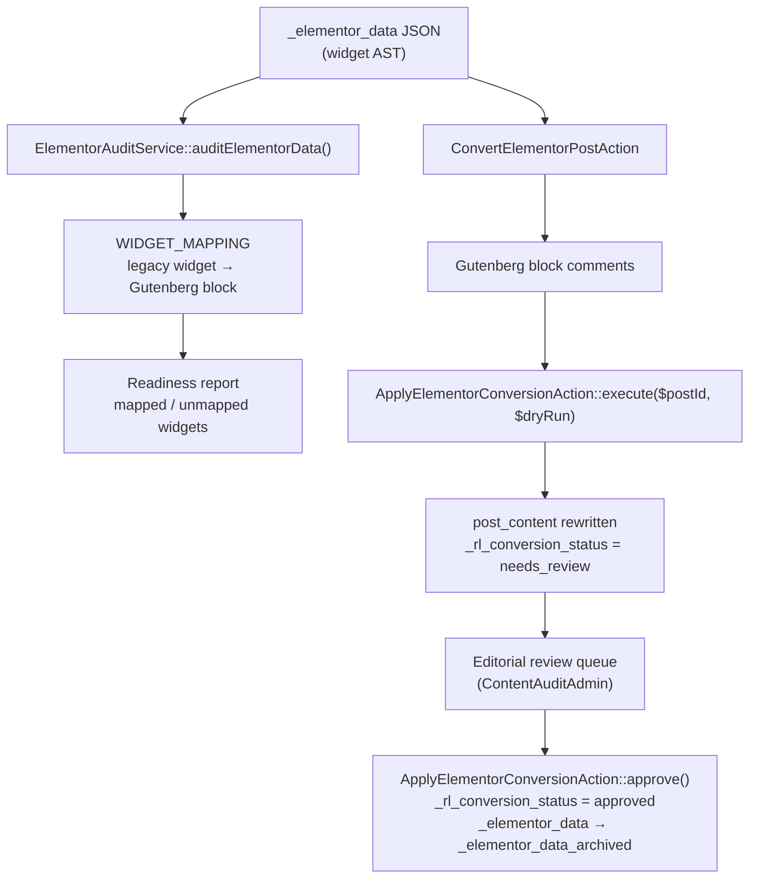

# ContentAudit domain

`app/Domains/ContentAudit` — the tooling that gets content off Elementor, plus the email-signature generator.

Replaces the `rl-content-auditor` and `rl-social-kit` plugins.

This domain exists to serve the migration. Once production content is off Elementor, most of it becomes dead weight and can be retired — that is expected, not a design flaw.

---

## Why it matters for launch

**ADR-0005 treats "zero posts carry `_elementor_data`" as a mandatory gate before cutover.** 119 blog posts on production are still Elementor. The conversion tooling is built; the production database dump has never been ingested and the conversion has never been run against real content. That single ops step is the largest remaining blocker on the Elementor retirement gate — see [production-cutover.md](../production-cutover.md).

## The conversion pipeline



**Nothing goes live unreviewed.** Every converted post — mapped and unmapped alike — lands as `needs_review`. Approval is an explicit human action, and it archives rather than deletes the original Elementor payload, so a bad conversion is recoverable.

## Widget mapping

`ElementorAuditService::WIDGET_MAPPING` covers the legacy custom widgets plus the standard elements:

| Legacy widget(s) | Target |
| :--- | :--- |
| `HeroWidget`, `HeroSectionWidget`, `HeroCarouselWidget` | `acf/hero-block` |
| `HeadlessCalendlyMultistepWidget`, `GoogleCalendarMultistepWidget`, `IsolatedFieldsHeadlessCalendlyMultistepWidget` | `acf/booking-block` |
| `TestimonialCardWidget`, `TestimonialListWidget`, `TrustSectionWidget` | `acf/testimonials-block` |
| `DepartmentCardWidget`, `ContractorCardWidget`, `GlassCardWidget` | `acf/department-cards-block` |
| `ProcessStepsWidget`, `HiringProcessWidget` | `acf/process-steps-block` |
| `ArticleFAQAccordionWidget` | `acf/accordion-faq-block` |
| `ArticleDataTableWidget` | `acf/data-table-block` |
| `ContactCTAWidget`, `ArticleLeadFormWidget` | `acf/cta-banner-block` |
| `heading`, `text-editor`, `image`, `button` | `core/heading`, `core/paragraph`, `core/image`, `core/button` |

Anything outside this map is reported as unmapped rather than silently dropped. An unmapped widget is a decision for a human, not a conversion failure.

**`JoinLiveCallWidget`, `BenefitsSectionWidget` and `GuaranteeSectionWidget` were removed from
the map on 2026-09-15**, when the `live-call` and `benefits-guarantee` blocks were deleted as
unused. Those widgets now fall through to the unmapped path, which is the correct outcome:
live-call behaviour in v2 is the `/live-call/connect` route, not a block, so a human decides.

> **Known bug — every target in this table is wrong.** The slugs all carry a `-block` suffix
> (`acf/hero-block`, `acf/booking-block`, …) but no registered block uses that suffix; the real
> slugs are `acf/booking`, `acf/testimonials`, `acf/department-cards` and so on. There is also no
> `acf/hero` block at all. Any page this converter touches therefore emits block comments
> WordPress cannot resolve, and they render as nothing. Pre-existing, found 2026-09-15 while
> deleting unused blocks. The hand-migration path does not use this converter, so nothing
> currently shipping is affected — but the table needs correcting before it is next run.

## The classes

| Class | Does |
| :--- | :--- |
| `ElementorAuditService` | Traverses the widget AST, maps against the block matrix, flags unmapped elements |
| `ConvertElementorPostAction` | AST → Gutenberg block comments (pure; does not write) |
| `ApplyElementorConversionAction` | Persists the conversion and the review status; `approve()` archives `_elementor_data` |
| `ElementorProseExtractor` | Pulls readable prose out of *rendered* Elementor HTML — `extract()`, `summary()`, `faqs()`. Used by the blog import, where the source is scraped HTML rather than an AST. |
| `YoastMetaMapper` | Pure. Production's `yoast_head_json` → `_yoast_wpseo_*` postmeta, with canonical rewriting and Search Appearance template detection — see [seo-meta-migration.md](../seo-meta-migration.md) |
| `PrismAiAuditor` | AI-assisted content review over markdown |
| `AuditMarkdownContentAction` | Wraps the auditor |
| `GenerateSignatureHtmlAction` | Email-signature HTML (below) |

## Commands

```bash
# Read-only readiness report across all posts (run this first)
wp acorn content:audit-elementor
wp acorn content:audit-elementor --post_id=123

# Convert — preview, then apply
wp acorn content:convert-elementor --dry-run
wp acorn content:convert-elementor --post_id=123

# Import blog posts from captured production JSON
wp acorn content:import-posts

# Carry production's Yoast SEO meta onto local content, matched by slug.
# Canonicals are rewritten off the production host — see docs/seo-meta-migration.md.
wp acorn content:import-seo --dry-run
wp acorn content:import-seo

# Regenerate docs/block-inventory.md — the "what already exists" index that page authors
# read before writing markup. --check fails if the committed file is stale (CI-friendly).
wp acorn blocks:inventory
wp acorn blocks:inventory --check
```

`BlockInventoryCommand` lives in this domain because it is migration tooling: it answers
"which block already renders this production section?" by reading each block's class, its
Blade view comment, its fields, and every pattern, view and `BlockDefaults::render*` helper
that uses it. Usage detection must follow the helper indirection — a block reached only
through `BlockDefaults::renderAboutHero()` has its slug nowhere in the pattern, and counting
raw `acf/<slug>` matches alone reports well-used blocks as unused.

## Editorial review queue

`ContentAuditAdmin` (registered via `DomainServiceProvider`) adds to the Posts and Pages list tables:

- a **Conversion Status** column with badges
- a status filter dropdown
- an **Approve & Mark Clean** row action

This is WR-101, and it is what makes ADR-0005's human sign-off gate real rather than aspirational.

## ~~Email signatures~~ — moved out of this domain 2026-09-15

`GenerateSignatureHtmlAction`, the `EmailSignatureGenerator` Livewire component and the six
templates under `resources/views/signatures/` **were all deleted.** They were a second,
partial implementation of something the ported `rl-social-kit` dashboard already did better,
and the two template sets had already drifted (`#25104A` against the kit's `#250D4A`, in 3 of
6 files).

Signature generation now lives entirely at **`/social-media-kit/`** — the same three layouts ×
two themes, plus the asset library and the client setup instructions.
`/tools/signature-generator` 301s there via `config/redirects.php`. See
[social-media-kit.md](../social-media-kit.md).

## Tests

`tests/Unit/ElementorAuditTest.php` (AST traversal, unmapped flagging, block-comment validity), `tests/Unit/ElementorProseExtractorTest.php`, and `tests/Unit/YoastMetaMapperTest.php` (canonical rewriting, meta extraction, site-template detection).
