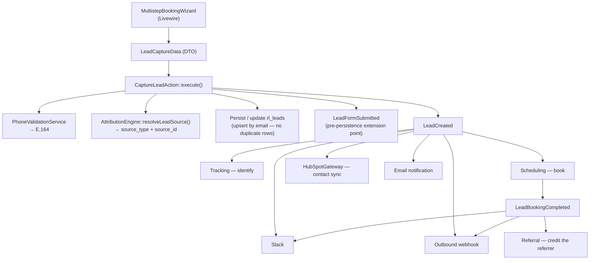

# Lead domain

`app/Domains/Lead` — every prospective customer who touches a form, from a half-filled email field to a confirmed consultation.

Replaces Gravity Forms, the `gravityformshubspot` (`GF_HubSpot`) add-on, `gform_after_submission` hooks and the `wp_gf_*` tables. Formalised in **ADR-0008**.

---

## Why it exists

Under Gravity Forms, a lead's journey was invisible. A submission fired hooks; whether HubSpot actually received it, whether the Slack notification went out, whether analytics identified the person — none of that was recorded anywhere you could query. Debugging a "we never got that lead" report meant reading plugin logs, if they existed.

This domain makes the whole journey a queryable record, and makes partial submissions first-class: someone who types an email and leaves is a `partial` lead, not nothing.

## Identity graph — the "passport"

One person, across every identifier they have used. Built 2026-09-16 so a lead can be blocked as
a *person* rather than as an email address.

### Why `rl_leads.uuid` could not do this

It is `Str::uuid()` minted per row and declared `unique()` — a surrogate key. A returning visitor
gets a brand new one every time, so it can never link two visits. Same for `session_id`, which is
minted per component mount. Recognising a returning visitor needs an identifier that persists,
which is why `device_id` and the first-party `rl_vid` cookie exist.

### Tables

| Table | Holds |
| :--- | :--- |
| `rl_lead_profiles` | The person. A block lives here, which is what makes it cover identifiers attached later. |
| `rl_lead_identifiers` | One row per `(type, value_hash)`, unique. The edge list. |
| `rl_leads.profile_id` / `is_blocked` | The link, and a denormalised flag the suppressing listeners read. |

Identifier values are **hashed** with an application salt, never stored in the clear, so a block
survives a data-deletion request without retaining personal data. `value_preview` keeps a masked
remnant (`a***@example.com`) for recognising a row in the admin.

### Strength — the rule everything else follows

A block lives on the profile, so merging two profiles merges their blocks. **A false merge is a
false ban:** an innocent person silently stops reaching sales, and nothing about the symptom
points at the cause.

| Strength | Types | May merge two profiles? |
| :--- | :--- | :--- |
| strong | `email`, `phone` | Yes — close to unique per person, deliberately entered |
| weak | `device` | **Never.** Recorded as evidence only |

A shared browser, an office machine or a cleared cookie would otherwise fuse unrelated people.
IP is not an identifier type at all: behind CloudFront the origin sees an edge node shared by
thousands.

Other guards, each protecting against a specific way the graph could over-merge:

- **Phones under seven digits are discarded.** Otherwise everyone who typed `1234` becomes one
  bannable person.
- **Gmail dots and `+tags` fold; other providers do not.** At Gmail those really are one mailbox.
  Folding everywhere would merge two real people.
- **Merges are reversible.** The losing profile is kept and points at the winner — an over-merge
  that cannot be seen cannot be undone.
- **A block survives a merge in the safe direction only.** If either side was blocked, the winner
  is blocked; otherwise a block would vanish because it happened to be raised against the newer
  record.

### Resolving links; it never blocks

`IdentityResolver` builds the graph. `BlockLeadProfileAction` is a separate, human action.

That separation is deliberate: linking can be poisoned. Someone already blocked can enter a
competitor's phone number or a victim's email, and a graph that blocked automatically would do
that work for them. The graph is evidence; a person makes the decision.

### Blocking is a shadow ban

The form still succeeds and the lead is still stored. What stops is everything downstream:

| Suppressed | Where |
| :--- | :--- |
| Slack alert | `HandleLeadEventsForSlack` |
| HubSpot sync | `LeadServiceProvider`, logged as `skipped` |
| Outgoing webhook | `HandleLeadEventsForWebhook` |
| Calendly booking | `HandleLeadCreatedForBooking` |

Silence rather than an error, for the same reason the email validator's rejection message is
generic: telling someone they are blocked tells them which identifier to change, and they are
back within a minute under a new one.

`CaptureLeadAction` resolves the identity **before** dispatching `LeadCreated`, because the
listeners read `is_blocked` off the lead — resolving afterwards would let the Slack alert and the
CRM sync fire first, which is the entire thing the block exists to prevent.

### Operating it

Block from the lead detail screen in wp-admin: **Leads → (a lead) → Identity**. The panel shows
the profile, its identifiers with masked previews, which are evidence-only, and who blocked it
and why. Unblocking clears the flag from every attached lead, so a reversed decision does not
leave someone silently suppressed.


## Storage

**`rl_leads`** (`wp_rl_leads` with the default prefix)

| Group | Columns |
| :--- | :--- |
| Identity | `uuid`, `name`, `first_name`, `last_name`, `email`, `phone`, `phone_country`, `company` |
| Qualification | `role_needed`, `weekly_hours`, `start_date`, `monthly_revenue`, `notes` |
| Attribution | `source_type` (enum: `ad`, `organic`, `referral_hub`, `partnership`), `source_id`, `referral_code` |
| Campaign | `utm_source`, `utm_medium`, `utm_campaign`, `utm_term`, `utm_content`, `gclid`, `fbclid` |
| Session | `landing_url`, `referrer_url`, `session_id` |
| State | `status` (enum: `captured`, `booked`, `partial`, `abandoned`, `qualified`, `canceled`) |
| Booking retry | `booking_retry_count`, `booking_next_retry_at` |

A fulltext/search index was added in a later migration to keep the admin dashboard's search usable.

**`rl_lead_activity_logs`** — the dual-write audit trail, one row per dispatch and per consumption. See [the audit contract](#the-dual-write-audit-contract).

**`rl_bounced_leads`** — submissions step one refused, which are deliberately *not* leads.

A visitor refused by `PhoneValidationService` or `EmailValidationService` returns from step one
before `capturePartialLead()` runs, so they have no `rl_leads` row, no `lead_id` and therefore no
activity log either. Both gates record; `checked_by` separates them (`phone`, `format`,
`blacklist`, `domain_validator`, `zerobounce`).

**Abandonment is not recorded here.** Somebody who fills the form in and leaves without pressing
Continue was never refused anything, so there is nothing to write. The only signal for those is the
gap between the `form_loaded` and `partial_form_submitted` events in PostHog, which cannot name
anyone. Until this
table existed, a rejection added a form error and vanished, and "the booking form is broken" could
not be told apart from "their address was blocked" — which is the report it actually was.

Click identifiers (`gclid`, `fbclid`, `msclkid`, `fbc`, `fbc_synthetic`, `landing_url`) are columns
at the same widths `rl_leads` uses, because "which campaign is buying leads we then refuse" is a
query. `fbc` is resolved through `FbcResolver`, not copied from the wizard's frozen attribution —
that copy is usually a synthetic stand-in built from a bare `fbclid` before Meta's pixel JS ran.
`_fbp` has no column here, exactly as it has none on `rl_leads`, and rides in `context`.

Written only by `RecordBouncedLeadAction`, read only by the **Bounced Leads** admin screen
(`admin.php?page=rl-leads-bounced`). Nothing else may consume it: these addresses were refused, so
they must stay out of exports, KPIs and CRM sync. Retention follows the lead window —
`PurgeOldLeadsAction` prunes both.

Repeat attempts inside `RecordBouncedLeadAction::COLLAPSE_WINDOW_MINUTES` (30) bump `attempts`
rather than inserting, because somebody retyping a refused address is one turned-away person, not
four. `created_at` is therefore first seen and `last_seen_at` is the latest try. A retry fills in
details the first attempt lacked and upgrades `fbc` under the same upgrade-only rule `FbcResolver`
applies across writes to a lead — Meta's pixel JS often writes the real cookie while the visitor is
retyping, and this is the one place a synthetic stand-in could otherwise outlive the real value.

The same screen carries the **ZeroBounce blocking toggles** — one checkbox per verdict in
`EmailValidationService::TOGGLEABLE_STATUSES`, each showing what that rule refused in the last 30
days. Deliberately here rather than on Settings: the list that shows what a rule cost is the one
that can change it. Removing `do_not_mail` took a PR, a merge and a deploy; it is now a checkbox.

Saving goes through `LeadSettingsService::saveZeroBounceStatuses()`, **not** `save()`, which
rebuilds the whole option from its input — a partial payload through `save()` would blank the
domain list, the blacklist and the notification recipients.

## Flow



## The classes

### Actions

| Class | Does |
| :--- | :--- |
| `CaptureLeadAction` | The ingestion orchestrator. Validates, normalises the phone, stamps attribution, persists, dispatches `LeadFormSubmitted` then `LeadCreated`. **Updates an existing lead rather than creating a duplicate** — this is what makes progressive/partial capture work. |
| `ProcessAbandonedLeadsAction` | Finds leads with no completed booking past a timeout (default 2h), flips them to `abandoned`, dispatches `LeadAbandoned`. Runs hourly on WP-Cron and via `wp acorn lead:process-abandoned`. |
| `PurgeOldLeadsAction` | Deletes leads past the retention window. **Enforces a 30-day floor** — `MINIMUM_RETENTION_DAYS = 30` — regardless of what an admin configures. Prunes `rl_bounced_leads` on the same window. |
| `RecordBouncedLeadAction` | Records a submission the email check refused, with the step-one contact details so a wrongly-refused buyer can be called back. Called from the form's rejection branch, not from inside the validator — the validator is pure and has no database. **Never throws**: a visitor already told their address was refused must not then meet a 500. |

### Services

| Class | Does |
| :--- | :--- |
| `FbcResolver` | The `fbc` rules, extracted from `CaptureLeadAction` when a second write path needed them. Upgrade-only, never replaces a confirmed-real value, only accepts a cookie whose embedded click id matches the lead's, and stays silent for callers that collected no attribution of their own. **One copy on purpose**: the booking wizard freezes attribution in `mount()` before Meta's pixel JS runs, so its `fbc` is routinely synthetic, and both `CaptureLeadAction` and `RecordBouncedLeadAction` need the live-cookie upgrade the Conversions API depends on. |
| `EmailValidationService` | Three gates over one field, cheapest first: address blacklist, domain block/allow list, then ZeroBounce. **Fails open** — an outage, a missing key or a slow response accepts the address. Which ZeroBounce verdicts block is an admin setting (`zerobounce_blocked_statuses`), read through the static `rejectedStatusesFor()` so the screen and the form cannot drift; `valid` can never be on it. Rejections are recorded by `RecordBouncedLeadAction`; any new caller that can refuse a visitor should call it too, or the refusal is invisible again. |
| `PhoneValidationService` | `libphonenumber-for-php`. Parses against a country code, returns a validity flag plus the E.164 string. Every stored phone is normalised. |
| `AttributionEngine` | Lives in the Referral domain but is central here — resolves `source_type`/`source_id` from query params (`utm_*`, `gclid`, `fbclid`, `via`, `ref`, `r`) and the `rl_referrer` cookie. See [referral.md](referral.md). |
| `LeadActivityLogger` | Writes both stages of the audit contract. Also does booking deduplication lookups: `findRecentBookingForSlot()` and `findPriorBookingForDifferentSlot()` stop a double-submit from creating two Calendly invitees. |
| `LeadSettingsService` | Reads/writes `rl_lead_settings`. Notification recipients, optional-field toggles, retention days (floor enforced here too), HubSpot/Slack/webhook overrides. |
| `HubSpotGateway` | Creates or updates a HubSpot contact. Prefers the admin-configured token, falls back to `HUBSPOT_ACCESS_TOKEN` / `HUBSPOT_PORTAL_ID` in the environment. |

### Events

| Event | When |
| :--- | :--- |
| `LeadFormSubmitted` | Immediately on submission, **before** persistence — the extension point for custom validation or enrichment |
| `LeadCreated` | After validation, attribution and persistence |
| `LeadBookingCompleted` | Scheduling booked the consultation |
| `LeadBookingCanceled` | A Calendly webhook reported a cancellation |
| `LeadAbandoned` | The hourly sweep found a stalled lead |

All listeners are synchronous — see [architecture.md §4](../architecture.md#4-the-event-graph) for what that costs.

### Livewire

`MultistepBookingWizard` (`app/Application/Livewire/Booking`) is the only lead-capture surface. It is `#[Lazy]`, so it does not block first paint.

Three steps: details & revenue → date picker → time slot & confirm, then a scheduled-confirmation screen with the Google Meet link and add-to-calendar buttons.

Configuration (all optional, passed as attributes on `<livewire:booking.multistep-booking-wizard />`; both kebab-case and camelCase are accepted):

| Attribute | Effect |
| :--- | :--- |
| `skin` | `default` (white card), `naked` (borderless, for hero embeds), `glass` (dark glassmorphic, used in the footer) |
| `enable-isolated-fields` | Progressive disclosure — show one field group, expand the rest after submit |
| `isolated-steps` | Custom field segmentation for the above |
| `hide-profile-header`, `hide-progress-bar` | Compact placements |
| `compact-fields` | Names on one row, revenue as a dropdown — for narrow contexts like the article sidebar |
| `role-needed`, `button-text` | Prefill and CTA copy |

The wizard captures the full UTM/session set into hidden state and passes it through `LeadCaptureData`.

## The dual-write audit contract

Every participant in a lead's lifecycle writes twice to `rl_lead_activity_logs`:

| Stage | Action value | Written by |
| :--- | :--- | :--- |
| 1 — dispatch | `dispatch_initiated` | The dispatcher, with the payload it sent |
| 2 — consumption | `consumed_by_tracking`, `consumed_by_crm`, `consumed_by_webhook`, … | Each listener, with its outcome |

**A Stage 1 row with no matching Stage 2 row is a failed listener.** That is the whole point: the log answers "did HubSpot actually get this?" without reading anyone's logs.

The Leads admin renders the two stages as a chronological timeline per lead, with expandable JSON payloads — see [admin-screens.md](../admin-screens.md).

## Operating it

```bash
# Retention purge (30-day floor enforced regardless of --days)
wp acorn lead:purge
wp acorn lead:purge --days=90

# Sweep abandoned leads manually (runs hourly on cron anyway)
wp acorn lead:process-abandoned --hours=4

# Inspect
wp db query "SELECT id, email, status, source_type, monthly_revenue FROM wp_rl_leads ORDER BY id DESC LIMIT 5;"
wp db query "SELECT stage, action, status, created_at FROM wp_rl_lead_activity_logs WHERE lead_id = 123 ORDER BY id;"
```

Admin: **Leads** (`admin.php?page=rl-leads`) → All Leads · Activity Logs · Diagnostics · Settings.

## Tests

`tests/Unit/LeadDomainTest.php`, `tests/Unit/LeadSettingsTest.php`. Cover E.164 normalisation, attribution stamping, partial-lead upsert (no duplicate rows), the 30-day retention floor, and listener consumption logging.

## Known gaps

- **`LeadSettingsService::isFieldEnabled()` is wired but has nothing to toggle.** The booking wizard's Blade view does not render `company` or `notes` inputs at all, so the admin toggles for those fields currently do nothing (WR-102, noted at the time).
- **HubSpot credentials are not in `.env.example`** and not in the current `.env`. Without them or an admin-configured token, `HubSpotGateway` silently no-ops. See [known-issues.md](../known-issues.md).
