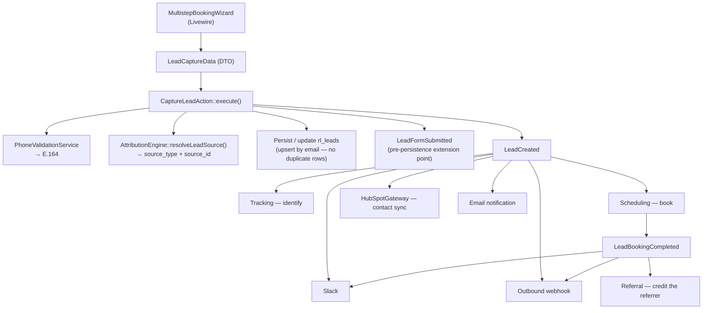

# Lead domain

`app/Domains/Lead` — every prospective customer who touches a form, from a half-filled email field to a confirmed consultation.

Replaces Gravity Forms, the `gravityformshubspot` (`GF_HubSpot`) add-on, `gform_after_submission` hooks and the `wp_gf_*` tables. Formalised in **ADR-0008**.

---

## Why it exists

Under Gravity Forms, a lead's journey was invisible. A submission fired hooks; whether HubSpot actually received it, whether the Slack notification went out, whether analytics identified the person — none of that was recorded anywhere you could query. Debugging a "we never got that lead" report meant reading plugin logs, if they existed.

This domain makes the whole journey a queryable record, and makes partial submissions first-class: someone who types an email and leaves is a `partial` lead, not nothing.

## Storage

**`rl_leads`** (`wp_rl_leads` with the default prefix)

| Group | Columns |
| :--- | :--- |
| Identity | `uuid`, `name`, `first_name`, `last_name`, `email`, `phone`, `phone_country`, `company` |
| Qualification | `role_needed`, `weekly_hours`, `start_date`, `monthly_revenue`, `notes` |
| Attribution | `source_type` (enum: `ad`, `organic`, `referral_hub`, `partnership`), `source_id`, `referral_code` |
| Campaign | `utm_source`, `utm_medium`, `utm_campaign`, `utm_term`, `utm_content`, `gclid`, `fbclid` |
| Session | `landing_url`, `referrer_url`, `session_id` |
| State | `status` (enum: `captured`, `booked`, `partial`, `abandoned`, `qualified`, `canceled`) |
| Booking retry | `booking_retry_count`, `booking_next_retry_at` |

A fulltext/search index was added in a later migration to keep the admin dashboard's search usable.

**`rl_lead_activity_logs`** — the dual-write audit trail, one row per dispatch and per consumption. See [the audit contract](#the-dual-write-audit-contract).

## Flow



## The classes

### Actions

| Class | Does |
| :--- | :--- |
| `CaptureLeadAction` | The ingestion orchestrator. Validates, normalises the phone, stamps attribution, persists, dispatches `LeadFormSubmitted` then `LeadCreated`. **Updates an existing lead rather than creating a duplicate** — this is what makes progressive/partial capture work. |
| `ProcessAbandonedLeadsAction` | Finds leads with no completed booking past a timeout (default 2h), flips them to `abandoned`, dispatches `LeadAbandoned`. Runs hourly on WP-Cron and via `wp acorn lead:process-abandoned`. |
| `PurgeOldLeadsAction` | Deletes leads past the retention window. **Enforces a 30-day floor** — `MINIMUM_RETENTION_DAYS = 30` — regardless of what an admin configures. |

### Services

| Class | Does |
| :--- | :--- |
| `PhoneValidationService` | `libphonenumber-for-php`. Parses against a country code, returns a validity flag plus the E.164 string. Every stored phone is normalised. |
| `AttributionEngine` | Lives in the Referral domain but is central here — resolves `source_type`/`source_id` from query params (`utm_*`, `gclid`, `fbclid`, `via`, `ref`, `r`) and the `rl_referrer` cookie. See [referral.md](referral.md). |
| `LeadActivityLogger` | Writes both stages of the audit contract. Also does booking deduplication lookups: `findRecentBookingForSlot()` and `findPriorBookingForDifferentSlot()` stop a double-submit from creating two Calendly invitees. |
| `LeadSettingsService` | Reads/writes `rl_lead_settings`. Notification recipients, optional-field toggles, retention days (floor enforced here too), HubSpot/Slack/webhook overrides. |
| `HubSpotGateway` | Creates or updates a HubSpot contact. Prefers the admin-configured token, falls back to `HUBSPOT_ACCESS_TOKEN` / `HUBSPOT_PORTAL_ID` in the environment. |

### Events

| Event | When |
| :--- | :--- |
| `LeadFormSubmitted` | Immediately on submission, **before** persistence — the extension point for custom validation or enrichment |
| `LeadCreated` | After validation, attribution and persistence |
| `LeadBookingCompleted` | Scheduling booked the consultation |
| `LeadBookingCanceled` | A Calendly webhook reported a cancellation |
| `LeadAbandoned` | The hourly sweep found a stalled lead |

All listeners are synchronous — see [architecture.md §4](../architecture.md#4-the-event-graph) for what that costs.

### Livewire

`MultistepBookingWizard` (`app/Application/Livewire/Booking`) is the only lead-capture surface. It is `#[Lazy]`, so it does not block first paint.

Three steps: details & revenue → date picker → time slot & confirm, then a scheduled-confirmation screen with the Google Meet link and add-to-calendar buttons.

Configuration (all optional, passed as attributes on `<livewire:booking.multistep-booking-wizard />`; both kebab-case and camelCase are accepted):

| Attribute | Effect |
| :--- | :--- |
| `skin` | `default` (white card), `naked` (borderless, for hero embeds), `glass` (dark glassmorphic, used in the footer) |
| `enable-isolated-fields` | Progressive disclosure — show one field group, expand the rest after submit |
| `isolated-steps` | Custom field segmentation for the above |
| `hide-profile-header`, `hide-progress-bar` | Compact placements |
| `compact-fields` | Names on one row, revenue as a dropdown — for narrow contexts like the article sidebar |
| `role-needed`, `button-text` | Prefill and CTA copy |

The wizard captures the full UTM/session set into hidden state and passes it through `LeadCaptureData`.

## The dual-write audit contract

Every participant in a lead's lifecycle writes twice to `rl_lead_activity_logs`:

| Stage | Action value | Written by |
| :--- | :--- | :--- |
| 1 — dispatch | `dispatch_initiated` | The dispatcher, with the payload it sent |
| 2 — consumption | `consumed_by_tracking`, `consumed_by_crm`, `consumed_by_webhook`, … | Each listener, with its outcome |

**A Stage 1 row with no matching Stage 2 row is a failed listener.** That is the whole point: the log answers "did HubSpot actually get this?" without reading anyone's logs.

The Leads admin renders the two stages as a chronological timeline per lead, with expandable JSON payloads — see [admin-screens.md](../admin-screens.md).

## Operating it

```bash
# Retention purge (30-day floor enforced regardless of --days)
wp acorn lead:purge
wp acorn lead:purge --days=90

# Sweep abandoned leads manually (runs hourly on cron anyway)
wp acorn lead:process-abandoned --hours=4

# Inspect
wp db query "SELECT id, email, status, source_type, monthly_revenue FROM wp_rl_leads ORDER BY id DESC LIMIT 5;"
wp db query "SELECT stage, action, status, created_at FROM wp_rl_lead_activity_logs WHERE lead_id = 123 ORDER BY id;"
```

Admin: **Leads** (`admin.php?page=rl-leads`) → All Leads · Activity Logs · Diagnostics · Settings.

## Tests

`tests/Unit/LeadDomainTest.php`, `tests/Unit/LeadSettingsTest.php`. Cover E.164 normalisation, attribution stamping, partial-lead upsert (no duplicate rows), the 30-day retention floor, and listener consumption logging.

## Known gaps

- **`LeadSettingsService::isFieldEnabled()` is wired but has nothing to toggle.** The booking wizard's Blade view does not render `company` or `notes` inputs at all, so the admin toggles for those fields currently do nothing (WR-102, noted at the time).
- **HubSpot credentials are not in `.env.example`** and not in the current `.env`. Without them or an admin-configured token, `HubSpotGateway` silently no-ops. See [known-issues.md](../known-issues.md).
