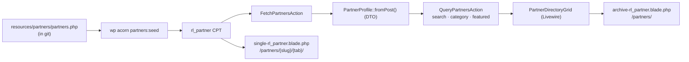

# PartnerHub domain

`app/Domains/PartnerHub` — strategic co-branded partners. Two distinct features share the name:

1. **The co-branded hub** — a tabbed page per partner at `/partners/{slug}/{tab}/`. This is the port target of the legacy `rl-partners-hub` plugin.
2. **The directory** — a searchable index of partners at `/partners/`, built from the same CPT. Net-new in v2; the legacy plugin had no equivalent.

Not to be confused with the [Referral domain](referral.md), which handles the affiliate programme. "Partner" here means a strategic co-branded relationship (Oyster, Lexgo); "referrer" means an affiliate with a commission.

---

## 1. The co-branded hub

### Routing

`PartnerPostType` registers the `rl_partner` CPT plus rewrite rules and the `rl_tab` query var, so `/partners/oyster/pricing/` resolves to the single template with `rl_tab=pricing`. This mirrors the legacy plugin's URL structure exactly — existing partner links keep working.

`single-rl_partner.blade.php` renders it.

### Tabs

`PartnerHubTabResolver::resolveTabs($hasComarketing)` builds the ordered map:

| Key | Label |
| :--- | :--- |
| `overview` | Overview & Actions |
| `icp` | Ideal Client Profile |
| `services` | Services Overview |
| `why-rl` | Why Remote Leverage |
| `referral-program` | Referral Program & Fees |
| `comarketing` | Co-Marketing — **only when enabled for that partner** |
| `case-studies` | Case Studies |
| `faq` | Partner FAQ |
| `contact` | Contact Team |

`resolveCurrentTab()` falls back to `overview` for an unknown tab or one that is disabled for this partner — so a link to a co-marketing tab on a partner without co-marketing degrades instead of 404ing.

The resolver is a pure static class precisely so this logic is unit-testable without WordPress.

### Fields and defaults

Around 35 per-partner meta fields are authored through an ACF tabbed field group (`app/Fields/PartnerHubFields.php`): branding, terms, bidirectional referral actions and commission, resources, co-marketing, manager contact, content overrides, per-section PDF attachments.

`PartnerHubGlobalData` supplies the default content each tab falls back to when a partner overrides nothing — a static library of core values, "why choose RL" points, an 8-row comparison matrix, target industries, geographic markets, services, the referral lifecycle stages, default referral rules, co-marketing copy, case studies and FAQs. A blank override field means "use the global default", not "render nothing".

`PartnerHubAdmin` adds Referral Code and Submission Form columns to the CPT list table. Field editing itself is ACF's, not a custom metabox — that is the one structural difference from the legacy plugin, which hand-rolled eight metaboxes.

### Attribution

`HandleLeadBookingCompletedForReferrer` credits a referrer when a booking arrives with a matching `source_type`/`source_id`. This is architecture the legacy plugin never had. (It is named `...ForReferrer`, not `...ForPartner`; several tickets and older docs use the latter, and it has never existed. Partners and referrers share the one `referrer-*` portal.)

#### The partnership identifier (WR-73)

A partner hub renders a **tracked link** built by `App\Domains\PartnerHub\Support\PartnerLink`, carrying the partner's `_rl_partner_code` on `?partner=`:

```
https://remoteleverage.com/hire-va-4/?partner=RL-OYSTER
```

That parameter was chosen over inventing one because it already exists end to end: `AttributionCollector::NAMED` maps `partner` to a column on `rl_leads`, and `HubSpotGateway` has always sent it. What it carried was free text — a campaign tag someone typed — which is why nothing could join on it.

`HubSpotGateway::propertiesFor()` now splits the two meanings apart:

| `?partner=` value | `partnership_id` | `partner_name` |
| :--- | :--- | :--- |
| resolves to an `rl_partner` post | the code, e.g. `RL-OYSTER` | the partner's name, e.g. `Oyster` |
| resolves to nothing (a legacy campaign tag) | not sent | the raw value, unchanged |

`PartnerLink::nameForCode()` is what distinguishes them, and null is the signal that a value is *not* an identifier.

**`partnership_id` does not exist in HubSpot portal 243484989** — checked against the live schema on 2026-09-21: 488 contact properties, `partner_name` the only partner one. `dropUnknownProperties()` therefore skips it and logs a warning, and it starts flowing the moment somebody creates it, with no deploy. Create it as a single-line text property under `conversioninformation`. The private app token cannot create it itself; it reads the schema but lacks `crm.schemas.contacts.write`.

Two things deliberately **not** done here:

- **`?via=` was not reused.** It belongs to the Referral domain, sits in `AttributionCollector::IGNORED`, and `AttributionEngine::resolveLeadSource()` classifies a slug as `partnership` by prefix — `partner-`, `co-`, `strategic`. `RL-OYSTER` matches none, so borrowing the parameter would stamp every partner lead `referral_hub`.
- **The `AttributionEngine` prefix heuristic was left alone.** It still decides `partnership` vs `referral_hub` by slug shape rather than by looking a partner up. That is worth replacing with a `PartnerLink::findByCode()` lookup, but it governs `source_type` on paths this ticket does not touch, and changing it silently reclassifies historical leads.

## 2. The directory



| Class | Does |
| :--- | :--- |
| `FetchPartnersAction` | Loads every published `rl_partner` as a directory-ready array. Uncached — it is a handful of local posts |
| `QueryPartnersAction` | `execute($search, $category, $featuredOnly)` — zero-reload filtering |
| `PartnerProfile` | The DTO the grid renders; `fromPost()` maps the CPT meta |
| `PartnerDirectoryGrid` | The Livewire component |
| `PartnerSeedCommand` | `partners:seed` applies the definitions file; `--dry-run`, `--prune` |

No configuration — the directory has no external dependency.

### The directory used to be Notion-fed

Until 2026-09-15 the grid was hydrated from a Notion database via
`NotionSyncService` / `SyncNotionPartnersAction`, cached for an hour. Both are
deleted, along with `NOTION_API_KEY` and `NOTION_PARTNERS_DATABASE_ID`.

Two things were wrong with it in practice. Neither credential was ever set, so
`fetchPartners()` returned `[]` and `/partners/` rendered "No matching partners
found" — while three fully-populated `rl_partner` entries sat unused. And a
partner's identity had to be maintained twice: in Notion for the directory card,
in the CPT for the hub the card links to. The card even guessed its link target
by slugifying the Notion name, because Notion had no slug column.

The CPT is now the single source of truth for both surfaces.

### Where partner content lives

`resources/partners/partners.php` — in git, applied by `partners:seed`:

```bash
wp acorn partners:seed --dry-run   # report what would change
wp acorn partners:seed             # create or update, matched on post_name
wp acorn partners:seed --prune     # also trash published entries the file omits
```

Idempotent, and it never changes an existing post ID, so attribution and linked
media keep pointing at the same entry. This exists for the reason page content
lives in `patterns/`: entries authored only in the database are lost on a
refresh, which previously emptied the directory and 404'd every hub.

## Status

The gap against the legacy plugin was tracked as epic **WR-115** (subtasks WR-116–120) and **closed on 2026-09-09**: the admin surface, all ~35 fields in the template, the global default-content library, the tab resolver and 24 Pest tests all landed. [partner-hub-gap-analysis.md](../partner-hub-gap-analysis.md) is the original analysis, kept for reference — read it as history, not as an open gap list.

## Tests

`tests/Unit/PartnerHubTest.php` — 34 tests covering the admin save handler, the global data library, tab resolution, the per-partner override resolver, the CPT-backed directory DTO and directory filtering.

`tests/Unit/PartnershipIdentifierTest.php` — 12 tests covering the tracked link, code resolution, and the `partnership_id` / `partner_name` split in the HubSpot payload, including that the property is dropped rather than 400ing the sync while the portal lacks it.

## Known gaps

- **Lexgo and Lano have no referral intake form or tracking sheet.** The hand-authored
  database entries carried Oyster's form and sheet URLs, which would have routed their
  referrals into Oyster's tracking sheet. `partners.php` leaves both unset until each
  partner supplies its own; the hub degrades to the direct intro email.
- **Oyster has no referral destination.** `_rl_partner_referral_email` is the literal
  string `pending to define`, so the hub shows a "pending setup" badge rather than a dead
  mailto. Carried over from the source data deliberately — do not invent an address.
- **No partner logos.** `_rl_partner_logo_url` is unset for all three, so directory cards
  fall back to a two-letter monogram. Needs the actual brand assets.
- **The partner manager is a team, not a person.** `_rl_manager_name` is `Partnerships Team`
  for every entry by design (2026-09-15) — a partner-facing contact should not depend on any
  individual still being in the role. Do not put a personal name in
  `resources/partners/partners.php`.
- **`archive-rl_partner.blade.php` links to `/partner-dashboard`**, which currently throws. See [known-issues.md](../known-issues.md).
