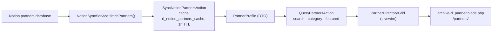

# PartnerHub domain

`app/Domains/PartnerHub` — strategic co-branded partners. Two distinct features share the name:

1. **The co-branded hub** — a tabbed page per partner at `/partners/{slug}/{tab}/`. This is the port target of the legacy `rl-partners-hub` plugin.
2. **The directory** — a searchable, Notion-synced index of partners at `/partners/`. Net-new in v2; the legacy plugin had no equivalent.

Not to be confused with the [Referral domain](referral.md), which handles the affiliate programme. "Partner" here means a strategic co-branded relationship (Oyster, Lexgo); "referrer" means an affiliate with a commission.

---

## 1. The co-branded hub

### Routing

`PartnerPostType` registers the `rl_partner` CPT plus rewrite rules and the `rl_tab` query var, so `/partners/oyster/pricing/` resolves to the single template with `rl_tab=pricing`. This mirrors the legacy plugin's URL structure exactly — existing partner links keep working.

`single-rl_partner.blade.php` renders it.

### Tabs

`PartnerHubTabResolver::resolveTabs($hasComarketing)` builds the ordered map:

| Key | Label |
| :--- | :--- |
| `overview` | Overview & Actions |
| `icp` | Ideal Client Profile |
| `services` | Services Overview |
| `why-rl` | Why Remote Leverage |
| `referral-program` | Referral Program & Fees |
| `comarketing` | Co-Marketing — **only when enabled for that partner** |
| `case-studies` | Case Studies |
| `faq` | Partner FAQ |
| `contact` | Contact Team |

`resolveCurrentTab()` falls back to `overview` for an unknown tab or one that is disabled for this partner — so a link to a co-marketing tab on a partner without co-marketing degrades instead of 404ing.

The resolver is a pure static class precisely so this logic is unit-testable without WordPress.

### Fields and defaults

Around 35 per-partner meta fields are authored through an ACF tabbed field group (`app/Fields/PartnerHubFields.php`): branding, terms, bidirectional referral actions and commission, resources, co-marketing, manager contact, content overrides, per-section PDF attachments.

`PartnerHubGlobalData` supplies the default content each tab falls back to when a partner overrides nothing — a static library of core values, "why choose RL" points, an 8-row comparison matrix, target industries, geographic markets, services, the referral lifecycle stages, default referral rules, co-marketing copy, case studies and FAQs. A blank override field means "use the global default", not "render nothing".

`PartnerHubAdmin` adds Referral Code and Submission Form columns to the CPT list table. Field editing itself is ACF's, not a custom metabox — that is the one structural difference from the legacy plugin, which hand-rolled eight metaboxes.

### Attribution

`HandleLeadBookingCompletedForPartner` credits a partner when a booking arrives with a matching `source_type`/`source_id`. This is architecture the legacy plugin never had.

## 2. The directory



| Class | Does |
| :--- | :--- |
| `NotionSyncService` | `fetchPartners()` against the Notion API |
| `SyncNotionPartnersAction` | Sync with a 1-hour cache (`CACHE_KEY = 'rl_notion_partners_cache'`, `CACHE_TTL_SECONDS = 3600`); `execute(true)` forces a refresh |
| `QueryPartnersAction` | `execute($search, $category, $featuredOnly)` — zero-reload filtering |
| `PartnerProfile` | The DTO the grid renders |
| `PartnerDirectoryGrid` | The Livewire component |

Configuration: `NOTION_API_KEY`, `NOTION_PARTNERS_DATABASE_ID`.

```bash
wp acorn tinker --execute="\App\Domains\PartnerHub\Actions\SyncNotionPartnersAction::run();"
```

## Status

The gap against the legacy plugin was tracked as epic **WR-115** (subtasks WR-116–120) and **closed on 2026-09-09**: the admin surface, all ~35 fields in the template, the global default-content library, the tab resolver and 24 Pest tests all landed. [partner-hub-gap-analysis.md](../partner-hub-gap-analysis.md) is the original analysis, kept for reference — read it as history, not as an open gap list.

## Tests

`tests/Unit/PartnerHubTest.php` — 24 tests covering the admin save handler, the global data library and tab resolution.

## Known gaps

- **Only one of two production partners exists locally.** Oyster is migrated; Lexgo is pure data entry against the restored field group.
- **`/remote-leverage-x-oyster/` and `/remote-leverage-x-lano/`** are standalone production pages with no recorded decision about whether they fold into the hub. "Lano" appears nowhere else in the content audit — it may be a dead page or a missing partner record.
- **`archive-rl_partner.blade.php` links to `/partner-dashboard`**, which currently throws. See [known-issues.md](../known-issues.md).
