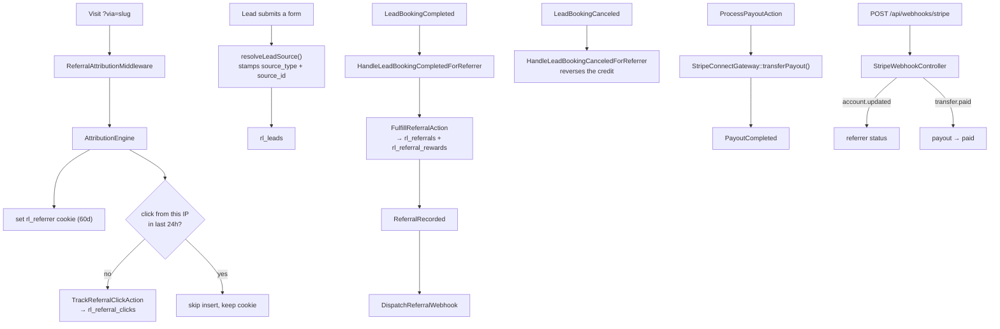

# Referral domain

`app/Domains/Referral` — the affiliate programme: who referred whom, what that earned, and how it gets paid.

Replaces the `rl-referral-program` plugin.

---

## Vocabulary

The legacy plugin called these "partners", which collides with the co-branded Partner Hub. In this codebase:

- **Referrer** — an individual or company in the affiliate programme, with a referral code and a Stripe Connect account. This domain.
- **Partner** — a strategic co-branded partner with a `/partners/{slug}/` hub. See [partner-hub.md](partner-hub.md).

The Livewire components are named accordingly (`ReferrerPortalDashboard`, `ReferrerRegistrationForm`) — older docs calling them `PartnerPortalDashboard` are wrong.

## Storage

| Table | Holds |
| :--- | :--- |
| `rl_referrers` | The affiliate: referral code, contact, Stripe Connect account id, status |
| `rl_referral_clicks` | Every attributed click, with IP, for deduplication |
| `rl_referrals` | A referral that converted to a lead/booking |
| `rl_referral_rewards` | Earned commission per referral |
| `rl_payouts` | Stripe Connect transfers |

## Attribution

`AttributionEngine` is the heart of the domain and is used by Lead as well.

**Resolution priority** (`resolveReferralSlug()`):

1. `?via=`
2. `?ref=`
3. `?r=`
4. the `rl_referrer` cookie
5. the query string of `HTTP_REFERER`

The cookie (`AttributionEngine::COOKIE_NAME = 'rl_referrer'`) lasts 60 days by default (`DEFAULT_COOKIE_DAYS`), overridable via `rl_referral_settings`. Slugs are sanitised — XSS vectors are stripped before anything is stored or echoed.

**Click deduplication**: `isRecentClick($referrerUserId, $ipAddress)` enforces a 24-hour rolling window per IP per referrer. Repeat visits inside that window refresh the cookie but do not insert another `rl_referral_clicks` row, so a referrer cannot inflate click counts by refreshing.

**Lead source stamping**: `resolveLeadSource()` produces the `source_type` / `source_id` pair written onto every lead — `ad`, `organic`, `referral_hub` or `partnership`.

`ReferralAttributionMiddleware` sets the cookie on Acorn-routed requests.

## Flow



## The classes

### Actions

| Class | Does |
| :--- | :--- |
| `TrackReferralClickAction` | Records a click, subject to the 24h/IP window |
| `RegisterReferrerAction` | Creates a referrer, generates a unique referral slug, initialises the commission profile |
| `FulfillReferralAction` | Converts an attributed lead into a `rl_referrals` row plus its reward |
| `ProcessPayoutAction` | Calculates the owed amount and executes the Stripe Connect transfer |

### Services & repositories

| Class | Does |
| :--- | :--- |
| `AttributionEngine` | Above |
| `ReferralSettingsService` | `rl_referral_settings` — cookie days, reward type (`cash` default), currency (`USD`), landing pages |
| `StripeConnectGateway` | `createOnboardingLink()` for referrer onboarding, `transferPayout()` for the transfer |
| `ReferrerRepositoryInterface` / `EloquentReferrerRepository` | The one place in the codebase with an explicit repository abstraction — find by id, code or email; create; update; list active |

### Livewire

| Component | Page |
| :--- | :--- |
| `ReferrerRegistrationForm` | `/referrer-register` |
| `ReferrerPortalDashboard` | `/referrer-portal` — referral links, clicks, conversions, pending commission, Stripe Connect status |

`/referral-dashboard` is kept as a legacy route: the old plugin served signup and login as tabs of one URL, so `?tab=login`, `?logged_out` and `?action=login` route to the portal and everything else to registration. Old bookmarks and email links keep working without a redirect.

## Webhooks

`POST /api/webhooks/stripe` → `StripeWebhookController`:

- `account.updated` → referrer onboarding status
- `transfer.paid` → payout marked paid, `PayoutCompleted` dispatched

```bash
curl -X POST https://remoteleverage-v2.test/api/webhooks/stripe \
  -H "Content-Type: application/json" \
  -d '{"type":"transfer.paid","data":{"object":{"id":"tr_test_12345","amount":1400,"currency":"usd","destination":"acct_test_partner"}}}'
```

## Admin

**Referrers** (`admin.php?page=rl-referrers`) → Analytics · All Referrers · Referrals · Rewards & Payouts · Settings.

## Tests

`AttributionEngineTest`, `ReferralAttributionReferrerTest`, `ReferralAnalyticsTest`, `ReferralRewardAutomationTest`, `ReferralSettingsTest`, `ReferrerAuthenticationTest`, `ReferrerPortalLoginTest`, `tests/Feature/StripeWebhookTest.php`.

## Known issues

- **`/partner-dashboard` is broken.** `routes/web.php` redirects it to a route named `partner.portal` that does not exist (the real name is `referrer.portal`), `archive-rl_partner.blade.php` links to `/partner-dashboard` twice, and `config/redirects.php` maps it to `partner-portal` — a third path that also does not exist. See [known-issues.md](../known-issues.md).
- **`REFERRAL_WEBHOOK_SECRET` is in `.env` but read by nothing.** `config/services.php` reads `REFERRAL_WEBHOOK_URL` instead.
