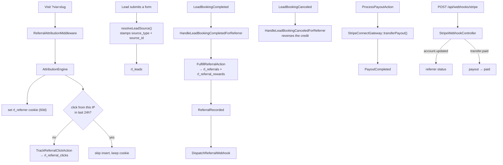

# Referral domain

`app/Domains/Referral` — the affiliate programme: who referred whom, what that earned, and how it gets paid.

Replaces the `rl-referral-program` plugin.

---

## Vocabulary

The legacy plugin called these "partners", which collides with the co-branded Partner Hub. In this codebase:

- **Referrer** — an individual or company in the affiliate programme, with a referral code and a Stripe Connect account. This domain.
- **Partner** — a strategic co-branded partner with a `/partners/{slug}/` hub. See [partner-hub.md](partner-hub.md).

The Livewire components are named accordingly (`ReferrerPortalDashboard`, `ReferrerRegistrationForm`) — older docs calling them `PartnerPortalDashboard` are wrong.

## Storage

| Table | Holds |
| :--- | :--- |
| `rl_referrers` | The affiliate: referral code, contact, Stripe Connect account id, status |
| `rl_referral_clicks` | Every attributed click, with IP, for deduplication |
| `rl_referrals` | A referral that converted to a lead/booking. `lead_id` is the real FK to `rl_leads` (added 2026-09-17) |
| `rl_referral_rewards` | Earned commission per referral |
| `rl_payouts` | Stripe Connect transfers |

## Attribution

`AttributionEngine` is the heart of the domain and is used by Lead as well.

**Resolution priority** (`resolveReferralSlug()`):

1. `?via=`
2. `?ref=`
3. `?r=`
4. the `rl_referrer` cookie
5. the query string of `HTTP_REFERER`

The cookie (`AttributionEngine::COOKIE_NAME = 'rl_referrer'`) lasts 60 days by default (`DEFAULT_COOKIE_DAYS`), overridable via `rl_referral_settings`. Slugs are sanitised — XSS vectors are stripped before anything is stored or echoed.

**Click deduplication**: `isRecentClick($referrerUserId, $ipAddress)` enforces a 24-hour rolling window per IP per referrer. Repeat visits inside that window refresh the cookie but do not insert another `rl_referral_clicks` row, so a referrer cannot inflate click counts by refreshing.

**Lead source stamping**: `resolveLeadSource()` produces the `source_type` / `source_id` pair written onto every lead — `ad`, `organic`, `referral_hub` or `partnership`.

`ReferralAttributionMiddleware` sets the cookie on Acorn-routed requests.

## Flow



## The classes

### Actions

| Class | Does |
| :--- | :--- |
| `TrackReferralClickAction` | Records a click, subject to the 24h/IP window |
| `RegisterReferrerAction` | Creates a referrer, generates a unique referral slug, initialises the commission profile |
| `FulfillReferralAction` | Converts an attributed lead into a `rl_referrals` row plus its reward |
| `SyncHubSpotLifecycleAction` | Mirrors the HubSpot contact lifecycle stage onto referred leads and fulfils the referral when the deal closes |
| `ProcessPayoutAction` | Calculates the owed amount and executes the Stripe Connect transfer (inert while Connect is off — see below) |

### Services & repositories

| Class | Does |
| :--- | :--- |
| `AttributionEngine` | Above |
| `ReferralSettingsService` | `rl_referral_settings` — cookie days, reward type (`cash` default), currency (`USD`), landing pages |
| `StripeConnectGateway` | `createOnboardingLink()` for referrer onboarding, `transferPayout()` for the transfer. **Both are no-ops while `STRIPE_CONNECT_ENABLED` is unset** |
| `ReferralLeadMatcher` | Resolves a lead to its referral through the identity graph — the one definition of "the same person" all three call sites share |
| `ReferrerDashboardPresenter` | Assembles the portal's whole view model (KPIs, earnings, per-referral timeline, staleness) |
| `ReferralTimeline` | Allowlists internal activity-log events into something a referrer may read |
| `DemoDashboardData` | Bundled sample dashboard for demonstrations, administrator-gated |
| `ReferrerRepositoryInterface` / `EloquentReferrerRepository` | The one place in the codebase with an explicit repository abstraction — find by id, code or email; create; update; list active |

### Livewire

| Component | Page |
| :--- | :--- |
| `ReferrerRegistrationForm` | `/referrer-register` |
| `ReferrerPortalDashboard` | `/referrer-portal` — referral links, KPIs, commissions, and a per-referral status timeline with staleness flags |

`/referral-dashboard` is kept as a legacy route: the old plugin served signup and login as tabs of one URL, so `?tab=login`, `?logged_out` and `?action=login` route to the portal and everything else to registration. Old bookmarks and email links keep working without a redirect.

## Linking a referral to its lead

`rl_referrals.lead_id` is the join. Before it existed the only link was string equality on
`lead_email`, which is wrong in the ordinary case rather than at the edges:

- `CaptureLeadAction` **always inserts a new Lead**; it never updates one. A prospect submitted
  by a referrer and the same prospect filling in the form a week later are two rows.
- A phone-only submission gives the lead a synthesised `@remoteleverage.internal` address while
  the referral row holds a blank one. Neither matches.

Both cases made the booking listener's `updateOrCreate` **insert a duplicate referral** rather
than fail visibly — so the referrer saw one prospect twice and the reward attached to whichever
row an admin happened to fulfil.

`ReferralLeadMatcher` resolves through `LeadProfile`, the identity "passport" every lead is
attached to, then falls back to the legacy email match for rows that predate the column (and
backfills `lead_id` when it does). The migration backfills existing rows from the `(lead #N, …)`
note direct submissions used to write, then from a case-insensitive email match; anything it
cannot resolve is left `NULL` rather than guessed at.

## Deal fulfillment — HubSpot lifecycle

Booking a call **qualifies** a referral. Only the deal closing **fulfils** it and earns a
reward. That transition is now driven by HubSpot rather than by an admin remembering to change
a dropdown.

`SyncHubSpotLifecycleAction` runs hourly (`rl_sync_hubspot_lifecycle`, also
`wp acorn referral:sync-hubspot-lifecycle`). It batch-reads the configured contact property for
every lead attached to a still-open referral, mirrors it onto the lead, writes a timeline entry
when it changes, and fulfils the referral when it reaches the configured closing value.

| Setting | Default | Where |
| :--- | :--- | :--- |
| `hubspot_lifecycle_property` | `lifecyclestage` | Leads → Settings → Integration Overrides |
| `hubspot_lifecycle_fulfilled_value` | `customer` | Same |
| `stale_days` | `5` | Referrers → Settings → Attribution |

Both HubSpot values are configurable because the answer is a portal convention, not a fact about
the code — a team that works `hs_lead_status` needs a different property, and getting it wrong
means no referrer is ever paid.

**This is the polling half of a two-part design.** `applyStage()` is the seam: a HubSpot webhook
receiver calls that one method and inherits every rule (fulfilment threshold, idempotency,
activity-log write) rather than reimplementing them. The existing read+write private-app token
is enough to poll, but **not** to receive webhooks — those are configured in the private app's
own settings and signed with its *client secret*, which is a separate credential this
application does not hold. Keep the poll on as reconciliation once a webhook exists: a dropped
delivery is otherwise invisible, and its cost is an unpaid referrer.

### Staleness

A referral is stale when its lifecycle stage has not moved in `stale_days` and still could.
Terminal statuses (`fulfilled`, `rewarded`, `rejected`) are never stale — a finished deal has
stopped moving because it is finished.

The clock is `hubspot_lifecycle_changed_at`, which moves **only** when the stage value itself
changes. `hubspot_lifecycle_synced_at` moves on every successful poll, which is what separates
"nothing has happened for five days" from "the sync has been broken for five days" — only the
first is the referrer's problem. An id HubSpot does not return is treated as *unknown*, never as
empty: writing a null stage would read as the deal regressing.

## Stripe Connect is off

Referrer payouts are shelved (2026-09-16). `services.stripe.connect_enabled` defaults to
`false` and nothing in the repo or `.env` sets `STRIPE_CONNECT_ENABLED`, so both gateway calls
return `null` before any HTTP request. The referrer portal contains no Stripe surface at all.

The guard lives in the gateway rather than at each call site so there is no second place to
forget it, and `StripeConnectDisabledTest` asserts the default is off **and** that "off" means
no outbound call is attempted — a stray env var in one environment's task definition is all it
would take to start moving real money.

## Webhooks

`POST /api/webhooks/stripe` → `StripeWebhookController`:

- `account.updated` → referrer onboarding status
- `transfer.paid` → payout marked paid, `PayoutCompleted` dispatched

```bash
curl -X POST https://remoteleverage-v2.test/api/webhooks/stripe \
  -H "Content-Type: application/json" \
  -d '{"type":"transfer.paid","data":{"object":{"id":"tr_test_12345","amount":1400,"currency":"usd","destination":"acct_test_partner"}}}'
```

## Admin

**Referrers** (`admin.php?page=rl-referrers`) → Analytics · All Referrers · Referrals · Rewards & Payouts · Settings.

## Tests

`AttributionEngineTest`, `ReferralAttributionReferrerTest`, `ReferralAnalyticsTest`, `ReferralRewardAutomationTest`, `ReferralSettingsTest`, `ReferrerAuthenticationTest`, `ReferrerPortalLoginTest`, `ReferralLeadLinkageTest`, `HubSpotLifecycleSyncTest`, `ReferrerDashboardTest`, `StripeConnectDisabledTest`, `tests/Feature/StripeWebhookTest.php`.

## Known issues

- **`REFERRAL_WEBHOOK_SECRET` is in `.env` but read by nothing.** `config/services.php` reads `REFERRAL_WEBHOOK_URL` instead.
