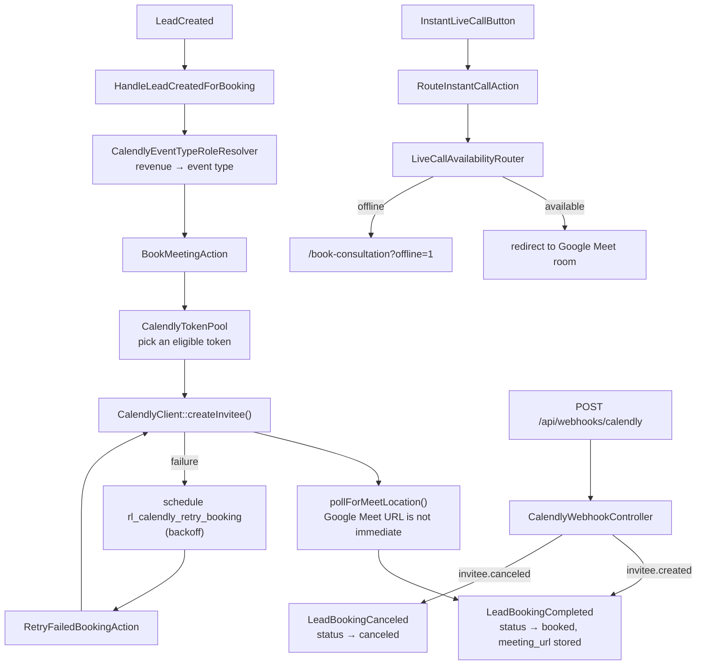

# Scheduling domain

`app/Domains/Scheduling` — turning a qualified lead into a booked consultation, or into an instant video call with whoever is online right now.

Replaces the Calendly iframe embeds in `rl-elementor-blocks` and the `rl-join-live-call` plugin.

---

## Why it exists

Calendly's own embed gives you no control over routing, no server-side record of what was booked, and no way to react when a booking fails. This domain talks to Calendly's API directly, so the site decides which calendar a lead lands on, keeps its own record, and can retry.

## Revenue-tier routing

The single most important behaviour here. `HandleLeadCreatedForBooking` picks the Calendly event type from the lead's self-reported monthly revenue:

| Lead | Event type role | Env var |
| :--- | :--- | :--- |
| MRR ≥ $10k | `t10` — high-tier | `CALENDLY_T10_EVENT_TYPE` |
| MRR < $10k | `t0` — standard | `CALENDLY_T0_EVENT_TYPE` |
| Instant live call | `live_call` | `CALENDLY_LIVE_CALL_EVENT_TYPE` |
| Fallback | `default` | `CALENDLY_DEFAULT_EVENT_TYPE` |

Job seekers and applicant flows skip the sales calendar entirely.

`CalendlyEventTypeRoleResolver` (option `rl_calendly_event_type_roles`, roles `['default','t10','t0','live_call']`) is what actually maps a role to an event-type URI, so the mapping can be re-pointed from wp-admin without a deploy. The env vars are the seed, not the runtime source of truth.

## The token pool

Calendly rate-limits aggressively, and a single token throttling takes the booking funnel down. `CalendlyTokenPool` (option `rl_calendly_token_pool`, seeded from `CALENDLY_API_KEY` through `CALENDLY_API_KEY_4`) holds several tokens and implements:

- `getEligibleTokens($context)` — tokens not currently cooling down
- `markRateLimited($token, $cooldownSeconds = 60)` — take one out of rotation
- `recordFailure()` / `failureCount()` / `isCircuitOpen()` — a per-context circuit breaker
- `clearFailures()` / `clearAllFailures()` — manual reset from the admin screen

Failures are tracked per *context* (metadata lookups vs. booking), so a broken metadata call does not open the circuit on bookings.

## Flow



## The classes

### Actions

| Class | Does |
| :--- | :--- |
| `FetchAvailableSlotsAction` | Real-time available intervals for a date range, in the visitor's timezone, for a given event type |
| `BookMeetingAction` | Creates the Calendly invitee and returns the meeting URL, or reports a failure. Calendly is the only provider — see below |
| `RetryFailedBookingAction` | Re-attempts a booking that failed, using `HandlesBookingRetryBackoff` and the `booking_retry_count` / `booking_next_retry_at` columns on `rl_leads` |
| `RouteInstantCallAction` | Decides whether a consultant is available now and where to send the visitor |
| `WarmCalendlyMetadataCacheAction` | Pre-fetches event-type metadata twice daily so the first booking of the day is not slow |

### Gateways

| Class | Does |
| :--- | :--- |
| `CalendlyClient` | The API surface: `getAvailableSlots`, `countBookedEvents`, `getEventType`, `getEventQuestions`, `createInvitee`, `findExistingInvitee`, `cancelScheduledEvent`, `getScheduledEvent`, `getInvitee`, `pollForMeetLocation`. Token selection goes through the pool; `getForToken()` exists for calls that must use a specific one. |
| `CalendlyMetadataCache` | Caches event types and questions; `warm()`, `forget()`, `forgetAll()`. Schedules `rl_calendly_refresh_questions` as a single WP-Cron event rather than refetching inline. |
| `CalendlyTokenPool` | Above. |

**There is no second provider, deliberately.** A Google Calendar fallback sat behind Calendly
until 2026-09-21, on the theory that a booking is too valuable to lose to one vendor being
unreachable. The activity log says it never once worked: across every booking this application has
taken, Calendly produced 241 meetings carrying a real invitee uri and Google produced five, all of
them a `uniqid()` minted locally because `createAppointment()` had returned null. Its entire
measurable output was five people told a consultant was expecting them. A failure that says so puts
the lead on the retry ladder — five attempts over 32 minutes at the same slot — which is more
booking than the fallback ever delivered, and it does not lie in the meantime.

`pollForMeetLocation()` deserves a note: Calendly does not return the Google Meet URL synchronously when an invitee is created, so the client polls (20 attempts, 300ms apart by default). If you see bookings with an empty `meeting_url`, that poll timed out.

### Services

| Class | Does |
| :--- | :--- |
| `CalendlyEventTypeDiscoveryService` | Lists the account's event types, and backs them up to `rl_calendly_event_types_backup` so the admin screen can still render if the API is down |
| `CalendlyEventTypeRoleResolver` | Role → event-type URI mapping |
| `AvailabilityHealthMonitor` | Whether a tier still has anything to sell. `record()` on a pageview, `recordUtilization()` from the probe. Owns the alert bands and writes `rl_availability_health` for the diagnostics panel |
| `TierUtilizationProbe` | Measures how full a tier's rolling booking window is. Self-throttled (`booking.availability.probe_ttl`); runs after the response on a real availability fetch and hourly on `rl_calendly_probe_utilization` |
| `LiveCallAvailabilityRouter` | `isAvailable()`, `setAvailability($bool, $ttlMinutes = 30)`, `getStatus()`. Cache key `rl_live_call_availability`, default room `https://meet.google.com/rl-instant-consult`. |

### Model

`LiveCallSession` → `rl_live_call_sessions`.

## Availability alerts

Three thresholds on one ladder, per tier: **90%** and **95%** full, then sold out.

Fill is `booked / (booked + open)` over the rolling booking window, because
`event_type_available_times` only ever returns what is still open and never says how much there
was. The booked side comes from `CalendlyClient::countBookedEvents()`, which pages
`/scheduled_events` for the window and matches the event-type URI in PHP — that endpoint has no
`event_type` filter.

Tuned in `config/booking.php` under `availability`:

| Key | Default | Why it is that |
| :--- | :--- | :--- |
| `window_days` | `4` | Mirrors the date range set on the event type in Calendly, which **the API does not expose** — so it is kept in step by hand. Four is what T10/T0 published during the 2026-09-17 sell-out. Capped at 7; Calendly rejects a longer availability range |
| `warning_threshold` | `0.90` | |
| `critical_threshold` | `0.95` | |
| `min_sample` | `8` | Below this many slots in the window, no percentage is reported at all. Zero open and one booked is arithmetically 100% full, and is far more often a calendar with no hours published |
| `probe_ttl` | `300` | How long a measurement is reused, so a busy hour measures once rather than once per visitor |

**90% and 95% alert on crossing, not on being there.** A tier hovering at 91% all afternoon is
one message. Coming back down is silent; filling up again is a new episode and alerts again.

**Sold out is the exception** and keeps its own hourly repeat. It is not a heads-up but an
active revenue stop, and the repeat is what leaves a trail across an overnight incident instead
of one 2am message. Its throttle is independent of the ladder, so 92% → sold out inside an hour
produces both messages.

Watch for: `countBookedEvents()` returns **null, not 0**, when it could not find out. Zero booked
is the healthiest reading there is, so coercing the two together would report a tier one booking
from selling out as wide open. A null skips the check entirely.

## Webhooks

`POST /api/webhooks/calendly` → `CalendlyWebhookController`.

- `invitee.created` → lead status `booked`, meeting URL recorded, `LeadBookingCompleted` dispatched
- `invitee.canceled` → lead status `canceled`, `LeadBookingCanceled` dispatched

Signature verification reads `CALENDLY_WEBHOOK_SIGNING_KEY` from `config/services.php`. **That key is not present in the current `.env`** — see [known-issues.md](../known-issues.md).

```bash
curl -X POST https://remoteleverage-v2.test/api/webhooks/calendly \
  -H "Content-Type: application/json" \
  -d '{"event":"invitee.created","payload":{"email":"founder@acme.com","scheduled_event":{"uri":"https://api.calendly.com/scheduled_events/test-123","start_time":"2026-09-18T15:00:00Z"}}}'
```

## Admin

**Calendly** (`admin.php?page=rl-calendly`) → Token Pool · Event Types. Add/remove tokens, see which are rate-limited or circuit-open, clear failures, discover event types and assign them to roles.

## Tests

`tests/Unit/BookingWizardRoutingTest.php` (tier routing, month navigation, applicant bypass), `tests/Unit/AvailabilitySellOutTest.php` and `tests/Unit/AvailabilityUtilizationTest.php` (the alert ladder and the booked-side count), and `tests/Feature/CalendlyWebhookTest.php` (both webhook events).

## Known gaps

- **`LiveCallAvailabilityRouter` is a cache flag, not a calendar.** `InstantLiveCallButton` calls it on mount, but nothing polls a real consultant calendar and nothing updates the flag automatically — availability has to be set explicitly. This is WR-104, deliberately on hold. The "Online Now" indicator is therefore only as truthful as the last manual toggle.
