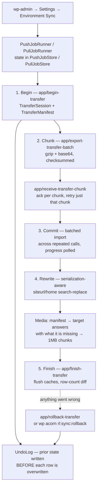

# Sync domain

`app/Domains/Sync` — moving content, media and whitelisted settings between environments, driven from wp-admin, over HTTP.

Net-new in v2; no legacy plugin equivalent. **Never available in production, by design.**

This document describes the code as built. The design rationale — including why the original backup plan was replaced by an undo log — is in [environment-sync.md](../environment-sync.md). One-time credential setup is in [ai-mcp-and-sync.md](../ai-mcp-and-sync.md).

---

## The problem it solves

Staging runs on ECS with no shell and no WP-CLI. Every previous mechanism for moving content assumed CLI access on both ends. This domain removes that assumption: the *receiving* environment only has to serve HTTP.

Transport is the WordPress Abilities API (core 6.9+, this project runs WP 7.1) — `SyncClient` calls `/wp-json/wp-abilities/v1/abilities/{name}/run` on the remote, authenticated by Basic auth as a dedicated `sync-service` user holding one custom capability, `rl_manage_ai_sync`.

## Four production gates

Independent, so no single mistake is enough:

1. The admin screen is **not registered** when `WP_ENV === 'production'`.
2. Every transfer/maintenance ability **refuses to run** when `WP_ENV === 'production'`, whatever the caller or capability (`TransferAbility`).
3. The client **refuses to target** an environment whose configured URL matches `PRODUCTION_SYNC_URL` (`TransferPusher`).
4. `sync-service` on production is never granted `rl_manage_ai_sync`, so even a leaked credential cannot reach the abilities.

Gate 2 is the load-bearing one: production stays safe even if someone copies the staging code, credentials and config wholesale.

## Datasets

`DatasetRegistry` is the catalogue. Selection is per-run, not global config.

| Group | Tables / files | Default |
| :--- | :--- | :--- |
| `content` | `wp_posts`, `wp_postmeta`, `wp_terms`, `wp_termmeta`, `wp_term_taxonomy`, `wp_term_relationships` | selected |
| `media` | `attachment` rows + the referenced files under `uploads/` | selected |
| `settings` | the option whitelist in `config/rl-sync.php` | opt-in |
| `leads` | `rl_leads`, `rl_lead_activity_logs` | **never transferred** |
| `referrals` | `rl_referrers`, `rl_referrals`, `rl_referral_clicks`, `rl_referral_rewards`, `rl_payouts` | **never transferred** |
| `scheduling` | `rl_live_call_sessions` | **never transferred** |
| `users` | `wp_users`, `wp_usermeta` | **never transferred** |
| — | `wp_migrations`, `wp_comments`, `wp_commentmeta` | never synced, not selectable |

The four "never transferred" groups are real customer data or the credentials the tool runs on. They still appear on the screen, but only under **Maintenance** — you can purge them on either side without ever copying them between environments.

Per-run exclusions within `content`: by post type, by post ID, by taxonomy. Each group also has a **clean before import** toggle — on, the target's rows are deleted first so it becomes an exact mirror; off, rows are upserted by primary key and extra rows on the target survive.

## Transfer flow

Sized for ~28MB with no long-running process on the far side, so every step fits inside one PHP request and is resumable.



### Why an undo log, not a backup

The original design specified a full backup of every affected table before the first row landed. That cannot work on a receiving side with no CLI and no long-running process — dumping `wp_posts` inside one request is exactly what times out.

`UndoLog` instead records each row's prior state immediately *before* it is overwritten. It is bounded by what actually changed rather than by table size, is written incrementally, and covers files as well as rows.

The write ordering matters: entries go in **before** the change, so a request dying between the two leaves an undo entry for a change that did not happen — harmless — rather than a change with no undo entry, which would be unrecoverable.

A failed batch deliberately leaves the session open and its undo log intact. Tidying up would discard the only thing that can restore the target. Logs are kept after *successful* transfers too, because a sync that worked but brought the wrong selection needs undoing just as much as one that failed; they age out with the 20-run retention.

### Media

An attachment is more than one file. WordPress generates a resized copy per registered image size, records them in `_wp_attachment_metadata`, and does not rebuild them on demand. On this install that is the difference between 512 files and **1,599** (≈140MB) — sending only the originals would leave every `srcset` variant 404ing even though the attachment row and its main file arrived.

- The sender builds a manifest; the target answers with the subset it is missing or holds at a different checksum; only those upload. A re-sync after a partial run moves almost nothing.
- Files stream in 1MB chunks to a temporary name and are moved into place only once the whole file has arrived and its SHA-256 matches. An interruption leaves a stray `.rl-sync-part` file rather than a truncated image that looks present and renders broken.
- **`UploadPath` validates rather than sanitises.** Paths arrive from another environment and are joined onto the uploads directory. Absolute paths, traversal segments, stream wrappers, null bytes, unsafe characters and any extension outside a small allowlist are refused outright — never written, never even requested.

### Attachment IDs are remapped, not preserved

The importer allocates new IDs on the target and rewrites every reference to the old one: `post_content` (including block attribute JSON and serialized ACF values), `_thumbnail_id`, and any postmeta holding a bare attachment ID (`AttachmentIdMap`, `AttachmentReferenceRewriter`). Slower and more code than clobbering, but it cannot destroy an attachment the target already had.

## Abilities

Each is permission-gated by its own `permission()` method against `rl_manage_ai_sync`.

| Ability | Purpose |
| :--- | :--- |
| `app/begin-transfer` | Open a session, record the manifest |
| `app/export-transfer-batch` / `app/receive-transfer-chunk` | The chunked content pipe |
| `app/export-media-manifest` / `app/check-media-files` | Decide which files actually need sending |
| `app/read-media-file` / `app/receive-media-file` | The chunked file pipe |
| `app/finish-transfer` | Flush, report the row-count diff |
| `app/rollback-transfer` | Revert everything a session wrote, files included |
| `app/purge-dataset` | Maintenance truncate |
| `app/export-syncable-settings` / `app/import-syncable-settings` | The `config/rl-sync.php` option whitelist |
| `app/export-landing-page` / `app/import-landing-page` | A single page, post + postmeta |

**Why these set `show_in_rest` but not `public`:** WP 7.1 gates the REST run endpoint on `meta.show_in_rest` (seeded from `meta.public` unless set explicitly) — an ability without it 404s before its own `permission()` callback ever runs. The sync abilities set `show_in_rest` directly so the endpoint exists, while staying out of general ability listings and MCP's `public`-keyed auto-discovery. `show_in_rest` controls whether the endpoint exists, never who may call it.

## Commands

```bash
wp acorn rl:sync:grant sync-service        # one-time per environment, idempotent

wp acorn rl:sync:push --target=staging     # push selected datasets
wp acorn rl:sync:pull --target=staging     # pull them down
wp acorn rl:sync:settings --push --target=staging
wp acorn rl:sync:page 123 --push --target=staging
wp acorn rl:sync:page 0 --pull --remote-post-id=456 --target=staging

wp acorn rl:sync:purge                     # truncate a purgeable dataset (not undoable)
wp acorn rl:sync:rollback <session>         # undo what a session wrote on the target
wp acorn rl:sync:rollback-local <session>   # undo a transfer imported into this environment
```

## Admin

**Settings → Environment Sync** (`options-general.php?page=rl-environment-sync`), `manage_options`, registered only when `SyncEnvironment::syncEnabled()`.

- **Generate sync credentials** — creates `sync-service` if absent, grants the capability, mints an application password and shows it once with the `.env` lines to paste. This replaces the CLI bootstrap entirely, which is what made the feature reachable from staging at all.
- Push/pull dataset selection, progress polling (`wp_ajax_rl_sync_push_step` / `_pull_step`), history and restore.
- Purge controls, each requiring the environment name typed to confirm, and refused when either side is production.

Staging's screen is read-only status and restore — it never initiates a transfer, because local is the only side holding the remote's credentials. Pull is the safer direction (local is disposable).

## What it deliberately does not do

- **Schema changes.** `wp_migrations` is never synced. If local is ahead on schema, migrate the target first — a transfer into a stale schema is refused rather than half-applied.
- **Plugin/theme files.** Code ships through the deploy pipeline.
- **Production, in either direction.**
- **Comments.** Treated as disposable; the site is not meant to support them.

## Configuration

```
STAGING_SYNC_URL=https://staging.remoteleverage.com
STAGING_SYNC_USER=sync-service
STAGING_SYNC_APP_PASSWORD=xxxx xxxx xxxx xxxx xxxx xxxx
```

Same shape for `PRODUCTION_SYNC_*`, which exists so gate 3 has something to compare against — not so production can be synced. These are read locally to call *out*; do not add them to `scripts/seed-staging-secrets.sh`, which pushes values in the opposite direction.

### The body-credential bridge — TEMPORARY

```
STAGING_SYNC_BODY_AUTH=true
```

CloudFront removes the `Authorization` header before it reaches the origin unless a cache or origin request policy carries it, and this distribution does not. Every Application Password request therefore arrives unauthenticated and the sync screen cannot reach staging at all. WordPress's own Site Health REST check fails on staging for the same reason, which suggests the block editor is affected too.

With this flag on, `SyncClient` sends the credential **as well as** the header, in a `_rl_sync_auth` field beside the `input` envelope. On the receiving side `web/app/mu-plugins/rl-sync-body-auth.php` copies it into `PHP_AUTH_USER` / `PHP_AUTH_PW` before `determine_current_user` runs.

The bridge verifies nothing itself. `wp_authenticate_application_password()` still performs the lookup, the hash comparison, the rate limiting and the failure hook, so a caller without a valid credential gains nothing it would not have gained from a header. The mu-plugin refuses unless all of: the environment is one sync may run in, the method is POST, the request is HTTPS, the path is the abilities endpoint, the content type is JSON, and no real credential arrived. `SyncClient` refuses to attach it when either side is production.

**This is a workaround for an infrastructure defect, not a design.** The correct fix is a `/wp-json/wp-abilities/*` cache behavior with `CachingDisabled` and an origin request policy that forwards `Authorization`. Once that lands, set the flag to false and delete both halves. Target for removal: **2026-10-15**. It is the second workaround for this same misconfiguration; the first is the `X-Livewire` header hack in `docker/nginx.conf`, still marked temporary.

## Tests

Sixteen files, the largest test group in the suite: `SyncTransferPusherTest`, `SyncTransferPullerTest`, `SyncContentExporterTest`, `SyncContentImporterTest`, `SyncAttachmentRemapTest`, `SyncMediaFileTest`, `SyncUploadPathTest`, `SyncUndoLogTest`, `SyncSessionTest`, `SyncJobProgressTest`, `SyncDatasetsTest`, `SyncPurgeTest`, `SyncEnvironmentTest`, `SyncBodyAuthTest`, `SyncClientBodyAuthTest`.
