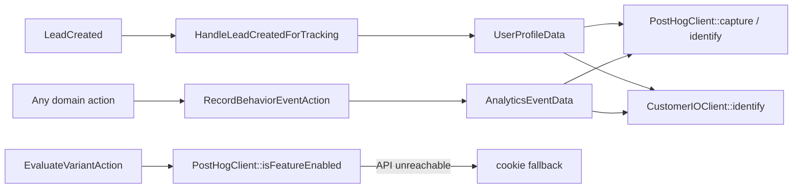

# Tracking domain

`app/Domains/Tracking` — behavioural analytics and server-side feature flags.

Replaces the `rl-customer-io` and `rl-posthog-feature-flags` plugins.

---

## Why it exists

The two legacy plugins each had their own snippet injection, their own identify call and their own idea of who the user was. A lead could end up identified in one and anonymous in the other. This domain dispatches to both from one place, off one event, with one profile shape.

## Dual dispatch



Both destinations receive the same DTO. `RecordBehaviorEventAction` is the only sanctioned way to emit an analytics event — calling a gateway directly bypasses the dual dispatch and the audit log.

## The classes

| Class | Does |
| :--- | :--- |
| `RecordBehaviorEventAction` | Takes `AnalyticsEventData`, dispatches to PostHog and Customer.io |
| `EvaluateVariantAction` | `execute($flagKey, $distinctId = null, $properties = [])` — server-side flag evaluation with a cookie fallback when PostHog is unreachable |
| `PostHogClient` | `capture()`, `isFeatureEnabled()` |
| `CustomerIOClient` | `identify()`, `track()` |
| `HandleLeadCreatedForTracking` | Listener — identifies the person on both platforms the moment a lead is captured |
| `AnalyticsEventData`, `UserProfileData` | The DTOs |
| `TrackingHooks` (`app/Infrastructure/WordPress/Hooks`) | Injects the PostHog snippet in `<head>` (priority 2) and the Customer.io **CDP** snippet (`window.cioanalytics`) in the footer. **This is the only place PostHog is initialised** — see the warning below |

## Configuration

| Variable | Used by |
| :--- | :--- |
| `POSTHOG_API_KEY`, `POSTHOG_HOST` | `PostHogClient`, front-end snippet |
| `CUSTOMERIO_SITE_ID`, `CUSTOMERIO_API_KEY`, `CUSTOMERIO_APP_API_KEY` | `CustomerIOClient` (Track API v1, server side) |
| `CUSTOMERIO_CDP_WRITE_KEY` | The browser `cioanalytics` snippet only. A **different credential** from the site id above — CDP source write key vs Track API site id. Blank -> no snippet is emitted. Value recovered 2026-09-15 from the `analytics.load("…")` argument in the page source of `remoteleverage.com` and `rl-testing.test`, identical on both; it is a publishable browser key, not a secret. |

GTM, LinkedIn Insight and Meta Pixel are **not** injected by this domain. Google Site Kit is installed (`wp-plugin/google-site-kit`) and ships the GTM `<head>` snippet and `wp_body_open` noscript once a container is connected; LinkedIn and Meta are added as tags inside that container. This was a deliberate rescope of WR-99 from code to configuration — the remaining work is admin setup, not engineering.

> **Site Kit is currently inactive locally** (verified 2026-09-14), so no GTM snippet is emitted and no tag inside the container fires. Activating it and connecting the container is a prerequisite for any GTM-delivered tracking at cutover.

## PostHog is initialised exactly once

`TrackingHooks::injectPostHogSnippet()` on `wp_head` is the only initialisation. `resources/js/app.js`
used to import the `posthog-js` package and call `init()` a second time against the same key, which
loaded two copies of the SDK and captured every pageview twice. Removed 2026-09-15, along with the
`posthog-js` dependency and the `window.POSTHOG_API_KEY` / `window.POSTHOG_HOST` globals in
`layouts/app.blade.php` that existed only to feed it. It had never been observed because
`POSTHOG_API_KEY` has never been set in any environment.

`window.posthog` is the snippet's queueing stub until `array.js` lands, so client callers such as
`resources/js/payment-gateway.js` can call `capture()` immediately regardless of load order.

> **Production initialises PostHog from GTM, not from the theme.** Its HTML carries
> `posthog.capture` but no `posthog.init`. Since v2 inherits both production GTM containers
> ([cutover-decisions.md §32](../cutover-decisions.md)), check the container before switching Site
> Kit on, or the duplicate comes back from the other direction.

## Booking funnel events

The names below are **verbatim from the legacy form** (`rl-elementor-blocks`
`assets/js/headless-calendly-multistep.js`), which fired them client-side via `posthog.capture()`.
The PostHog funnels, Customer.io campaigns and n8n flows are keyed to them, so they are not free to
rename. `MultistepBookingWizard` emits them **server-side** now, which is strictly more reliable —
no ad-blockers, no lost beacon on unload.

| Event | Raised when | Extra properties |
| :--- | :--- | :--- |
| `form_loaded` | `mount()` | — |
| `form_started` | first property update, once per instance | — |
| `step_date_selection` | arrival at the calendar step | — |
| `hour_selected` | `selectSlot()` | `selected_time` |
| `partial_form_submitted` | partial lead captured after step 1 | `lead_id` |
| `booking_request_sent` | start of `submitBooking()`, before the outcome | `selected_time` |
| `booking_finished` | booking confirmed, **and** the skip-calendar route | `meeting_id`, `lead_id`, `role`, `booked_slot` |
| `step_viewed` | every step change — **v2 addition**, no legacy counterpart | `step` |

Every event also carries the legacy common shape: `form_id` (the Livewire component id, where
legacy used the Gravity Forms id), `session_id`, `form_type: 'multistep'`, `is_isolated`.

**Fixed at the same time (2026-09-15):** these were briefly emitted as `booking_wizard_<name>`,
which no downstream consumer listened for. And `distinctId` was `$email ?: session()->getId()` —
`session()` has no `getId()` in every context, and `trackStepEvent()` swallows throwables, so every
event raised before the visitor typed an email was silently discarded. It now falls back to the
component's own `sessionId` UUID. `tests/Unit/BookingFunnelEventParityTest.php` pins both.

`form_started` is also emitted by the checkout funnel (`CheckoutFunnelStep::CheckoutStarted`), as it
was in the legacy code. `form_type` is what separates them.

## Verifying it

Browser console on any front-end page:

```js
window.posthog          // initialised PostHog client
window.cioanalytics     // Customer.io CDP analytics array (`_writeKey` names the source)
```

`window.cioanalytics` is an array that gains a queued entry per call until `analytics.min.js` replaces it; `typeof window.cioanalytics.track === 'function'` is the check that matters. `window._cio` (the classic tracker) is **no longer injected** as of 2026-09-15 — if it is defined, something else on the page put it there, most likely a GTM tag.

Network tab, filtered to `posthog` or `customer.io`: PostHog `/e/`, the CDP bundle at `cdp.customer.io/v1/analytics-js/snippet/<write key>/analytics.min.js`, and server-side `/api/v1/customers/` calls from `CustomerIOClient`.

## Tests

`tests/Unit/ActionsTest.php` (flag evaluation with cookie fallback) and `tests/Feature/TrackingSubscribersTest.php` (auto-identify on `LeadCreated`).

## Notes

- `PostHogRedirectMiddleware` (`app/Application/Http/Middleware`) exists for flag-driven redirects on Acorn-routed requests. It does not apply to WordPress page requests — see [architecture.md §2](../architecture.md#2-two-request-paths).
- Both gateways are called synchronously inside the request that captured the lead. See [architecture.md §4](../architecture.md#listeners-are-synchronous).
