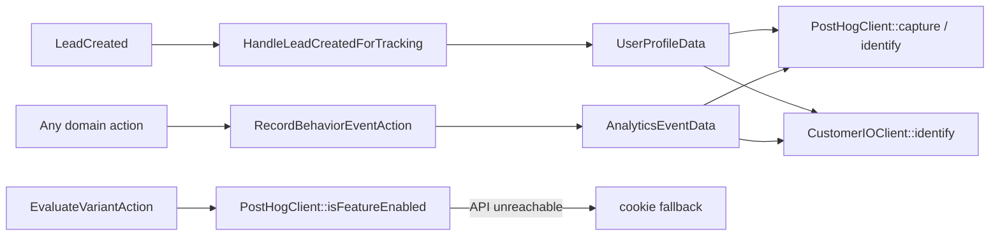

# Tracking domain

`app/Domains/Tracking` — behavioural analytics and server-side feature flags.

Replaces the `rl-customer-io` and `rl-posthog-feature-flags` plugins.

---

## Why it exists

The two legacy plugins each had their own snippet injection, their own identify call and their own idea of who the user was. A lead could end up identified in one and anonymous in the other. This domain dispatches to both from one place, off one event, with one profile shape.

## Dual dispatch



Both destinations receive the same DTO. `RecordBehaviorEventAction` is the only sanctioned way to emit an analytics event — calling a gateway directly bypasses the dual dispatch and the audit log.

## The classes

| Class | Does |
| :--- | :--- |
| `RecordBehaviorEventAction` | Takes `AnalyticsEventData`, dispatches to PostHog and Customer.io |
| `EvaluateVariantAction` | `execute($flagKey, $distinctId = null, $properties = [])` — server-side flag evaluation with a cookie fallback when PostHog is unreachable |
| `PostHogClient` | `capture()`, `isFeatureEnabled()` |
| `CustomerIOClient` | `identify()`, `track()` |
| `HandleLeadCreatedForTracking` | Listener — identifies the person on both platforms the moment a lead is captured |
| `AnalyticsEventData`, `UserProfileData` | The DTOs |
| `TrackingHooks` (`app/Infrastructure/WordPress/Hooks`) | Injects the PostHog snippet in `<head>` (priority 2) and the Customer.io **CDP** snippet (`window.cioanalytics`) in the footer. **This is the only place PostHog is initialised** — see the warning below |

## Configuration

| Variable | Used by |
| :--- | :--- |
| `POSTHOG_API_KEY`, `POSTHOG_HOST` | `PostHogClient`, front-end snippet |
| `CUSTOMERIO_SITE_ID`, `CUSTOMERIO_API_KEY` | `CustomerIOClient` (Track API v1, server side). Region is **us** (`track.customer.io`), confirmed against the legacy `rl_cio_region` option. |
| `CUSTOMERIO_CDP_WRITE_KEY` | The browser `cioanalytics` snippet only. A **different credential** from the site id above — CDP source write key vs Track API site id. Blank -> no snippet is emitted. Value recovered 2026-09-15 from the `analytics.load("…")` argument in the page source of `remoteleverage.com` and `rl-testing.test`, identical on both; it is a publishable browser key, not a secret. |

LinkedIn Insight is a tag inside the GTM container. **Meta Pixel and Microsoft UET are not** —
production hardcodes them into the page, outside GTM, so nothing carried them across the cutover.
They are emitted by `MarketingPixelHooks` from `config/pixels.php`. See the container audit below.

Three things production loads are deliberately **not** reproduced, and the reasons are in
`config/pixels.php` next to where each one used to be configured:

| Gone | When | Why |
| :--- | :--- | :--- |
| HubSpot browser tracking | 2026-09-19 | 5,582ms of main-thread time on throttled mobile, the most expensive script on the site. Removed outright, not flagged off, because the flag was "is `HUBSPOT_PORTAL_ID` empty" and `HubSpotGateway` reads that same variable as a credential. **Server-side contact sync is unaffected** — different config key, still live. |
| Rewardful | 2026-09-19 | The theme runs its own referral program (`app/Domains/Referral`), so this was second-guessing a system we do not use. `Lead::$referral_code` was never sourced from it. |
| TikTok pixel | 2026-09-19 | Switched off, not removed: `pixels.tiktok.enabled`, back on with `TIKTOK_PIXEL_ENABLED=true`. Nothing is spending against the account, and it was the largest non-Google third party at 162KB. | GTM itself is delivered by `SiteKitHooks` (`app/Infrastructure/WordPress/Hooks`) from `config/site-kit.php`.

**This reverses the earlier plan of having Site Kit ship the snippet.** Site Kit's Tag Manager module holds exactly one container: `Modules\Tag_Manager::register_tag()` builds `new Web_Tag($settings['containerID'])` from a single value, and `ampContainerID` is a separate AMP-only render path, not a second container on the same page (verified against Site Kit 1.187.0). Production serves **two** containers ([cutover-decisions.md §32](../cutover-decisions.md)), so connecting Site Kit to one would have silently stopped every tag in the other — exactly the ad-spend parity that decision exists to protect.

Site Kit stays installed and is still *configured* from the same file: `SiteKitHooks` serves `googlesitekit_tagmanager_settings` through a `pre_option_` filter, so the config file wins over whatever wp-admin holds. `useSnippet` is forced to `false` while the theme is emitting, which makes a double snippet structurally impossible rather than something a deploy has to correct. Site Kit's own dashboards still work if anyone connects it.

| Setting | Default | Does |
| :--- | :--- | :--- |
| `GTM_CONTAINER_IDS` | *(blank)* | Containers to load, in order. Empty since `GTM-53JDTQCZ` was retired on 2026-09-18 and everything it carried moved into `config/pixels.php` |
| `GTM_EMIT_SNIPPET` | `true` | Theme renders them; `false` hands delivery back to Site Kit, and back to one container |
| `GTM_ENVIRONMENTS` | `production` | Which `wp_get_environment_type()` values load them |
| `GTM_ACCOUNT_ID` | *(blank)* | GTM account, for Site Kit's dashboards only |
| `GTM_FORCE_MODULE_ACTIVE` | `false` | Force `tagmanager` into Site Kit's active module list |

Production-only by default for the same reason Site Kit's `Tag_Environment_Type_Guard` is: the containers hold Meta and LinkedIn conversion pixels, and a test booking on staging fires them against the same ad accounts as a real one.

`tests/Unit/SiteKitConfigTest.php` pins all of it.


## Container audit, 2026-09-17

> The full three-way event matrix — production, the 2026-08-27 backup and v2 — is in
> [`tracking-event-matrix.md`](tracking-event-matrix.md). This section covers the containers only.

Read from the containers' published payloads (`googletagmanager.com/gtm.js?id=…`, public) and
production's live HTML.

**`GTM-P4KZNJWL` is empty and was never live.** Its payload is version 1 with `"tags":[],
"predicates":[], "rules":[]`, and production's snippet for it sits inside an HTML comment reading
*"Deprecated: unused Google Tag Manager script tag"*. Decision 32 read two container ids out of the
HTML without noticing the second was commented out. Only `GTM-53JDTQCZ` (version 46, 21 live tags,
5 paused) has ever run.

### What fires, and on what

| Trigger | Tags |
| :--- | :--- |
| `gtm.init_consent` | Consent default (`ad_storage` + `analytics_storage` **granted**, no CMP behind it); **PostHog init** |
| `gtm.init` | Google tag `AW-11406183013`, `send_to: G-SCP464C5EH` |
| All Pages | Conversion Linker; TikTok `CPMB51BC77U75I0QMMAG`; LinkedIn Insight `9514236`; OpenAI `GtXTy8ihLz5qrMUanZ3fqf`; StatCounter `13176576`; Rewardful `39ea7a`; Calendly inline widget |
| Click text contains "Book a Consultation" | GA4 `Book a Consultation Click`; Ads conversion `oEXvCN-QnpcbEOWU8r4q` |
| Path contains `VAThankYou` | GA4 `appointment_booked`; Ads conversions `AyW6CJHZnr8ZEOWU8r4q` and `pTbrCP6-_dIbEOWU8r4q`; PostHog `appointment_booked_web` |
| `form_submit` | GA4 `generate_lead`; Ads conversion `oqW3CP3jnJcbEOWU8r4q` |
| Click class has `e-eicon-play` | GA4 `watched_testimonial_video` |

`/vathankyou/` carries no inline tracking of its own — every conversion on it comes from the
container's path trigger. v2 has the page (ID 126) and `MultistepBookingWizard` redirects to it, so
that path survives intact.

### Tags that cannot work on v2

| Tag | Why |
| :--- | :--- |
| Calendly inline widget | Calls `jQuery(document).ready(...)`; v2 loads no jQuery, so it throws and takes the Calendly→dataLayer bridge in the same script block with it. Its target element does not exist either. |
| GA4 `watched_testimonial_video` | Triggers on the Elementor class `e-font-icon-svg e-eicon-play`. No Elementor in v2. |
| GA4 `generate_lead` + Ads `oqW3CP3jnJcbEOWU8r4q` | Fired on `form_submit`, which came from gtag.js detecting a **native** Gravity Forms submit — the container has no form-submit listener tag. Livewire never submits natively. **Fixed** by `MultistepBookingWizard::pushToDataLayer()`. |

### Duplicated with different ids

Production runs both of these twice, from the page *and* from the container, into different
accounts.

| Vendor | Hardcoded in page | In GTM |
| :--- | :--- | :--- |
| LinkedIn Insight | `6411876` | `9514236` |
| OpenAI pixel | `7QY9HDVocGyeNvMMW1gLWb` | `GtXTy8ihLz5qrMUanZ3fqf` |

Which id is the live ad account **could not be determined from outside**, and all three available
signals came up empty: LinkedIn's beacon returns 302 for any partner id including invented ones,
not one of the 3,969 imported leads carries an `li_fat_id`, and neither id appears in any option
or postmeta row. The container tells us only that its LinkedIn and OpenAI tags (`tag_id` 64 and
65) are the most recently created in it — consistent with a half-finished migration, but
circumstantial. The answer is in LinkedIn Campaign Manager under Account Assets -> Insight Tag,
and in the OpenAI ads account.

**Both are therefore kept firing**, which is exactly what production does today: the page-hardcoded
id comes from `config/pixels.php`, the other keeps arriving from the container. Dropping the wrong
one would take an ad account dark with no error anywhere; keeping both changes nothing.

`config/pixels.php` declares what the container already delivers in `delivered_by_gtm`, and
`MarketingPixelTest` fails the build if an id ever appears in both places — which is the mistake
production made twice.

## PostHog is initialised exactly once

`TrackingHooks::injectPostHogSnippet()` on `wp_head` is the only initialisation. `resources/js/app.js`
used to import the `posthog-js` package and call `init()` a second time against the same key, which
loaded two copies of the SDK and captured every pageview twice. Removed 2026-09-15, along with the
`posthog-js` dependency and the `window.POSTHOG_API_KEY` / `window.POSTHOG_HOST` globals in
`layouts/app.blade.php` that existed only to feed it. It had never been observed because
`POSTHOG_API_KEY` has never been set in any environment.

`window.posthog` is the snippet's queueing stub until `array.js` lands, so client callers such as
`resources/js/payment-gateway.js` can call `capture()` immediately regardless of load order.

> **Production initialises PostHog from GTM, not from the theme.** Its HTML carries
> `posthog.capture` but no `posthog.init`. Since v2 inherits both production GTM containers
> ([cutover-decisions.md §32](../cutover-decisions.md)), a PostHog init tag in either one loads a
> second copy of the SDK alongside `TrackingHooks::injectPostHogSnippet()` and counts every
> pageview twice — the same bug that was fixed on 2026-09-15 by removing `posthog-js` from
> `app.js`, arriving from the other direction.
>
> **`POSTHOG_API_KEY` is now set**, and it is byte-identical to the key inside the container
> (`phc_3Pbasn…`), so v2 already initialises PostHog client-side today. The duplicate lands the
> moment GTM is switched on — this is live, not hypothetical. Before then, remove the PostHog init tag from both containers and leave
> `TrackingHooks` as the sole owner: a container tag can be edited by anyone with GTM access and
> no deploy, so the theme is the side that can be reasoned about. GTM tags that *call*
> `posthog.capture()` are fine and need no change — the snippet's queueing stub accepts calls
> before the SDK lands.

## Booking funnel events

The names below are **verbatim from the legacy form** (`rl-elementor-blocks`
`assets/js/headless-calendly-multistep.js`), which fired them client-side via `posthog.capture()`.
The PostHog funnels, Customer.io campaigns and n8n flows are keyed to them, so they are not free to
rename.

**PostHog is captured in the browser; Customer.io is sent from PHP.** `MultistepBookingWizard::trackStepEvent()`
drives both from one call: `capturePostHog()` hands the browser a guarded `posthog.capture()` through
Livewire's `js()` effect, and `deferTracking()` queues a `CustomerIOClient::track()` for after the
response.

These were briefly *both* sent server-side, on the reasoning that a server call cannot be
ad-blocked. That cost the funnel entirely and was reverted on 2026-09-18. Two things were wrong
with it:

- **PostHog's identity lives in the browser.** A server event carries no person, no `$current_url`,
  no `$lib` and no session to attach to unless the component first ships the browser's distinct id
  back to PHP — a round trip `form_loaded` always loses. Worse, nothing in the booking form ever
  called `posthog.identify()`, so with `person_profiles: 'identified_only'` there was no person for
  those events to land on at all. The legacy funnel had the visitor's email against every row; the
  server-side one had an empty Person column.
- **Nothing was arriving anyway.** See *Deferred work and `terminate()`* below.

`posthog.identify()` is now sent at partial capture, keyed to email, which is the same moment and
the same key the legacy form used.

| Event | Raised when | Extra properties |
| :--- | :--- | :--- |
| `form_loaded` | `mount()` | — |
| `form_started` | first property update, once per instance | — |
| `step_date_selection` | arrival at the calendar step | — |
| `hour_selected` | `selectSlot()` | `selected_time` |
| `partial_form_submitted` | partial lead captured after step 1 | `lead_id` |
| `booking_request_sent` | start of `submitBooking()`, before the outcome | `selected_time` |
| `booking_finished` | booking confirmed, **and** the skip-calendar route | `meeting_id`, `lead_id`, `role`, `booked_slot` |
| `step_viewed` | every step change — **v2 addition**, no legacy counterpart | `step` |

Every event also carries the legacy common shape: `form_id` (the Livewire component id, where
legacy used the Gravity Forms id), `session_id`, `form_type: 'multistep'`, `is_isolated`.

### Deferred work and `terminate()`

`dispatch(...)->afterResponse()` registers a *terminating callback*, which runs only when something
calls `$app->terminate()`. Acorn calls it in two places (`Bootable::registerRequestHandler`): the
route it handles itself, and the `wordpress` route when `handlesWordPressRequests()` is true. This
theme renders through WordPress' template hierarchy, so an ordinary page view matches neither and
Acorn returns before registering its shutdown hook — as do `/wp-admin`, `/wp-login.php`, `/wp-json`
and any `.php` path.

On all of those the container never terminated and **every deferred job was discarded** — silently,
with no exception and no log line. That is fourteen call sites: Customer.io, PostHog, the Slack
alerts, the outgoing lead webhook, the notification mail, the referral notifications.

`ThemeServiceProvider::ensureApplicationTerminates()` closes it with a `shutdown` hook at priority
999 that terminates the container when Acorn has not. It is guarded by a sentinel terminating
callback, because `Application::terminate()` walks its callbacks **without clearing them** — calling
it twice re-runs all of them, which on the paths Acorn *does* handle would mean a duplicate of every
deferred job.

Measured on 2026-09-18, before the fix: a front-end page render logged the dispatch and never the
closure; the Livewire update endpoint logged both.

**Fixed at the same time (2026-09-15):** these were briefly emitted as `booking_wizard_<name>`,
which no downstream consumer listened for. And `distinctId` was `$email ?: session()->getId()` —
`session()` has no `getId()` in every context, and `trackStepEvent()` swallows throwables, so every
event raised before the visitor typed an email was silently discarded. It now falls back to the
component's own `sessionId` UUID. `tests/Unit/BookingFunnelEventParityTest.php` pins both.

`form_started` is also emitted by the checkout funnel (`CheckoutFunnelStep::CheckoutStarted`), as it
was in the legacy code. `form_type` is what separates them.

## Verifying it

Browser console on any front-end page:

```js
window.posthog          // initialised PostHog client
window.cioanalytics     // Customer.io CDP analytics array (`_writeKey` names the source)
```

`window.cioanalytics` is an array that gains a queued entry per call until `analytics.min.js` replaces it; `typeof window.cioanalytics.track === 'function'` is the check that matters. `window._cio` (the classic tracker) is **no longer injected** as of 2026-09-15 — if it is defined, something else on the page put it there, most likely a GTM tag.

Network tab, filtered to `posthog` or `customer.io`: PostHog `/e/`, the CDP bundle at `cdp.customer.io/v1/analytics-js/snippet/<write key>/analytics.min.js`, and server-side `/api/v1/customers/` calls from `CustomerIOClient`.

## Tests

`tests/Unit/ActionsTest.php` (flag evaluation with cookie fallback) and `tests/Feature/TrackingSubscribersTest.php` (auto-identify on `LeadCreated`).

## Notes

- `PostHogRedirectMiddleware` (`app/Application/Http/Middleware`) exists for flag-driven redirects on Acorn-routed requests. It does not apply to WordPress page requests — see [architecture.md §2](../architecture.md#2-two-request-paths).
- Both gateways are called synchronously inside the request that captured the lead. See [architecture.md §4](../architecture.md#listeners-are-synchronous).
