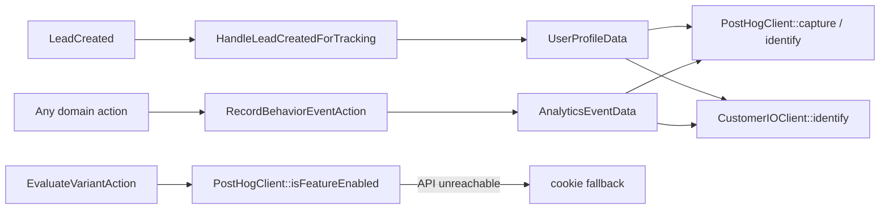

# Tracking domain

`app/Domains/Tracking` — behavioural analytics and server-side feature flags.

Replaces the `rl-customer-io` and `rl-posthog-feature-flags` plugins.

---

## Why it exists

The two legacy plugins each had their own snippet injection, their own identify call and their own idea of who the user was. A lead could end up identified in one and anonymous in the other. This domain dispatches to both from one place, off one event, with one profile shape.

## Dual dispatch



Both destinations receive the same DTO. `RecordBehaviorEventAction` is the only sanctioned way to emit an analytics event — calling a gateway directly bypasses the dual dispatch and the audit log.

## The classes

| Class | Does |
| :--- | :--- |
| `RecordBehaviorEventAction` | Takes `AnalyticsEventData`, dispatches to PostHog and Customer.io |
| `EvaluateVariantAction` | `execute($flagKey, $distinctId = null, $properties = [])` — server-side flag evaluation with a cookie fallback when PostHog is unreachable |
| `PostHogClient` | `capture()`, `isFeatureEnabled()` |
| `CustomerIOClient` | `identify()`, `track()` |
| `HandleLeadCreatedForTracking` | Listener — identifies the person on both platforms the moment a lead is captured |
| `AnalyticsEventData`, `UserProfileData` | The DTOs |
| `TrackingHooks` (`app/Infrastructure/WordPress/Hooks`) | Injects the PostHog snippet in `<head>` and the Customer.io **CDP** snippet (`window.cioanalytics`) in the footer |

## Configuration

| Variable | Used by |
| :--- | :--- |
| `POSTHOG_API_KEY`, `POSTHOG_HOST` | `PostHogClient`, front-end snippet |
| `CUSTOMERIO_SITE_ID`, `CUSTOMERIO_API_KEY`, `CUSTOMERIO_APP_API_KEY` | `CustomerIOClient` (Track API v1, server side) |
| `CUSTOMERIO_CDP_WRITE_KEY` | The browser `cioanalytics` snippet only. A **different credential** from the site id above — CDP source write key vs Track API site id. Blank -> no snippet is emitted. |

GTM, LinkedIn Insight and Meta Pixel are **not** injected by this domain. Google Site Kit is installed (`wp-plugin/google-site-kit`) and ships the GTM `<head>` snippet and `wp_body_open` noscript once a container is connected; LinkedIn and Meta are added as tags inside that container. This was a deliberate rescope of WR-99 from code to configuration — the remaining work is admin setup, not engineering.

> **Site Kit is currently inactive locally** (verified 2026-09-14), so no GTM snippet is emitted and no tag inside the container fires. Activating it and connecting the container is a prerequisite for any GTM-delivered tracking at cutover.

## Verifying it

Browser console on any front-end page:

```js
window.posthog          // initialised PostHog client
window.cioanalytics     // Customer.io CDP analytics array (`_writeKey` names the source)
```

`window.cioanalytics` is an array that gains a queued entry per call until `analytics.min.js` replaces it; `typeof window.cioanalytics.track === 'function'` is the check that matters. `window._cio` (the classic tracker) is **no longer injected** as of 2026-09-15 — if it is defined, something else on the page put it there, most likely a GTM tag.

Network tab, filtered to `posthog` or `customer.io`: PostHog `/e/`, the CDP bundle at `cdp.customer.io/v1/analytics-js/snippet/<write key>/analytics.min.js`, and server-side `/api/v1/customers/` calls from `CustomerIOClient`.

## Tests

`tests/Unit/ActionsTest.php` (flag evaluation with cookie fallback) and `tests/Feature/TrackingSubscribersTest.php` (auto-identify on `LeadCreated`).

## Notes

- `PostHogRedirectMiddleware` (`app/Application/Http/Middleware`) exists for flag-driven redirects on Acorn-routed requests. It does not apply to WordPress page requests — see [architecture.md §2](../architecture.md#2-two-request-paths).
- Both gateways are called synchronously inside the request that captured the lead. See [architecture.md §4](../architecture.md#listeners-are-synchronous).
