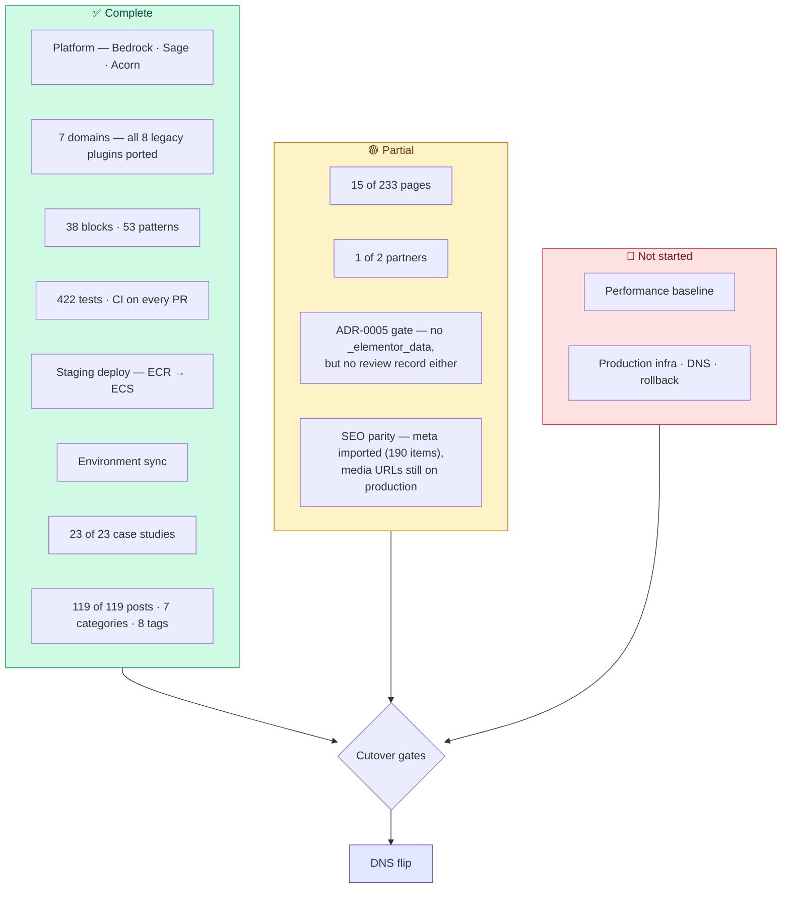

# Replacing production

What stands between this codebase and `remoteleverage.com`, and in what order to clear it.

Production-side figures come from the audit in [content-migration-checklist.md](content-migration-checklist.md) (2026-09-10). **Local figures were re-queried directly from the database on 2026-09-14** and supersede the older numbers in [content-migration-next-phase-plan.md](content-migration-next-phase-plan.md), which predate the blog import.

---

## The short version

> **⚠️ Parts of this document predate scope closure (2026-09-14) and the 2026-09-15 work.**
> The per-page counts below and "The three decisions" section were written when the plan was to
> migrate all 235 production pages. **That is no longer the plan.** Scope is a closed 48-URL list;
> the other 164 published pages are discarded and now carry 301s in `config/redirects.php`.
> For per-URL state read [`PAGE-MIGRATION-STATUS.md`](../../../../../PAGE-MIGRATION-STATUS.md);
> read this file for the **cutover gates**, which are current.

The platform is done. Posts, case studies, taxonomies and partners are done. Migration scope is
closed at 48 URLs and tracked per-URL elsewhere.

Production infrastructure — the ECS service, the deploy pipeline, the DNS runbook and the rollback
plan — is **owned outside this workstream** as of 2026-09-15. It remains a hard gate on the flip;
it is simply not this document's work item.

The media library is **not being ported** (2026-09-15). Page art is tracked as source in
`resources/images/pages/` and generated at build time, so nothing about the cutover depends on
reconciling production's library.

## Where each workstream stands

### Content

Local counts queried 2026-09-14; production counts from the 2026-09-10 audit.

| Type | Production | Migrated | Remaining |
| :--- | ---: | ---: | ---: |
| `page` | 233 | 15 | 218 |
| `case_study` (pages on production) | 23 | 23 | 0 |
| `post` | 119 | 119 | 0 |
| `rl_partner` | 2 | 1 | 1 |
| Categories | 7 | 7 | 0 |
| Tags | 8 | 8 | 0 |
| `attachment` | **not being ported** | 512 | — (see below) |

Migrated pages: `home`, `about-us`, `reviews`, `vapricing`, `privacy-policy`, `terms-of-use`, `comparison`, `compare-athena`, `wing-assistant-vs-remote-leverage`, `comparison-wing-assistant-ads`, `affiliate-program`, `referral`, `vathankyou`, `hire-va-4`, `blog`. *(Updated 2026-09-14: `hire-va-4-preview` was deleted; `hire-va-4` migrated in its place. `referral` holds incorrect content and is out of scope — see PAGE-MIGRATION-STATUS.md §4a.)*

Per-category post counts match production exactly — Business Growth 91, Outsourcing 95, Case Studies 13, Salary Guides 12, Real Estate Posts 9, News 2. The apparent **Live Sessions: 2 on production, 0 locally** discrepancy was **not real** (checked 2026-09-15): both items are `post_type=page`, not posts — production registers `category` on pages too, and a term count is not post-type-scoped. Nothing was dropped. Details in [content-migration-checklist.md](content-migration-checklist.md).

The 218 remaining pages break down as:

| Group | Count | State |
| :--- | ---: | :--- |
| §2 Role/industry SEO pages | ~45 | Blocked on decision 3 |
| §4 Noindex operational/funnel pages | ~19 | Blocked on decision 2 |
| §4 Confirmed-dead old homepage variants | ~13 | Just redirect to `/` |
| §5 In-sitemap experiment/ad landing pages | ~43 | Blocked on decision 1 |
| §7 Tools & lead magnets | ~10 | Interactive apps — need their own scoping pass |
| Everything else | remainder | Utility/nav pages needing keep/kill calls |

## The three decisions

Each needs a named owner and a yes/no. Each has a recommended default so the owner approves a proposal rather than authoring one.

### 1. Paid-traffic owner — 43 experiment pages (§5) + the funnel half of §4

**Needed:** which URLs currently have live ad spend pointed at them.

**Recommended default:** anything with spend in the last 90 days gets rebuilt; everything else 301s to its nearest live equivalent.

This is the single largest unblocking action available. Rebuilding a dead page wastes a week; killing a live one costs revenue, so nobody can guess it.

### 2. Sales/ops owner — 19 operational pages (§4)

`/payment/`, `/deposit-received/`, `/signedup/`, `/contractoragreement/`, `/onboardingform/`, `/vaonboardingform/`, `/onboardingguide/`, `/vainterview/`, `/vainterview2/`, `/service-cor/`, `/service-hiring/`, `/referral-program/`, `/va-form/`, `/hmchecklists/`, `/recruiterchecklists/`, `/saleschecklists/` and the two consultation-scheduled pages.

**Needed:** which are still in the hiring/onboarding flow, and who the audience is for the three `*checklists` pages — internal staff or clients. That last one decides whether they need authentication, which changes the build.

### 3. §2 architecture — one template or 45 pages?

**Recommendation: one data-driven template.**

The set already has an explicit role/industry/region axis, and the LatAm variants are the same page with a region swap. One Blade template fed by a CPT or ACF options set turns ~45 page builds into one build plus ~45 content records, and makes future role additions free. Building them individually re-creates the exact duplication the audit already found (`marketing-assistants` / `-2` / `-legacy`; `sales-virtual-assistants` / `-2`; `virtual-ecommerce-assistants` vs `ecommerce-virtual-assistants` vs `ecommerce-virtual-assistant`).

Pair it with a canonical-URL pass: pick one page per role, 301 the rest.

### Resolved: §8 blog

All 119 posts are imported, with all 7 categories and 8 tags, and **zero posts carry `_elementor_data`**. Per-category counts match production.

They came in through `wp acorn content:import-posts` (captured production JSON → `ElementorProseExtractor` → Gutenberg), not through the `content:audit-elementor` / `content:convert-elementor` / review-queue pipeline. That matters for the ADR-0005 gate: the *letter* of it is satisfied (no `_elementor_data` anywhere), but no post carries `_rl_conversion_status`, so nothing passed through `ContentAuditAdmin`'s editorial sign-off and there is no record of human review.

**Closed 2026-09-15:** `/blog/` is the canonical post archive, which is what production already does — `/guides/` 301s onto it on both sites, and Yoast is configured accordingly. A local `blog` page exists (ID 799) and carries the `/blog/` canonical. (The **Live Sessions** question is closed too — those two items are pages, not posts; see the content table above.)

## Work that needs no sign-off

Startable today, in parallel with chasing the decisions.

1. ~~**Install and configure Yoast SEO, and carry production's meta.**~~ ✅ **Done 2026-09-15.** Free 28.5 via `wp-plugin/wordpress-seo`, now **active** and configured by `wp option patch update` rather than through the first-time wizard — site representation mirrored off production's `Organization` schema node, social profiles, sitemap on, IndexNow off. `wp acorn content:import-seo` run for real: **190 local items, 863 postmeta rows, from 0**. All three gating decisions are closed — `/blog/` is the canonical archive; `referral-program` and `ecommerce-virtual-assistant` are excluded from production's stale `noindex` via the new `--force-index` option (defaulted, so plain re-runs honour it); Yoast Premium is not being bought, so redirects stay in `config/redirects.php` and the redirect manager is not configured. See [seo-meta-migration.md](seo-meta-migration.md).
2. ~~**Case-study sub-nav tab bar.**~~ ✅ **Done 2026-09-15.** Built as `App\Support\CaseStudySubnav` + `resources/views/partials/case-study-subnav.blade.php`, rendered once from `layouts.app` above `@yield('content')` so no template holds its own copy. TALENT PROFILES points at `/samples/` (page 1000005).

   **Correction to the original entry, which was wrong about placement.** Production does *not* share this bar site-wide with `/reviews/`. Verified 2026-09-15 — the string "TALENT PROFILES" does not appear in the served HTML of `/reviews/` or of `/case-study/` (the archive), and a Playwright probe at 1440px finds no bar on either. Production renders it **only on single `case_study` posts**, as an Elementor library template (element `521f30f0`, template `34011`).

   **Reverted to strict parity 2026-09-15.** v2 briefly also showed the bar on the `case_study` archive and on `/reviews/`, as a deliberate extension beyond production (a tab group whose tabs lead to pages that then drop the bar is broken wayfinding). Those two entries have been removed from `CaseStudySubnav::surfaces()`, which now matches `is_singular('case_study')` and nothing else. `/samples/` was never a surface either, so TALENT PROFILES and REVIEWS both lead to pages that lose the bar — accepted, because that is exactly what production does. Verified by curl: the bar renders on `/case-study/chick-fil-a/` with `aria-current="page"` on CASE STUDIES, and is absent from `/case-study/` and `/reviews/`.

   Measured off `/case-study/chick-fil-a/`: band `#330034` / 60px min-height; tabs Inter 16px/24px, idle `#FFFFFF` weight 300, active `#3DC53D` weight 500 underlined; row with 40px gap, stacking to a 10px-gap column below 768px. Pixel diff against production is 0.00% at 400px, and 0.00% at 1440px after allowing the 22px horizontal offset that comes from v2's case-study container being 1260px+`px-8` where production's is 1240px with no side padding.
3. ~~**`booking-footer` headline regression sweep.**~~ ✅ **Done 2026-09-15 — no page was still broken.** The `headline` ACF field was dead code until the affiliate-program review fixed it; `BookingFooterBlock::with()` now reads `$this->block->data['headline']` before falling back to `get_field()`, which also sidesteps the deep-in-page `get_field()` miss. All fifteen pages that set an override were re-rendered through `do_blocks()` on their real `post_content` and every one emits its own headline: `/hire-va-4/`, `/comparison/`, `/samples/`, `/hire-for-less/`, `/hire-va-1st-month-free/`, `/hire-va-6/` (all six via `hire-va-4-booking-footer`), `/spanish/`, `/affiliate-program/`, `/ecommerce-virtual-assistant/`, `/contractor-management/`, `/contractor-payments/`, `/steal-back-your-time/`, `/stealing-jobs/`, `/stealing-jobs-lp/`. `/referral/` renders the default `Book a free consultation` correctly — it sets no override. Worth noting for future patterns: `contractor-management` and `contractor-payments` pass `headline`/`description` **without** the `_headline`/`_description` field-key pairs and still render, because the raw-`data` read does not need them — but `map_image` is still resolved through `get_field()` only, so that one does (see the scoped override in `resources/patterns/steal-campaign.php`).
4. ~~**Lexgo partner content.**~~ ✅ **Done 2026-09-15.** All three entries (Oyster, Lexgo, Lano) render and appear in the directory. The real blocker was never content: `/partners/` read from an unconfigured Notion database rather than the CPT. Notion is deleted, the directory is CPT-backed, and partner content is seeded from `resources/partners/partners.php` (in git). What remains needs the partners, not code — intake forms for Lexgo and Lano, a referral destination for Oyster, logos for all three. See [domains/partner-hub.md](domains/partner-hub.md#known-gaps).
5. ~~**Reconcile the trackers.**~~ ✅ **Done 2026-09-14.** Resolved by inverting the relationship rather than merging: `PAGE-MIGRATION-STATUS.md` is the source of truth for migration scope, and `content-migration-checklist.md` was demoted to a read-only inventory of what exists on production. They no longer track the same thing, so they can no longer contradict each other.

## Cutover gates

These must all be green before DNS moves. One is green; the redirect gate closed on 2026-09-15.

| Gate | Source | State |
| :--- | :--- | :--- |
| Zero posts carry `_elementor_data` | ADR-0005 | ✅ Verified 2026-09-14 — 0 posts across the whole install |
| Every converted post human-approved | ADR-0005 amendment | 🔴 Queue exists (`ContentAuditAdmin`); no post carries `_rl_conversion_status`, so nothing went through it. Either run the 119 posts through the queue, or record an explicit decision that the import path made it unnecessary |
| SEO parity — Yoast installed, meta carried, redirect map complete | §9 of the checklist | 🟡 **Import done 2026-09-15.** Yoast 28.5 active and deliberately configured; `wp acorn content:import-seo` run for real — 190 local items, 863 postmeta rows, from 0. Every canonical rewritten onto the local host (0 rows still on `remoteleverage.com`); re-running reports 0 changes. `/blog/` is the canonical archive; `referral-program` and `ecommerce-virtual-assistant` excluded from production's stale `noindex`; redirect map complete in `config/redirects.php` (no Yoast Premium). **Not green yet:** (a) `services`, `store` and `contractoragreement` — built as v2 pages after the decision — inherited production's `noindex` and need a ruling; (b) `company_logo` and 171 OpenGraph image URLs still point at production, pending the media library; (c) the import and the Yoast configuration have to be repeated on staging and production. See [seo-meta-migration.md](seo-meta-migration.md) |
| Every killed URL has a 301 | ADR-0006 | ✅ **Closed 2026-09-15.** `config/redirects.php` holds 166 entries, grouped by bucket with the rule stated per group. Every target verified to resolve 200; no 301 chains; no key shadows a live v2 page. Revised 2026-09-15 after the client decisions: `contractoragreement`, `services` and `store` are being built as real v2 pages, so their keys were dropped rather than 301ing the live pages away; `hire-us-uk-now` was re-pointed from `/hire-for-less/` (LATAM VAs at $6-$10/hr) to `/hire-va-4/`, since the production page sells American and British professionals at $10-$15/hr; and `anyshore` now 301s off-site to `https://anyshore.ai/`, the first absolute external target the map carries |
| Performance baseline met (mobile 96+, LCP < 1.2s, CLS 0.00) | [performance-baseline.md](performance-baseline.md) | 🟡 Measured locally 2026-09-15 — **0 of 7 pages green on all three targets**; best LCP is 1.36s against a 1.2s target. Not yet measured on staging, which is what the gate asks for |
| Production infrastructure exists | — | 🔴 **Owned outside this workstream** (2026-09-15). Still a hard gate; not tracked here |
| Rollback plan documented and rehearsed | — | 🔴 **Owned outside this workstream** (2026-09-15). Still a hard gate; not tracked here |
| Transactional email deliverability verified | [performance-baseline.md](performance-baseline.md) | 🔴 Not started — every `MAIL_*` value is empty |
| Webhook signing secrets set in every environment | [known-issues.md](known-issues.md) #7 | 🔴 **New gate, 2026-09-15.** Both webhook endpoints now fail closed: with no secret they return 503 and process nothing. `STRIPE_WEBHOOK_SECRET` and `CALENDLY_WEBHOOK_SIGNING_KEY` are empty everywhere, so deploying as-is takes Stripe Connect payout events and Calendly booking events dark. Set both before this reaches staging |
| Error monitoring reporting | — | 🔴 Sentry has no DSN. `SENTRY_LARAVEL_DSN` is now present and blank in `.env` / `.env.example` (2026-09-15) — the key exists, the value is still the gate |

## Recommended sequence

1. Install Yoast; settle `/guides/` vs `/blog/` canonical. *(Unblocks §9 and prevents rework — and with 119 posts already imported, doing it late now means a second pass over 157 items, not 38.)*
2. Send decision requests 1 and 2 — longest lead time, send first.
3. Clear the no-sign-off work: sub-nav, booking-footer sweep, Lexgo, tracker reconciliation.
4. Settle the ADR-0005 review gate — run the posts through the queue, or record why the import path made it unnecessary.
5. Agree decision 3 and build the role/industry template — the long pole.
6. Build production infrastructure and the DNS/rollback runbook in parallel with content. **This is the one workstream with no content dependency and no decision blocker, and it has not started.**
7. Measure performance; close the remaining gates; flip.

## Gaps this plan does not cover

- **Drafts, private and password-protected content were never audited on production.** The REST API only exposes published content without auth; an application password against wp-admin would allow `status=any`. A missed draft is invisible until someone asks for it.
- **Google Site Kit is installed but inactive**, so no GTM snippet is emitted and no tag inside the container fires. Activating it and connecting the container is admin work, but it is a prerequisite for any GTM-delivered tracking at cutover.
- **`e-landing-page` CPT (2 entries)** has no equivalent post type in v2 and no recorded decision.
- **Production's media library is deliberately not being ported** (decided 2026-09-15). Local holds 512 attachments; production's was never counted and will not be. Page art is tracked as source in `resources/images/pages/` and generated into `public/images/` at build time, so it does not depend on a library migration. This is a closed decision, not an open gap.
- **`/comparison/` is a never-filled-in internal template on production** — literal `[X]` placeholders, "Text here Text here", a stray "NEW SECTION" label. It was reproduced verbatim under the strict-fidelity rule. Someone should decide whether it ships that way.

## SEO gates added 2026-09-14

- [x] **`robots.txt` exists** — `web/robots.txt`, static file in the Bedrock web root. Disallows `/wp/wp-admin/`, the authenticated portals and `/api/`; points at `https://remoteleverage.com/sitemap_index.xml` (**changed from `/wp-sitemap.xml` on 2026-09-15**, see the sitemap item below). (Locally it reports 404 — a Herd/nginx artifact affecting `robots.txt` and `favicon.ico` only. Production serves it 200. See known-issues.md #3.)
- [ ] **Unknown URLs must 404, not serve the homepage** — fixed in code by `MissingPathNotFoundMiddleware`; re-verify on staging after deploy, since the bug was invisible locally until then. Check any nonsense path returns 404 and every Laravel route (`/book-consultation`, `/referrer-portal`, `/referrer-register`, `/referral-dashboard`, `/partners`, `/tools/signature-generator`) still returns 200.
- [x] **Stop forcing indexability on non-production** — ✅ done 2026-09-14. The theme's indexability override was **removed entirely**; WordPress/Bedrock defaults now apply, so `DISALLOW_INDEXING` (set in `config/environments/development.php` and `staging.php`) does its job. Verified locally: `blog_public=0` and `<meta name="robots" content="noindex, nofollow" />`. Production is unaffected — the DB value is `1`. See known-issues.md #4. **Re-confirm on staging after deploy** that the page source contains that noindex meta, and that production does *not*.
- [x] **Confirm the sitemap** — ✅ **decided 2026-09-15: Yoast's `/sitemap_index.xml`.** Activating Yoast settles it — with `enable_xml_sitemap` on, Yoast serves `/sitemap_index.xml` and 301s core's `/wp-sitemap.xml` onto it, verified locally and exactly what production has served for years. Letting Yoast win keeps the URL Search Console already has, and core's sitemap would otherwise advertise the eight pages this migration just marked `noindex`, since it cannot read `_yoast_wpseo_meta-robots-noindex`. `web/robots.txt` updated to match. (Core's sitemap 404s locally anyway: `blog_public` is `0`, which disables it. Yoast's serves regardless.)
- [ ] **Re-point `company_logo` and the OpenGraph image URLs** — Yoast's Organization logo and 171 imported `_yoast_wpseo_opengraph-image` values still resolve against `remoteleverage.com`, because the media library is deliberately not ported. Harmless while production is up; they must be re-pointed at local uploads before the DNS flip, or the new site's social cards depend on the old one.
