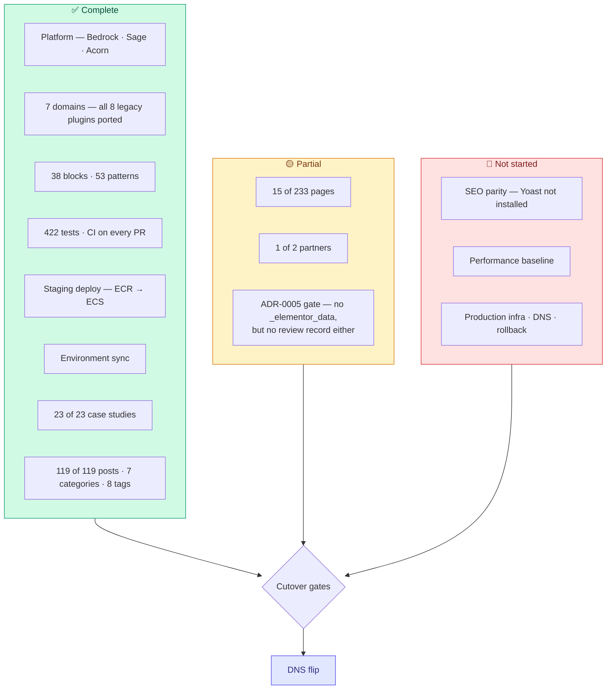

# Replacing production

What stands between this codebase and `remoteleverage.com`, and in what order to clear it.

Production-side figures come from the audit in [content-migration-checklist.md](content-migration-checklist.md) (2026-09-10). **Local figures were re-queried directly from the database on 2026-09-14** and supersede the older numbers in [content-migration-next-phase-plan.md](content-migration-next-phase-plan.md), which predate the blog import.

---

## The short version

The platform is done. Posts, case studies and taxonomies are done; **pages are 15 of 233**. Roughly 107 of the ~218 remaining pages are blocked behind three business decisions, not behind engineering capacity.

The largest remaining workstream with neither a decision blocker nor a content dependency is **production infrastructure**, which has not started at all.

## Where each workstream stands

### Content

Local counts queried 2026-09-14; production counts from the 2026-09-10 audit.

| Type | Production | Migrated | Remaining |
| :--- | ---: | ---: | ---: |
| `page` | 233 | 15 | 218 |
| `case_study` (pages on production) | 23 | 23 | 0 |
| `post` | 119 | 119 | 0 |
| `rl_partner` | 2 | 1 | 1 |
| Categories | 7 | 7 | 0 |
| Tags | 8 | 8 | 0 |
| `attachment` | not audited | 512 | unknown |

Migrated pages: `home`, `about-us`, `reviews`, `vapricing`, `privacy-policy`, `terms-of-use`, `comparison`, `compare-athena`, `wing-assistant-vs-remote-leverage`, `comparison-wing-assistant-ads`, `affiliate-program`, `referral`, `vathankyou`, `hire-va-4`, `blog`. *(Updated 2026-09-14: `hire-va-4-preview` was deleted; `hire-va-4` migrated in its place. `referral` holds incorrect content and is out of scope — see PAGE-MIGRATION-STATUS.md §4a.)*

Per-category post counts match production exactly — Business Growth 91, Outsourcing 95, Case Studies 13, Salary Guides 12, Real Estate Posts 9, News 2. The one discrepancy is **Live Sessions: 2 on production, 0 locally**; worth confirming those two posts were not dropped.

The 218 remaining pages break down as:

| Group | Count | State |
| :--- | ---: | :--- |
| §2 Role/industry SEO pages | ~45 | Blocked on decision 3 |
| §4 Noindex operational/funnel pages | ~19 | Blocked on decision 2 |
| §4 Confirmed-dead old homepage variants | ~13 | Just redirect to `/` |
| §5 In-sitemap experiment/ad landing pages | ~43 | Blocked on decision 1 |
| §7 Tools & lead magnets | ~10 | Interactive apps — need their own scoping pass |
| Everything else | remainder | Utility/nav pages needing keep/kill calls |

## The three decisions

Each needs a named owner and a yes/no. Each has a recommended default so the owner approves a proposal rather than authoring one.

### 1. Paid-traffic owner — 43 experiment pages (§5) + the funnel half of §4

**Needed:** which URLs currently have live ad spend pointed at them.

**Recommended default:** anything with spend in the last 90 days gets rebuilt; everything else 301s to its nearest live equivalent.

This is the single largest unblocking action available. Rebuilding a dead page wastes a week; killing a live one costs revenue, so nobody can guess it.

### 2. Sales/ops owner — 19 operational pages (§4)

`/payment/`, `/deposit-received/`, `/signedup/`, `/contractoragreement/`, `/onboardingform/`, `/vaonboardingform/`, `/onboardingguide/`, `/vainterview/`, `/vainterview2/`, `/service-cor/`, `/service-hiring/`, `/referral-program/`, `/va-form/`, `/hmchecklists/`, `/recruiterchecklists/`, `/saleschecklists/` and the two consultation-scheduled pages.

**Needed:** which are still in the hiring/onboarding flow, and who the audience is for the three `*checklists` pages — internal staff or clients. That last one decides whether they need authentication, which changes the build.

### 3. §2 architecture — one template or 45 pages?

**Recommendation: one data-driven template.**

The set already has an explicit role/industry/region axis, and the LatAm variants are the same page with a region swap. One Blade template fed by a CPT or ACF options set turns ~45 page builds into one build plus ~45 content records, and makes future role additions free. Building them individually re-creates the exact duplication the audit already found (`marketing-assistants` / `-2` / `-legacy`; `sales-virtual-assistants` / `-2`; `virtual-ecommerce-assistants` vs `ecommerce-virtual-assistants` vs `ecommerce-virtual-assistant`).

Pair it with a canonical-URL pass: pick one page per role, 301 the rest.

### Resolved: §8 blog

All 119 posts are imported, with all 7 categories and 8 tags, and **zero posts carry `_elementor_data`**. Per-category counts match production.

They came in through `wp acorn content:import-posts` (captured production JSON → `ElementorProseExtractor` → Gutenberg), not through the `content:audit-elementor` / `content:convert-elementor` / review-queue pipeline. That matters for the ADR-0005 gate: the *letter* of it is satisfied (no `_elementor_data` anywhere), but no post carries `_rl_conversion_status`, so nothing passed through `ContentAuditAdmin`'s editorial sign-off and there is no record of human review.

**Still open:** settle `/guides/` vs `/blog/` as the canonical post archive before configuring Yoast, so it is not reconfigured twice. A local `blog` page now exists (ID 799). And confirm the two missing **Live Sessions** posts were dropped deliberately.

## Work that needs no sign-off

Startable today, in parallel with chasing the decisions.

1. **Install Yoast SEO.** Zero-risk and it *unblocks* later work. Matching production's plugin means `_yoast_wpseo_*` postmeta carries over directly instead of needing field-mapping into a different plugin's schema, and Premium's redirect manager is the mechanism every kill decision depends on. Doing this late forces a second pass over everything already migrated.
2. **Case-study sub-nav tab bar.** Production shows a "CASE STUDIES / TALENT PROFILES / REVIEWS" tab bar above the case-study hero, shared site-wide with `/reviews/`. Confirmed absent. Build it once as a shared partial. Note the TALENT PROFILES destination does not exist in v2 yet — it needs a target before the tab can link anywhere real.
3. **`booking-footer` headline regression sweep.** The `headline` ACF field was dead code until the affiliate-program review fixed it — the Blade view hardcoded its default and ignored the field. Any page that set a headline override before that fix was silently rendering the default. Re-check every page using the `booking-footer` / `hire-va-4-booking-footer` patterns.
4. **Lexgo partner content.** Templates and admin UI are complete (WR-115 closed); only Oyster's content exists. Pure data entry against the restored field group.
5. **Reconcile the trackers.** `PAGE-MIGRATION-STATUS.md` contradicts the checklist on five pages. One source of truth.

## Cutover gates

These must all be green before DNS moves. One is green.

| Gate | Source | State |
| :--- | :--- | :--- |
| Zero posts carry `_elementor_data` | ADR-0005 | ✅ Verified 2026-09-14 — 0 posts across the whole install |
| Every converted post human-approved | ADR-0005 amendment | 🔴 Queue exists (`ContentAuditAdmin`); no post carries `_rl_conversion_status`, so nothing went through it. Either run the 119 posts through the queue, or record an explicit decision that the import path made it unnecessary |
| SEO parity — Yoast installed, meta carried, redirect map complete | §9 of the checklist | 🔴 Not started |
| Every killed URL has a 301 | ADR-0006 | 🔴 `config/redirects.php` has 5 entries; the kill list will be ~56 |
| Performance baseline met (mobile 96+, LCP < 1.2s, CLS 0.00) | `plan.md` Phase 8 | 🔴 Never measured |
| Production infrastructure exists | — | 🔴 No ECS service, ECR repo, secret store or deploy workflow |
| Rollback plan documented and rehearsed | — | 🔴 Does not exist |
| Transactional email deliverability verified | `plan.md` Phase 8 | 🔴 Not started |
| Error monitoring reporting | — | 🔴 Sentry has no DSN |

## Recommended sequence

1. Install Yoast; settle `/guides/` vs `/blog/` canonical. *(Unblocks §9 and prevents rework — and with 119 posts already imported, doing it late now means a second pass over 157 items, not 38.)*
2. Send decision requests 1 and 2 — longest lead time, send first.
3. Clear the no-sign-off work: sub-nav, booking-footer sweep, Lexgo, tracker reconciliation.
4. Settle the ADR-0005 review gate — run the posts through the queue, or record why the import path made it unnecessary.
5. Agree decision 3 and build the role/industry template — the long pole.
6. Build production infrastructure and the DNS/rollback runbook in parallel with content. **This is the one workstream with no content dependency and no decision blocker, and it has not started.**
7. Measure performance; close the remaining gates; flip.

## Gaps this plan does not cover

- **Drafts, private and password-protected content were never audited on production.** The REST API only exposes published content without auth; an application password against wp-admin would allow `status=any`. A missed draft is invisible until someone asks for it.
- **The media library has never been reconciled.** Local holds 512 attachments (1,599 files including generated size variants, ≈140MB). Production's library was never counted, so there is no way to know what is missing.
- **Google Site Kit is installed but inactive**, so no GTM snippet is emitted and no tag inside the container fires. Activating it and connecting the container is admin work, but it is a prerequisite for any GTM-delivered tracking at cutover.
- **`e-landing-page` CPT (2 entries)** has no equivalent post type in v2 and no recorded decision.
- **`/remote-leverage-x-oyster/` and `/remote-leverage-x-lano/`** — unresolved whether they fold into the partner hub. "Lano" appears nowhere else in the audit; it may be a dead page or a missing partner record.
- **`/comparison/` is a never-filled-in internal template on production** — literal `[X]` placeholders, "Text here Text here", a stray "NEW SECTION" label. It was reproduced verbatim under the strict-fidelity rule. Someone should decide whether it ships that way.

## SEO gates added 2026-09-14

- [x] **`robots.txt` exists** — `web/robots.txt`, static file in the Bedrock web root. Disallows `/wp/wp-admin/`, the authenticated portals and `/api/`; points at `https://remoteleverage.com/wp-sitemap.xml`. (Locally it reports 404 — a Herd/nginx artifact affecting `robots.txt` and `favicon.ico` only. Production serves it 200. See known-issues.md #3.)
- [ ] **Unknown URLs must 404, not serve the homepage** — fixed in code by `MissingPathNotFoundMiddleware`; re-verify on staging after deploy, since the bug was invisible locally until then. Check any nonsense path returns 404 and every Laravel route (`/book-consultation`, `/referrer-portal`, `/referrer-register`, `/referral-dashboard`, `/partners`, `/tools/signature-generator`) still returns 200.
- [x] **Stop forcing indexability on non-production** — ✅ done 2026-09-14. The theme's indexability override was **removed entirely**; WordPress/Bedrock defaults now apply, so `DISALLOW_INDEXING` (set in `config/environments/development.php` and `staging.php`) does its job. Verified locally: `blog_public=0` and `<meta name="robots" content="noindex, nofollow" />`. Production is unaffected — the DB value is `1`. See known-issues.md #4. **Re-confirm on staging after deploy** that the page source contains that noindex meta, and that production does *not*.
- [ ] **Confirm the sitemap** — v2 uses core's `/wp-sitemap.xml` (200 locally). Production currently runs Yoast; confirm which sitemap the live robots.txt should point at after cutover.
