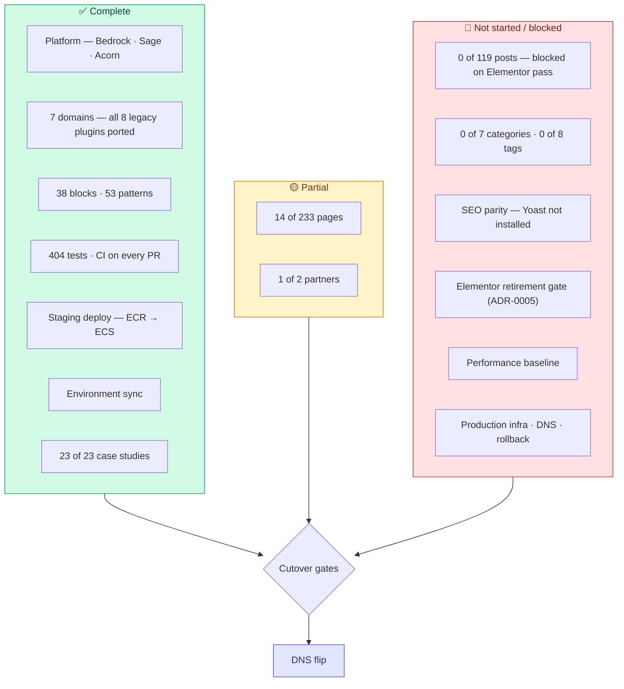

# Replacing production

What stands between this codebase and `remoteleverage.com`, and in what order to clear it.

Content figures come from the audit in [content-migration-checklist.md](content-migration-checklist.md) (production, 2026-09-10) and the local verification in [content-migration-next-phase-plan.md](content-migration-next-phase-plan.md) (2026-09-10). Platform figures were verified on 2026-09-14. The local database was not running during that pass, so page counts have not been re-confirmed since 2026-09-10 — re-run the verification before using them to plan.

---

## The short version

The platform is done. The content is 16% done. **Roughly 250 of ~338 remaining content items are blocked behind four business decisions, not behind engineering capacity.** Building more pages is not the bottleneck; getting those four answers is.

## Where each workstream stands



### Content

| Type | Production | Migrated | Remaining |
| :--- | ---: | ---: | ---: |
| `page` | 233 | 14 | 219 |
| `case_study` (pages on production) | 23 | 23 | 0 |
| `post` | 119 | 0 | 119 |
| `rl_partner` | 2 | 1 | 1 |
| Categories | 7 | 0 | 7 |
| Tags | 8 | 0 | 8 |

Migrated pages: `home`, `about-us`, `reviews`, `vapricing`, `privacy-policy`, `terms-of-use`, `comparison`, `compare-athena`, `wing-assistant-vs-remote-leverage`, `comparison-wing-assistant-ads`, `affiliate-program`, `referral`, `vathankyou`, `hire-va-4-preview`.

The 219 remaining break down as:

| Group | Count | State |
| :--- | ---: | :--- |
| §2 Role/industry SEO pages | ~45 | Blocked on decision 3 |
| §4 Noindex operational/funnel pages | ~19 | Blocked on decision 2 |
| §4 Confirmed-dead old homepage variants | ~13 | Just redirect to `/` |
| §5 In-sitemap experiment/ad landing pages | ~43 | Blocked on decision 1 |
| §7 Tools & lead magnets | ~10 | Interactive apps — need their own scoping pass |
| Everything else | remainder | Utility/nav pages needing keep/kill calls |

## The four decisions

Each needs a named owner and a yes/no. Each has a recommended default so the owner approves a proposal rather than authoring one.

### 1. Paid-traffic owner — 43 experiment pages (§5) + the funnel half of §4

**Needed:** which URLs currently have live ad spend pointed at them.

**Recommended default:** anything with spend in the last 90 days gets rebuilt; everything else 301s to its nearest live equivalent.

This is the single largest unblocking action available. Rebuilding a dead page wastes a week; killing a live one costs revenue, so nobody can guess it.

### 2. Sales/ops owner — 19 operational pages (§4)

`/payment/`, `/deposit-received/`, `/signedup/`, `/contractoragreement/`, `/onboardingform/`, `/vaonboardingform/`, `/onboardingguide/`, `/vainterview/`, `/vainterview2/`, `/service-cor/`, `/service-hiring/`, `/referral-program/`, `/va-form/`, `/hmchecklists/`, `/recruiterchecklists/`, `/saleschecklists/` and the two consultation-scheduled pages.

**Needed:** which are still in the hiring/onboarding flow, and who the audience is for the three `*checklists` pages — internal staff or clients. That last one decides whether they need authentication, which changes the build.

### 3. §2 architecture — one template or 45 pages?

**Recommendation: one data-driven template.**

The set already has an explicit role/industry/region axis, and the LatAm variants are the same page with a region swap. One Blade template fed by a CPT or ACF options set turns ~45 page builds into one build plus ~45 content records, and makes future role additions free. Building them individually re-creates the exact duplication the audit already found (`marketing-assistants` / `-2` / `-legacy`; `sales-virtual-assistants` / `-2`; `virtual-ecommerce-assistants` vs `ecommerce-virtual-assistants` vs `ecommerce-virtual-assistant`).

Pair it with a canonical-URL pass: pick one page per role, 301 the rest.

### 4. §8 blog — run the audit before estimating

```bash
wp acorn content:audit-elementor
```

Read-only and cheap. Its output is what says whether 119 posts are a scripted bulk import or a per-post slog. Nobody should commit to a blog-migration estimate before it has run. Settle `/guides/` vs `/blog/` as the canonical post archive before importing, so Yoast is not reconfigured twice.

## Work that needs no sign-off

Startable today, in parallel with chasing the decisions.

1. **Install Yoast SEO.** Zero-risk and it *unblocks* later work. Matching production's plugin means `_yoast_wpseo_*` postmeta carries over directly instead of needing field-mapping into a different plugin's schema, and Premium's redirect manager is the mechanism every kill decision depends on. Doing this late forces a second pass over everything already migrated.
2. **Case-study sub-nav tab bar.** Production shows a "CASE STUDIES / TALENT PROFILES / REVIEWS" tab bar above the case-study hero, shared site-wide with `/reviews/`. Confirmed absent. Build it once as a shared partial. Note the TALENT PROFILES destination does not exist in v2 yet — it needs a target before the tab can link anywhere real.
3. **`booking-footer` headline regression sweep.** The `headline` ACF field was dead code until the affiliate-program review fixed it — the Blade view hardcoded its default and ignored the field. Any page that set a headline override before that fix was silently rendering the default. Re-check every page using the `booking-footer` / `hire-va-4-booking-footer` patterns.
4. **Lexgo partner content.** Templates and admin UI are complete (WR-115 closed); only Oyster's content exists. Pure data entry against the restored field group.
5. **Reconcile the trackers.** `PAGE-MIGRATION-STATUS.md` contradicts the checklist on five pages. One source of truth.

## Cutover gates

These must all be green before DNS moves. None is currently green.

| Gate | Source | State |
| :--- | :--- | :--- |
| Zero posts carry `_elementor_data` | ADR-0005 | 🔴 Production DB never ingested; conversion never run on real content |
| Every converted post human-approved | ADR-0005 amendment | 🔴 Queue exists (`ContentAuditAdmin`); nothing has gone through it |
| SEO parity — Yoast installed, meta carried, redirect map complete | §9 of the checklist | 🔴 Not started |
| Every killed URL has a 301 | ADR-0006 | 🔴 `config/redirects.php` has 5 entries; the kill list will be ~56 |
| Performance baseline met (mobile 96+, LCP < 1.2s, CLS 0.00) | `plan.md` Phase 8 | 🔴 Never measured |
| Production infrastructure exists | — | 🔴 No ECS service, ECR repo, secret store or deploy workflow |
| Rollback plan documented and rehearsed | — | 🔴 Does not exist |
| Transactional email deliverability verified | `plan.md` Phase 8 | 🔴 Not started |
| Error monitoring reporting | — | 🔴 Sentry has no DSN |

## Recommended sequence

1. Install Yoast; settle `/guides/` vs `/blog/` canonical. *(Unblocks §9 and prevents rework.)*
2. Send decision requests 1 and 2 — longest lead time, send first.
3. Run the Elementor audit (decision 4) while waiting.
4. Clear the no-sign-off work: sub-nav, booking-footer sweep, Lexgo, tracker reconciliation.
5. Agree decision 3 and build the role/industry template — the long pole.
6. Build production infrastructure and the DNS/rollback runbook in parallel with content. **This is the one workstream with no content dependency and no decision blocker, and it has not started.**
7. Ingest the production DB, run the conversion, work the editorial review queue.
8. Measure performance; close the remaining gates; flip.

## Gaps this plan does not cover

- **Drafts, private and password-protected content, and the media library were never audited.** The REST API only exposes published content without auth; an application password against wp-admin would allow `status=any`. A missed draft is invisible until someone asks for it.
- **`e-landing-page` CPT (2 entries)** has no equivalent post type in v2 and no recorded decision.
- **`/remote-leverage-x-oyster/` and `/remote-leverage-x-lano/`** — unresolved whether they fold into the partner hub. "Lano" appears nowhere else in the audit; it may be a dead page or a missing partner record.
- **`/comparison/` is a never-filled-in internal template on production** — literal `[X]` placeholders, "Text here Text here", a stray "NEW SECTION" label. It was reproduced verbatim under the strict-fidelity rule. Someone should decide whether it ships that way.
