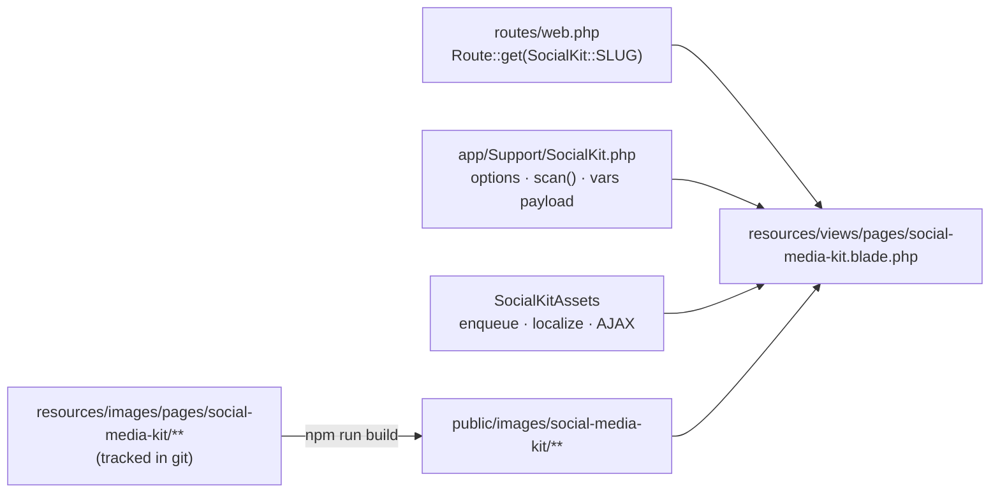

# Social Media Kit

`/social-media-kit/` — the internal brand kit: an email-signature generator plus a
downloadable asset library (LinkedIn covers, Facebook covers, logos and avatars).

Ported from the legacy `rl-social-kit` WordPress plugin on 2026-09-15. Functionality is the
plugin's, not a reimplementation: `resources/css/social-kit.css` and
`resources/js/social-kit.js` are the plugin's own files, and the Blade template reproduces
`render_shortcode()`'s markup element for element — same ids, classes and `data-` attributes,
because the carried-over JS and CSS are written against exactly those hooks. Change the markup
and the page silently stops working.

---

## Why it is a route, not a page



It is a tool, not editorial content, so it sits with the other utility routes
(`/tools/signature-generator`, `/book-consultation`, `/referrer-portal`) rather than being a
`page` row. That keeps it in git and means a database refresh cannot take it out — the same
reasoning behind keeping page content in `patterns/` and partner records in
`resources/partners/partners.php`.

A WordPress page with the slug `social-media-kit` would **shadow this route**. If the page ever
reappears, trash it.

| Piece | Where |
| :--- | :--- |
| Route | `routes/web.php` — `Route::get(SocialKit::SLUG, …)->name('social-media-kit')` |
| Template | `resources/views/pages/social-media-kit.blade.php` |
| Resource grid partial | `resources/views/partials/social-kit-resource-grid.blade.php` |
| Options, scanning, `rl_social_kit_vars` | `app/Support/SocialKit.php` |
| Enqueue, localize, AJAX endpoints | `app/Infrastructure/WordPress/SocialKitAssets.php` |
| Signature templates (6) | `resources/social-kit/signatures/*.html` |
| Tests | `tests/Unit/SocialKitTest.php` |

`SocialKitAssets` is registered in `DomainServiceProvider` rather than from the template,
because the AJAX handlers must exist on `admin-ajax.php` requests, which never render a view.
The enqueue gate is a request-path check (`request()->is(SocialKit::SLUG)`), not `is_page()` —
there is no queried object on a route.

---

## Assets

Source of truth is **`resources/images/pages/social-media-kit/`** (tracked, ~14MB), published
by the `themeImages()` Vite plugin to `public/images/social-media-kit/` with filenames
preserved exactly:

```
/app/themes/remote-leverage/public/images/social-media-kit/<tab>/<exact-filename>
```

| Directory | Contents |
| :--- | :--- |
| `linkedin/` | 8 personal banners (`RL_LKD_PersonalBanner_01..08_4400x1100.jpg`) |
| `facebook/` | 10 personal banners (`RL_FC_Personal_Banner_01..10_850x315.jpg`) |
| `other/` | 11 logos and avatars |
| `instagram/` | empty — the pane renders its empty state |
| `brand/` | signature assets: `ln/fb/ig/x/yt.png`, `logo-icon-black.svg`, `logo-icon-white.svg` |

**`SocialKit::scan()` reads the tracked source directory, not `public/`.** The build writes a
`.webp` sibling next to every raster, so scanning the published directory would render 16
LinkedIn cards instead of 8 and mislabel every file size. It builds the public URL for the
filename it found in source.

`web/app/plugins/*` is gitignored in this repo, so copying the plugin in would have been lost
on deploy — that, not preference, is why the assets live in the theme. The only URL difference
from the plugin is the prefix (`/app/themes/…/public/images/social-media-kit/` rather than
`/wp-content/plugins/rl-social-kit/assets/resources/`), which Bedrock's `CONTENT_DIR` makes
unavoidable. Filenames and the per-tab directory structure are unchanged.

---

## Access

**Public by default.** `rl_social_kit_require_login` defaults to `'0'` here, where the plugin
defaulted to `'1'` — the kit is meant to be usable without provisioning an account for everyone
who needs a signature. Setting the option to `'1'` restores the plugin's login card verbatim.

Two things differ for anonymous visitors, and only these two:

- **Avatar upload is disabled**, with "Sign in to upload a photo" in place of the button
  action. The upload endpoint stays logged-in-only — there is deliberately **no
  `wp_ajax_nopriv_rl_social_kit_upload_avatar` handler**, because that would let any anonymous
  visitor write files into the media library. Two of the three signature layouts use no avatar
  at all, and the third falls back to the brand mark.
- **The Log Out sidebar item is hidden.** The plugin rendered it unconditionally.

Everything else — all four tabs, all 29 downloads, all six signature variants, copy / HTML /
download / setup — is identical signed in or out.

---

## Deliberate departures from the plugin

1. **`social-kit.js`, one change.** `updateSignaturePreview()` was inside the
   `if (vars.is_logged_in)` branch, which left all six preview iframes blank for an anonymous
   visitor until their first keystroke. That single call moved out of the branch; the
   avatar prefill stays gated. Commented inline.
2. **Layout is container-aware.** The plugin's `.rl-grid-container` was a fixed `520px 1fr`
   that stacked on a `max-width: 1400px` *viewport* query. What actually constrains this grid
   is the content column beside the 250px sidebar, so at 1440px inside a 1380px container the
   query never fired and the preview column ran off-screen. Now: `minmax(0, 400px) minmax(0, 1fr)`,
   a `@container (max-width: 1040px)` query on `.rl-dash-content`, `min-width: 0` on the grid
   items, and a full-bleed page wrapper (`max-w-[1800px]`) instead of the editorial container.
   The media query is kept as a fallback.
3. **The empty state no longer prints a server path.** The plugin's Instagram pane told the
   public to drop files in `wp-content/plugins/rl-social-kit/assets/resources/instagram/`.
4. **The Instagram pane has no sidebar entry** — same as the plugin, where it is unreachable
   dead markup. Kept for structural fidelity.
5. **Its own copy of the six signature templates.** `resources/views/signatures/` already
   exists for the Livewire generator and has diverged (`#25104A` vs the plugin's `#250D4A` in
   3 of 6). Sharing them would silently change this page's output. A test pins this.

---

## Not ported

- **`rl_social_kit_login`.** The AJAX action is still registered so the carried-over JS works
  if the login gate is switched on, but with the kit public it is unreachable in normal use.

## Settings → RL Social Kit

`App\Infrastructure\WordPress\Admin\SocialKitAdmin` renders the options screen, ported
2026-09-15. It writes the same option names the plugin used, so an existing `wp_options` row
keeps working and nothing needs migrating; `SocialKit::OPTION_DEFAULTS` stays the single
source of truth for the defaults and the screen never restates them.

Two details worth keeping if this is ever edited: the Require Login checkbox needs an explicit
`sanitize_callback` (an unchecked box is simply absent from the POST body, so without it the
value could never save as `'0'`), and `rl_social_kit_company_logo` has to be registered
separately because it is resolved at read time by `SocialKit::companyLogo()` rather than
living in `OPTION_DEFAULTS` — miss it and the field renders but silently never saves.

## `/tools/signature-generator` was removed

Resolved 2026-09-15: the old Livewire generator is **gone**, and `/tools/signature-generator`
now 301s here via `config/redirects.php`. This page was a strict superset of it — the same six
variants plus the asset library and the Gmail/Outlook/Apple Mail setup instructions — while the
old route lacked the first/last name split, Department, photo upload, the six-variants-at-once
grid and the setup modal.

Deleted with it: `EmailSignatureGenerator` (component + view), `GenerateSignatureHtmlAction`,
`resources/views/signatures/` and both service-provider registrations. Keeping two
implementations had already let their templates drift (`#25104A` against this page's
`#250D4A`, in 3 of 6 files), which is the argument that settled it.
